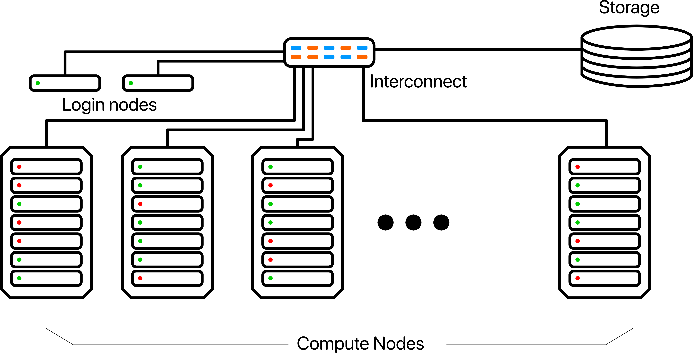

name: title
class: center, middle
layout: true
---
template: title

# Introduction to High Performance Computing

.red[\\\\\\]

.venue[

Engage Workshop on HPC and Data Science,

12$^{th}$ June $-$ 7$^{th}$ July 2023  

]

.red[\\\\\\]

.speaker[

Giannis Koutsou,

]

.sub[

Computation-based Science and Technology Research Center,

The Cyprus Institute

]
---
name: normal
layout: true
---

# Welcome

## Structure of this school

Four weeks
- First two weeks, mostly HPC and its applications
- Next two weeks, mostly data science/ML and its application

--

## This course

- Monday to Thursday of first week
--

- Introduction to High Performance Computing
--

- To be taught:
  - Navigating a computer cluster, scripting
  - Parallelism via shared- or distributed-memory programming (OpenMP and MPI)
  - Programming accelerators (GPUs)
--

- All of the above have a significant hands-on component
--

</br>
</br>
</br>

.center[ _But first, a gentle introduction to high performance computing_ ]

--

Ways of accessing these slides:
- As PDF from Indico page (one set of slides for each day)
- Via we browser at [sds402.online/engage](https://sds402.online/engage) .red[$\leftarrow$ **recommended**]

---

# Outline

### Introduction to HPC
- Introduction to high performance computing (HPC) and parallel computing
  - Scalability and other performance metrics
  - Modern HPC architectures and their characteristics
  
- Supercomputing ecosystem 
  - European landscape 
  - Exa-scale initiatives

--

### Cluster computing
- Navigating the cluster we will use for the training
- Some simple examples for practicing editing and compiling programs
  and running jobs

---

# High performance computing

### High performance computing means parallel computing

--

- Computers are becoming all the more parallel due to technological constraints

<style type="text/css">
img[alt=scaling] { width: 50%; float: center; padding: 0px}
</style>
.center[

]

.right[.tiny[[https://github.com/karlrupp/microprocessor-trend-data](https://github.com/karlrupp/microprocessor-trend-data)]]

--

- Moore’s law: transistor count exponentially increasing (but not as originally expected)

--

- Dennard Scaling: $P\propto AfV^2$. Lost around 2006 ($P$: power, $A$: area, $f$: freq., $V$: voltage)

---

# High performance computing

### High performance computing means parallel computing

- Exploiting parallelism is essential for scientific computing 
--

- Practitioners of computational sciences benefit from knowledge of concepts and challenges of parallel computing
--

  - Architectures and their characteristics
  - Algorithms and how amenable they are to parallelisation 
  - Performance metrics and their significance, e.g. sustained and peak floating point performance, bandwidth, scalability

<style type="text/css">
img[alt=col0] { width: 90%; float: left; padding: 0px}
img[alt=col1] { width: 90%; float: center; padding: 0px}
img[alt=col2] { width: 100%; float: right; padding: 0px}
</style>

.left-column-5[
</br>
]

.left-column-30[
	.center[.tiny[**Architectures**]]
 
]

.left-column-5[
	|
]

.left-column-30[
	.center[.tiny[**Algorithms**]]
 
]
.left-column-5[
	|
]

.left-column-30[
	.center[.tiny[**Performance metrics**]]
 
]

---

# High performance computing

### How do we "spend" parallelism?

- _Capacity computing_
  - Improve time-to-solution of a problem that can also run on less number of processes
  - E.g. solve many small problems

- _Capability computing_
  - Solve a problem that was _impossible_ to solve on less processes
  - E.g. solve a problem using $N$ nodes, that cannot fit in memory of less nodes 

--

----

.center[

_High Throughput Computing_ sometimes used to identify capacity
computing, with HPC used to mean capability computing

]

---

# High performance computing

### Concepts of parallel computing
- **Scalability**: The rate at which time-to-solution improves as we increase processing units

- **Weak scaling**: Increase processing units; keep the **local** problem size fixed $\Rightarrow$ for increasing global problem size

- **Strong scaling**: Increase processing units; keep the **global** problem size fixed $\Rightarrow$ for decreasing local problem size
<style type="text/css">
      img[alt=f0-l] { width: 95%; float: center; padding: 5px}
      img[alt=f0-r] { width: 95%; float: center; padding: 5px}
</style>

--

.left-column[

]

--

.right-column[

]

---
# High performance computing

### Concepts of parallel computing


- Performance metrics

	- Floating point rate: number of floating point operations carried
      out by a computational task per unit time
	- I/O or Bandwidth: bytes read and written per unit time

--

- Distinguish between theoretical peak and sustained 

	- Theoretical peak: Assuming full utilization of hardware
	- Sustained: measured, e.g. via running an application

--

- Note that usually a single floating point operation (flop) is an
  `add`, `sub`, or `mul`, with other operations (e.g. `dev`,
  exponentiation, etc.) typically requiring more than 1 flop.

---
# High performance computing

### Concepts of parallel computing

Taxonomy of computer architectures, _Flynn's Taxonomy_:
- Single Instruction stream, Single Data stream (SISD) 
- Multiple Instruction streams, Single Data stream (MISD) 
- Single Instruction stream, Multiple Data streams (SIMD) 
- Multiple Instruction streams, Multiple Data streams (MIMD) 

--

Parallel computing
- Most computing devices have underlying SIMD architecture units: GPUs, CPUs, etc.
- Most supercomputers can be considered MIMD architectures: multiple
  interconnected computing devices that can issue the same or
  different instructions on multiple data

---
# High performance computing

### What's in a supercomputer?

- Compute Nodes
  - Computational units - CPU and potentially a co-processor, e.g. a GPU
  - Memory (i.e. RAM)
  - Some storage and/or NVMe
  - Network interfaces, possibly separate between management and workload 

--
- Interconnect
  - Interfaces on nodes
  - Wiring and switches

--
- Storage
  - Still predominantly spinning disks
  - Solid state drives are emerging for smaller scratch space
  - Tape systems for archiving 

--
- Front-end nodes
  - For user access
  - Compiling, submitting jobs, etc.

---

# High performance computing

### Computing devices

Most supercomputers have compute nodes equipped with a co-processor,
typically a general purpose GPU

- CPU architecture
  - Optimized for handling a diverse ranged of instructions on multiple data
  - Large caches per core
  - Smaller bandwidth to memory but typically larger memory
  - Reliance on prefetching
  - Some availability of SIMD floating point units
  
- GPU architecture
  - Optimized for _throughput_, i.e. applying the same operation on multiple data
  - Smaller caches per "core"
  - Higher bandwidth to memory but typically smaller memory
  - Reliance on very wide SIMD units

---
# High performance computing

### Computing devices

Most supercomputers have compute nodes equipped with a co-processor,
typically a general purpose GPU

<style type="text/css">
	img[alt=block] { height: 300px; float: center; padding: 0px}
</style>

.left-column-40[

.center[## CPU]
- Large area devoted to control
- Large caches
- Few ALUs
]
.right-column-40[

.center[## GPU]
- Less area devoted to control
- Small caches
- Most area dedicated to ALUs
]

---
# High performance computing

### Computing devices

CPU architectures and main characteristics
- Intel Xeon and AMD EPYC (x86), various ARM implementations, and IBM Power
- $\mathcal{O}(10)$ cores per CPU (current max: 64), 2 - 4 CPUs per node
- Memory bandwidth of $\sim$50-100 GBytes/s
- Theoretical peak floating point performance $\sim$30-50 Gflop/s per core

GPU architectures and main characteristics
- NVIDIA Tesla and AMD Radeon 
- $\mathcal{O}(1000)$ "cores" or Arithmetic and Logical Unit (ALUs). 2 - 6 GPUs per node
- Memory bandwidth of $\mathcal{O}(1000)$ GBytes/s
- Theoretical peak floating point performance $\sim$10-20 Tflop/s per GPU

--

Intel Xe "Ponte Vecchio" GPUs also coming up


---

# Worldwide landscape of supercomputers


<style type="text/css">
	img[alt=t500] { width: 90%; float: center; padding: 0px}
</style>

.left-column[

]

.right-column[

- Bi-annual ranking of supercomputers
- Classification according to _sustained_  floating point performance
- Run High Performance Linpack (HPL) on whole system
]

.one-column[
- [`https://www.top500.org`](https://www.top500.org) Latest list: **June 2023**
  - Top system: US, AMD GPU-based system, 1.2 Eflop/s sustained 
  - Second: Japan, ARM-based system, 442 Pflop/s sustained 
  - Top in Europe: FI, third overall, GPUs (AMD MI250X), 310 Pflop/s sustained 
- .red[**7**] out of top 10 equipped with GPUs, either NVIDIA or AMD
]

---
# Supercomputing landscape

### Notable supercomputers in Europe

<style type="text/css">
		img[alt=sc]{width: 100%;}
</style>

.left-column-30[

]
.right-column-70[
**Lumi** - CSC, FI
- HPE Cray EX235a, AMD EPYC CPUs, AMD Instinct MI250X GPUs
- $\sim$430 Pflop/s theoretical peak
]

.one-column[]

.left-column-70[
**Leonardo** - CINECA, IT
- BullSequana XH2000, Intel Xeon CPUs, NVIDIA A100 GPUs
- $\sim$300 Pflop/s theoretical peak
]
.right-column-30[

]

---
# Supercomputing landscape

### Notable supercomputers in Europe

.left-column-20[

]
.right-column-70[
**Adastra** - GENCI, FR
- HPE Cray EX235a, AMD EPYC CPUs, AMD Instinct MI250X GPUs
- $\sim$60 Pflop/s theoretical peak
]

.one-column[]

.left-column-70[
**Juwels** - JSC, DE
- Bull Sequana XH2000, Intel Xeon CPUs, NVIDIA A100 GPUs
- $\sim$70 Pflop/s theoretical peak
]
.right-column-30[

]

---

# Supercomputing landscape

### Notable supercomputers in Europe


.left-column-30[

]
.right-column-70[
**Alps** - CSCS, CH (currently being deployed)
- NVIDIA Grace CPUs, NVIDIA Hopper (H100) GPUs
- $>$500 Pflop/s theoretical peak
]

.one-column[]
.left-column-70[
**MareNostrum 5** - BSC, ES
- Bull, four main partitions including Intel CPUs and NVIDIA GPUs
- Theoretical peak `¯\_(ツ)_/¯`
]
.right-column-30[

]

---

# Supercomputer access

### In Europe, these systems also made available via a single, centralized allocation process
Access via so-called EuroHPC calls
- Technical review: need to show that methods and software are
  appropriate for the underlying architecture.  Scaling and
  performance analysis required.
- Scientific review: peer-review of the proposed science.
- $\mathcal{O}(100)$ core-hours for individual projects within "Extreme Scale Allocations"
- $\mathcal{O}(10)$ core-hours for individual projects within regular allocations


Smaller-scale access available nationally 
- Depends on national mechanisms for access
- Usually follows same approach of technical and scientific review

--

.center[.red[Access to such resources requires good understanding of HPC and the challenges in achieving efficient software implementations]]

---
# Supercomputing landscape

### US Exascale roadmap

<style type="text/css">
		img[alt=a]{width: 100%;}
</style>


--

- First exascale system "Frontier" appeared in June 2022 Top 500 list

--

- "Aurora": Intel accelerators

--

- Similar mix as in Europe: Expect significant performance from NVIDIA, AMD, and Intel GPUs

---

# Concepts in High Performance Computing

### Scalability
- The rate at which time-to-solution improves as we increase processing units

#### Strong scaling
- Increase processing units; keep the **global** problem size fixed $\Rightarrow$ for decreasing local problem size

#### Weak scaling
- Increase processing units; keep the **local** problem size fixed $\Rightarrow$ for increasing global problem size


#### Where:
- Global problem size: the size of the problem over all processes
- Local problem size: the size of the problem per processing unit

---

# Concepts in High Performance Computing

### Scalability – an example

.left-column[

##### Weak scaling
- Local problem size fixed: $L_V=48^3\times24$
]

.right-column[

##### Strong scaling
- Global problem size fixed: $L_G=32^3\times96$
]

---
# Concepts in High Performance Computing

.left-column[
### Scalability

- Speedup $S$ when using $N$ processes
$$
  S(N) = \frac{T_0}{T(N)},
$$
  - $T_0$: Reference time-to-solution .smallerer[(using $N_0$ processors, nodes, GPUs, etc.)]
  - $T(N)$: Time-to-solution using $N$ > $N_0$ processes

- Parallel efficiency $\epsilon$

$$
\epsilon = S(N)\frac{N_0}{N}
$$

- Ideal scaling: $\epsilon \simeq 1$
]

.right-column[


.smallerer[
| $N$ | $T$ (sec) | $S$     | $\epsilon$ |
| --- | --------- | ------- | ---------- |
|  1  |  2.0      |  –      |   –        |
|  2  |  1.1      |  1.82   |   0.91     |
|  3  |  0.8      |  2.50   |   0.83     |
|  4  |  0.7      |  2.86   |   0.72     |
]
]

---
# Scalability

### Amdahl's Law

- $f$: fraction of application that can be parallelized
- $T_0$: time-to-solution of code when using one process
- $N$: Number of processes

.left-column[
$$
T(N) = (1-f)T_0 + f\frac{T_0}{N}
$$

$$
S(N) = \frac{T_0}{T(N)} = \frac{1}{1-f + \frac{f}{N}}
$$
]

.right-column[

]

---
# Amdahl's Law

### A practical example

<style>
     img[alt=dots]{width: 80%; float: left; padding: 0px}
</style>

.left-column[
- Consider the calculation of $\pi$ via simple Monte Carlo:
  - Define a unit square. Set $n_{hit}=0$
  - Randomly pick points ($x$, $y$) within the unit square
  - If $x^2+y^2 < 1$, $n_{hit} += 1$
  - Repeat $N$ times

- The ratio $n_{hit}/N$ approaches the area of a circle quadrant $\Rightarrow\frac{\pi}{4}$ 
]

.right-column[

]

---
# Amdahl's Law

### A practical example

.left-column[
```c
unsigned long int hits = 0;
for(unsigned long int i=0; i<N; i++) {
	double x = drand48();
	double y = drand48();
	if(x*x + y*y < 1)
		hits += 1;
}
```
]

.right-column[
	
]

--

.left-column[

- Parallelizable parts
  - The loop over `N`

]

--

.left-column[

- Scalar parts
  - Initialization
  - Summing the partial `nhit` and division by `N`


]


---

# Monte Carlo estimation of $\pi$

- $N$ = 14,968,800

.left-column[
<br/>

.smallerer[
| $n_{proc}$ | $t$ (sec) |  $\pi$  |
| ---------- | --------- | ------- |
| 1          |  0.53     | 3.141543|
| 2          |  0.27     | 3.141355|
| 3          |  0.19     | 3.141089|
| 4          |  0.16     | 3.141137|
| 5          |  0.12     | 3.141135|
| 6          |  0.10     | 3.141290|
| 7          |  0.11     | 3.141533|
| 8          |  0.11     | 3.141195|
]			 
]

.right-column[

]
---

# Monte Carlo estimation of $\pi$

- $N$ = 479,001,600

.left-column[
<br/>

.smallerer[
| $n_{proc}$ | $t$ (sec) |  $\pi$  |
| ---------- | --------- | ------- |
| 1          | 13.70     | 3.141558|
| 2          |  7.58     | 3.141605|
| 3          |  4.74     | 3.141603|
| 4          |  3.56     | 3.141647|
| 5          |  2.86     | 3.141650|
| 6          |  2.40     | 3.141604|
| 7          |  2.08     | 3.141625|
| 8          |  1.82     | 3.141646|
]			 
]
.right-column[

]

---
template: title


# Cluster Computing

---
template: normal

# Cluster Computing

<style type="text/css">
	img[alt=cluster]{width: 55%; float: center; padding: 5px}
</style>

.center[]

### Specific configuration of our local system
- Part of a larger system with $\sim$100 nodes
- 8 nodes in total for this training
  - Hostnames: `cyc{01,...,08}`
  - 2$\times$16-core Intel Xeon
  - 128 GBytes RAM
  - 2$\times$NVIDIA V100 GPUs
- Common storage for our course: `/nvme/scratch/engage/`

---

template: normal

# Cluster Computing

- Log in to a _login node_ or _frontend node_. Login node in our case has hostname `front02`
- To run programs on _compute nodes_, a _job scheduler_ is available
- Distinguish between _interactive_ and _batch_ jobs

--

### SLURM job scheduler

- See currently running and waiting jobs: `squeue`
- Ask for an interactive job: `salloc`
- Submit a batch job: `sbatch`
- Run an executable: `srun`

---

template: normal

# Cluster Computing Introductory Example

- Log in:
```zsh
[localhost ~]$ ssh <username>@front02.hpcf.cyi.ac.cy
```

--

- Type `hostename`. This tells you the name of the node you are currently logged into:
```zsh
[ikoutsou@front02 ~]$ hostname
front02
```
this is the login node.

--

- Ask for one node (`-N 1`):
```zsh
[ikoutsou@front02 ~]$ salloc -N 1 -p p100 --reservation=engage -A engage
salloc: Granted job allocation 55412
salloc: Waiting for resource configuration
salloc: Nodes cyc05 are ready for job
[ikoutsou@cyc05 ~]$
```

--
	- `-A engage`: charge project with name `engage`

--
	- `--reservation=engage`: use reservation `engage`

--
	- `-p=p100`: requests a node from the `p100` partition $-$ the partition that includes all `cyc??` nodes

--
- Type `hostname` again:
```zsh
[ikoutsou@cyc05 ~]$ hostname
cyc05
```
`cyc05` is a compute node.

---

template: normal

# Cluster Computing Introductory Example

- Release the node (type `exit` or hit `ctrl-d`):
```zsh
[ikoutsou@cyc05 ~]$ exit
salloc: Relinquishing job allocation 55412
[ikoutsou@front02 ~]$
```
we're back on `front02`

--

.center[.red[Please **do not** hold nodes unnecessarily; when you have nodes `salloc`ed you may be blocking other users from using those nodes.]]

--

- Use `srun` instead of `salloc`:
```zsh
[ikoutsou@front02 ~]$ srun -N 1 -p p100 -A engage --reservation=engage hostname
cyc05
```

--

- Allocates a node, runs the specified command (in this case
`hostname`), and then exits the node, releasing the allocation

--

- The output, `cyc05`, reveals that we were allocated node `cyc05` for this specific $-$ very short $-$ job

---

template: normal

# Cluster Computing Introductory Example

- Run multiple instances of `hostname` in parallel:
```zsh
[ikoutsou@front02 ~]$ srun -N 1 -n 2 -p p100 -A engage --reservation=engage hostname
cyc05
cyc05
```
--
    - `-N 1`: use one node
	- `-n 2`: use two processes

--

- Run on more than one node:
```zsh
[ikoutsou@front02 ~]$ srun -N 2 -n 2 -p p100 -A engage --reservation=engage hostname
cyc05
cyc07
```
runs one instance of `hostname` on each node

--

- Try:
```zsh
[ikoutsou@front02 ~]$ srun -N 2 -n 1 -p p100 -A engage --reservation=engage hostname
```
--
```zsh
srun: Warning: canʼt run 1 processes on 2 nodes, setting nnodes to 1
cyc05
```

---


template: normal

# Cluster Computing Introductory Example


- Make a directory. List it, see that it is there:
```zsh
[ikoutsou@front02 ~]$ mkdir engage-training
[ikoutsou@front02 ~]$ ls
engage-training
[ikoutsou@front02 ~]$ 
```

--
- Change into it:
```zsh
[ikoutsou@front02 ~]$ cd engage-training/
[ikoutsou@front02 engage-training]$ 
```

--
- `pwd` will tell you where you are in the file system:
```zsh
[ikoutsou@front02 engage-training]$ pwd
/nvme/h/ikoutsou/engage-training
```

--
- `/` is referred to as the _root directory_

--
- `.` is an alias for the _current directory_

--
- `..` is an alias for the directory one level above

--
- `~` is an alias for your _home directory_

--
- E.g.:
```zsh
[ikoutsou@front02 engage-training]$ cd ../../
[ikoutsou@front02 h]$ pwd
/nvme/h
```

---
template: normal

# Cluster Computing Introductory Example

- `cd` without any additional arguments takes you home (equivalent to `cd ~`)
```zsh
[ikoutsou@front02 h]$ cd
[ikoutsou@front02 ~]$ pwd
/nvme/h/ikoutsou
```

--

- Make a subdirectory under `engage-training` for our first C program
```zsh
[ikoutsou@front02 ~]$ cd engage-training
[ikoutsou@front02 engage-training]$ mkdir 01
[ikoutsou@front02 engage-training]$ cd 01
[ikoutsou@front02 01]$ 
```

--

- Use `emacs` or `vim` (or any other text editor you're comfortable with) to type out our first program

--

- E.g.:
```zsh
[ikoutsou@front02 01]$ emacs -nw prog-01.c
```

---
template: normal

# Cluster Computing Introductory Example

- Type out the following program:

```c
#include <unistd.h>           
#include <stdio.h>            
#include <sys/types.h>        


int
main(int argc, char *argv[])
{
  char hname[256];         
  pid_t p;                 
  gethostname(hname, 256); 
  p = getpid();            
  printf(" Hostname: %s, pid: %lu\n", hname, p); 
  return 0; 
            
}
```

---
template: normal

# Cluster Computing Introductory Example

- Type out the following program:

```c
#include <unistd.h>           // <-- provides definitions for gethostname() and getpid()
#include <stdio.h>            // <-- provides definitions for printf()
#include <sys/types.h>        // <-- defines the pid_t type 
// main()
//   -> argv[] is an array of strings which holds all command line arguments
//   -> argc holds the number of elements of argv
int
main(int argc, char *argv[])
{
  char hname[256];         // <-- declare hname[] as an array of 256 characters (a string of length 256)
  pid_t p;                 // <-- declare p as a pid_t type, in this case, an unsigned long integer
  gethostname(hname, 256); // <-- call gethostname(), return hostname in hname which is 256 characters long
  p = getpid();            // <-- call getpid(), return value in p
  printf(" Hostname: %s, pid: %lu\n", hname, p); // print statement
  return 0; // <-- return a value of 0 to the operating system. By convention 0 means success.
            //     Non zero values indicate errors.
}
```

---
template: normal

# Cluster Computing Introductory Example

After saving and exiting, you are back at the command line

--

- `ls` should show the file `prog-01.c`, which you just typed in and saved:
```zsh
[ikoutsou@front02 01]$ ls
prog-01.c
```

--

- It's time to _compile_ it into an executable. Use the `gompi` module:
```zsh
[ikoutsou@front02 01]$ module load gompi
[ikoutsou@front02 01]$ gcc prog-01.c -o p01
```
--
	- `-o p01` means "name the resulting executable `p01`". If you don't
      specify `-o` the executable name defaults to `a.out`

--

- Type `ls` to make sure it has been created. Then run it on the frontend node:
```zsh
[ikoutsou@front02 01]$ ls
p01  prog-01.c
[ikoutsou@front02 01]$ ./p01
 Hostname: front02, pid: 14848
```

--

.red[Note]: commands like `gcc` or `ls` are globally accessible because their locations are included in your shell environment's search path. for `p01` though, which we just created, you need to explicitly give its path, in this case via `./` which means "current directory".

---

template: normal

# Cluster Computing Introductory Example

- Run your new program `p01` using `srun` on two nodes with two processes each

--
```zsh
[ikoutsou@front02 01]$ srun -N 2 -n 4 -p p100 --reservation=engage -A engage ./p01
 Hostname: cyc05, pid: 13723
 Hostname: cyc05, pid: 13724
 Hostname: cyc07, pid: 12602
 Hostname: cyc07, pid: 12603
[ikoutsou@front02 01]$
```

--

- Go nuts 😆:
```zsh
[ikoutsou@front02 01]$ srun -N 2 -n 48 -p cpu --reservation=NCC -A edu17 ./p01
 Hostname: cyc05, pid: 13754
 Hostname: cyc05, pid: 13755
 Hostname: cyc07, pid: 12666
 ...
 Hostname: cyc07, pid: 12648
[ikoutsou@front02 01]$
```
(You will see 48 lines; I suppressed some above)

---
template: normal
# Cluster Computing Introductory Example

- Time for step 2 $-$ writing a simple program to compute $\pi$ in parallel

--

<style>
     img[alt=dots] { width: 100%; float: right; padding: 0px}
</style>

.left-column-60[
- Calculation of $\pi$ via simple Monte Carlo:
  - Define a unit square. Set $n_{hit}=0$
  - Randomly pick points ($x$, $y$) within the unit square
  - If $x^2+y^2 < 1$, $n_{hit} += 1$
  - Repeat $N$ times

- The ratio $n_{hit}/N$ approaches the area of a circle quadrant $\Rightarrow\frac{\pi}{4}$ 
]

.column-thrd[
.center[]
]

---
template: normal
# Cluster Computing Introductory Example

- First, make a new directory under `~/engage-training/.`
```sh
[ikoutsou@front02 01]$ cd ../
[ikoutsou@front02 engage-training]$ mkdir 02
[ikoutsou@front02 01]$ cd 02/
[ikoutsou@front02 02]$ 
```

--

- Copy the program `pi.c` from `/nvme/scratch/engage/intro/02/pi.c`
```sh
[ikoutsou@front02 02]$ cp /onyx/data/edu17/04_Scripting/02/pi.c .
```

- Inspect `pi.c`, e.g.:
```sh
[ikoutsou@front02 02]$ emacs -nw pi.c
```

---
template: normal
# Cluster Computing Introductory Example

```c
#include <unistd.h>
#include <stdio.h>
#include <stdlib.h>
#include <sys/types.h>

int
main(int argc, char *argv[])
{
  unsigned long int N = 10000;
  unsigned long int nhit = 0;
  for(int i=0; i<N; i++) {
    double x = drand48();
    double y = drand48();
    if((x*x + y*y) < 1)
      nhit++;
  }
  double pi = 4.0 * (double)nhit/(double)N;
  printf(" N = %16d   pi = %lf\n", N, pi);
  return 0;
}
```

--

- Compile and run on frontend:
```zsh
[ikoutsou@front02 02]$ gcc pi.c -o pi
[ikoutsou@front02 02]$ ./pi
 N =            10000   pi = 3.136400
```

---
template: normal
# Cluster Computing Introductory Example


- Now run, e.g. on 4 processes:

--
```sh
[ikoutsou@front02 02]$ srun -N 1 -n 4 -p p100 -A engage --reservation=engage ./pi
 N =            10000   pi = 3.148800
 N =            10000   pi = 3.148800
 N =            10000   pi = 3.148800
 N =            10000   pi = 3.148800
```

--
	We get exactly the same result four times 🤔

--

.center[**We need to seed the random number generator differently for each
process**]

--
- Use the process id (`pid`) from the previous example, to seed the random number generator

---

template: normal

# Cluster Computing Introductory Example

- Use the process id (`pid`) from the previous example, to seed the random number generator

--

```c
#include <unistd.h>
#include <stdio.h>
#include <stdlib.h>
#include <sys/types.h>
int
main(int argc, char *argv[])
{
  unsigned long int N = 10000;
  unsigned long int nhit = 0;

  pid_t p = getpid(); // <-- Add this 
  srand48(p);         // <-- Add this 
  
  for(int i=0; i<N; i++) {
    double x = drand48();
    double y = drand48();
    if((x*x + y*y) < 1)
      nhit++;
  }
  double pi = 4.0 * (double)nhit/(double)N;
  printf(" N = %16d   pi = %lf\n", N, pi);
  return 0;
}
```

--

- `srand48()` sets the random number generator .red[seed]
--

- Need a unique seed for each instance of the program $\Rightarrow$ use process id. 

---
# Cluster Computing Introductory Example

- Compile again and run:
```zsh
[ikoutsou@front02 02]$ gcc pi.c -o pi
[ikoutsou@front02 02]$ srun -N 1 -n 4 -p p100 -A engage --reservation=engage ./pi
 N =            10000   pi = 3.150800
 N =            10000   pi = 3.143200
 N =            10000   pi = 3.151200
 N =            10000   pi = 3.152800
```

--
- Now we would like to average over these four values to obtain a better estimate of $\pi$

--
- First redirect the output to a file, e.g.:
```zsh
[ikoutsou@front02 02]$ gcc pi.c -o pi
[ikoutsou@front02 02]$ srun -N 1 -n 4 -p p100 -A engage --reservation=engage ./pi > pi-out.txt
```

--
- Now `pi-out.txt` contains the four lines of output
```zsh
[ikoutsou@front02 02]$ ls
pi  pi.c  pi-out.txt
[ikoutsou@front02 02]$ more pi-out.txt
 N =            10000   pi = 3.113600
 N =            10000   pi = 3.128400
 N =            10000   pi = 3.156800
 N =            10000   pi = 3.148400
[ikoutsou@front02 02]$
```

---
template: normal

# Cluster Computing Introductory Example

- The program `awk` allows us to add over columns of a file. 


--
- E.g.:
```zsh
[ikoutsou@front02 02]$ cat pi-out.txt | awk '{pi_sum+=$6}; END {printf "%8.6f\n", pi_sum/NR}'
3.136800
```

--
- Use more processes
```zsh
[ikoutsou@front02 02]$ srun -N 2 -n 80 -p p100 -A engage --reservation=engage ./pi > pi-out.txt
[ikoutsou@front02 02]$ cat pi-out.txt | awk '{pi_sum+=$6}; END {printf "%8.6f\n", pi_sum/NR}'
3.142435
```
--
	- `$6` is the sixth column in the file, the value for $\pi$ per process
    - `pi_sum` is our summation variabl
    - `NR` is an AWK internal variable, the number of rows


--
- Let's wrap this up in a script "for posterity"

--
- In fact, we'll write a _Slurm batch script_

---
template: normal

# Cluster Computing Introductory Example

- Copy from `/nvme/scratch/engage/intro/02/pi.sh`

```sh
#!/bin/bash
#SBATCH -J pi
#SBATCH -o pi.txt
#SBATCH -e pi.err
#SBATCH -p p100
#SBATCH -A engage
#SBATCH --reservation=engage
#SBATCH -t 00:02:00
#SBATCH -n 64
#SBATCH -N 2
#SBATCH --ntasks-per-node=32

### Add these two lines
srun ./pi > pi-out.txt
cat pi-out.txt | awk '{sum+=$6}; END {printf "%8.6f\n", sum/NR}'
```

--
- All Slurm options $-$ that you so far used after `srun` $-$ are now included in the lines starting with `#SBATCH`

--
- Thus `srun` is now run without options

--
- Additional options include:
  - `-J`: sets the job name
  - `-o` and `-e`: set the files where the output and error should be redirected
  - `-t`: sets a time limit. The job will be killed if it exceeds this time (here 2 minutes)
  - `--ntasks-per-node=32`: is self explanatory

---
template: normal

# Cluster Computing Introductory Example

- Submit the job
```zsh
[ikoutsou@front02 02]$ sbatch pi.sh
Submitted batch job 198021
```

--
- Query its status. Filter only your jobs:
```zsh
[ikoutsou@front02 02]$ squeue -u $(whoami)
             JOBID PARTITION     NAME     USER ST       TIME  NODES NODELIST(REASON)
            198021      p100       pi ikoutsou PD       0:00      2 (Reservation)
```

- Status: `PD`, `R`, `CG`: "Pending", "Running", "Completing"

--
- After the program completes:
  - File `pi.err` contains any errors (hopefully empty)
  - File `pi.txt` contains the output of `awk` $-$ what would be printed to the screen had you used `srun` like before
  - File `pi-out.txt` should also contain new values from the `srun` that was run during the script


--

</br>
</br>
</br>
## .center[Now your task]

--

.center[_Strong scaling_ of the calculation of $\pi$ using this combination of program and script]

---
# Strong scaling example

Modify the script to obtain a _strong scaling_ of the calculation of $\pi$ using this combination of program and script

--
- First, modify the C file. Change:
```C
  unsigned long int N = 10000;
```
to:
```C
  unsigned long int N = atol(argv[1]);
```

--
- This allows passing the number of iterations from the _command line_. Compile and run this new version and run as follows:
```sh
[ikoutsou@front02 02]$ gcc pi.c -o pi
[ikoutsou@front02 02]$ ./pi 100
 N =              100   pi = 3.120000
[ikoutsou@front02 02]$ ./pi 1024
 N =             1024   pi = 3.117188
[ikoutsou@front02 02]$ 
```

---
# Strong scaling example

Now modify the batch script looping over different numbers of tasks to provide a strong scaling
  - Use 235,929,600 for the _global problem size_ [which is conveniently $(3\cdot 5\cdot 1024)^2$]
--

  - Note that:
	  -  In the same script you can call `srun` as many times as you like, or in a loop

--
	  -  In the script you can use `--ntasks-per-node=` in the `srun`
	     line (rather than after `#SBATCH`) which allows a different
		 number for each invocation of `srun`

--
	  -  You can get a timing of the program with the `time` command. First do:
```sh
[ikoutsou@front02 02]$ module load time
```  
then prepend the command with `$(which time) -f "%e secs" `, e.g.:
```sh
[ikoutsou@front02 02]$ $(which time) -f "%e secs" srun -N 2 -n 8 --ntasks-per-node=4  -p p100 -A engage --reservation=engage ./pi 29491200
 N =         29491200   pi = 3.142060
 N =         29491200   pi = 3.141677
 N =         29491200   pi = 3.141594
 N =         29491200   pi = 3.141807
 N =         29491200   pi = 3.141478
 N =         29491200   pi = 3.141355
 N =         29491200   pi = 3.141210
 N =         29491200   pi = 3.141117
1.32 secs
```  
reports that the 8 tasks, run in parallel, completed in 1.32 seconds (also called the _wall time_)

---
# Strong scaling example

Now modify the batch script looping over different numbers of tasks to provide a strong scaling
  - Use 235,929,600 for the _global problem size_ [which is conveniently $(3\cdot 5\cdot 1024)^2$]
  - Note that:
	  -  There are multiple ways to loop in a shell script. E.g.:
  ```sh
  for n in 1 2 3 4; do
	  ...
  done
  ```  
and the value of `n` is referenced as `$n` in the body of the iteration (denoted above by `...`)
--

      -  Integer math can be evaluated by enclosing expressions within
         `$((` and `))`. 
		 -  E.g. `$(($n / 2))` will divide the value of `n` by two and return the result
		 -  As a shorthand, you can omit the leading `$` sign inside `$((...))`. I.e. `$((n / 2))` is equivalent to the above

