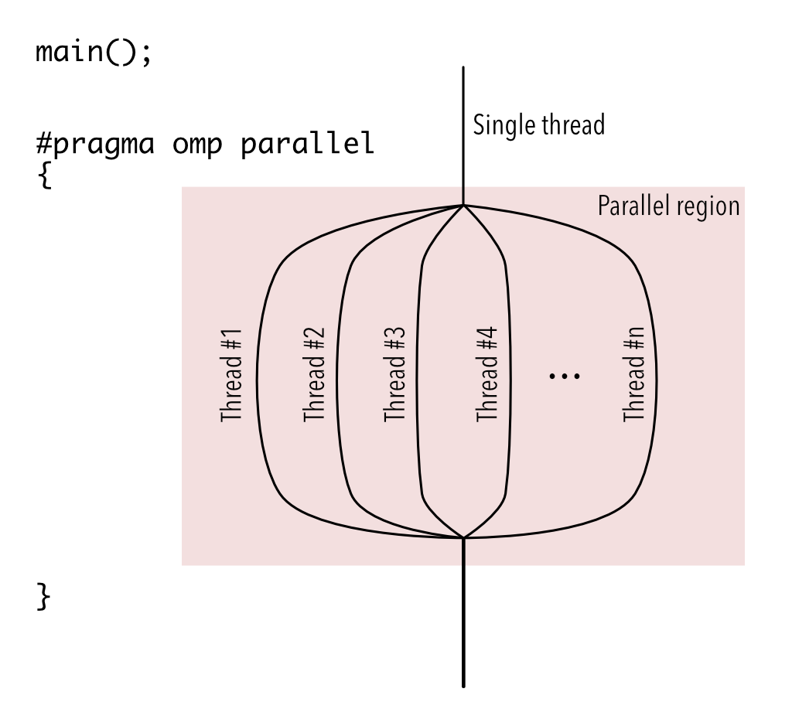
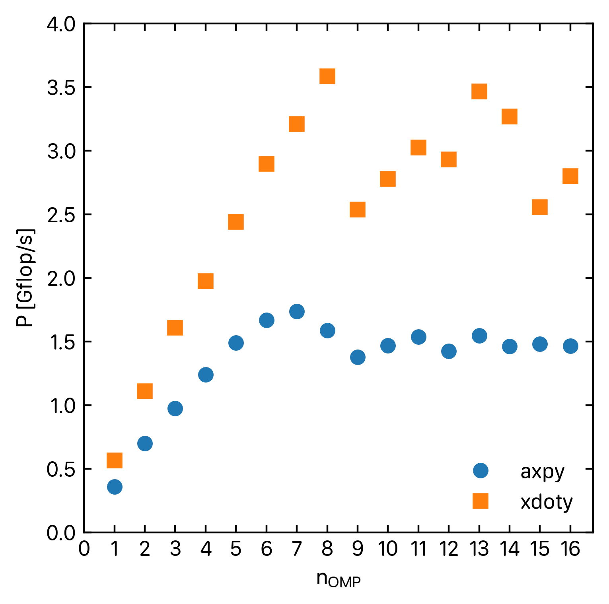
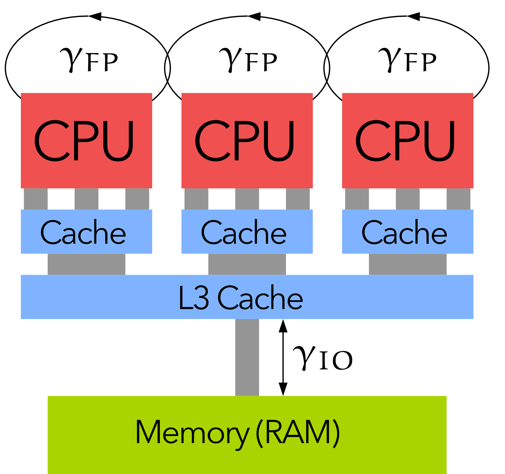
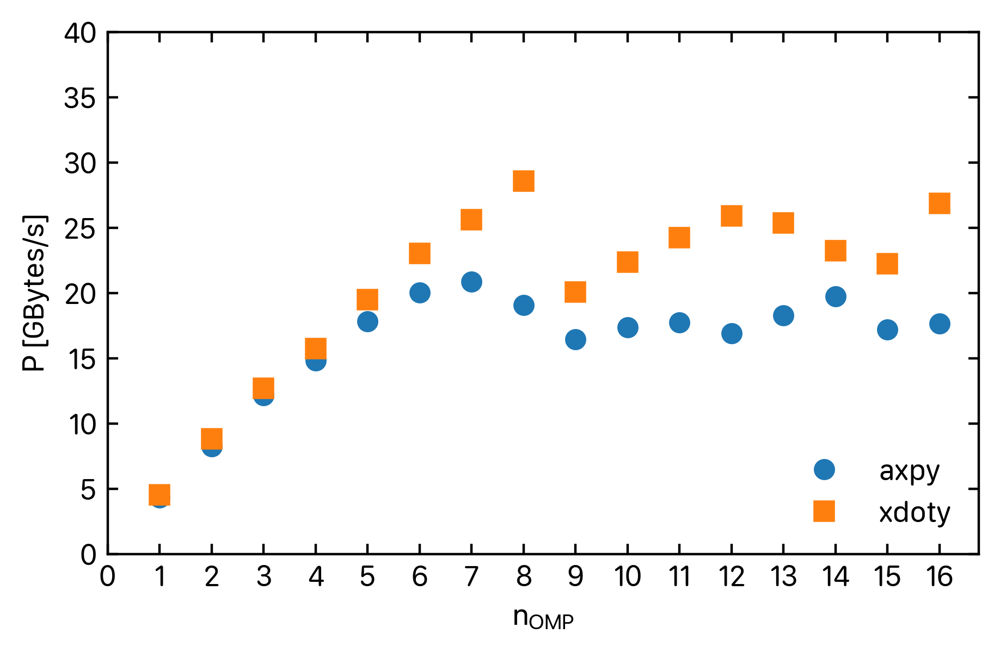
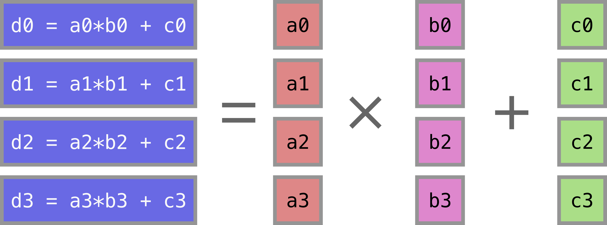
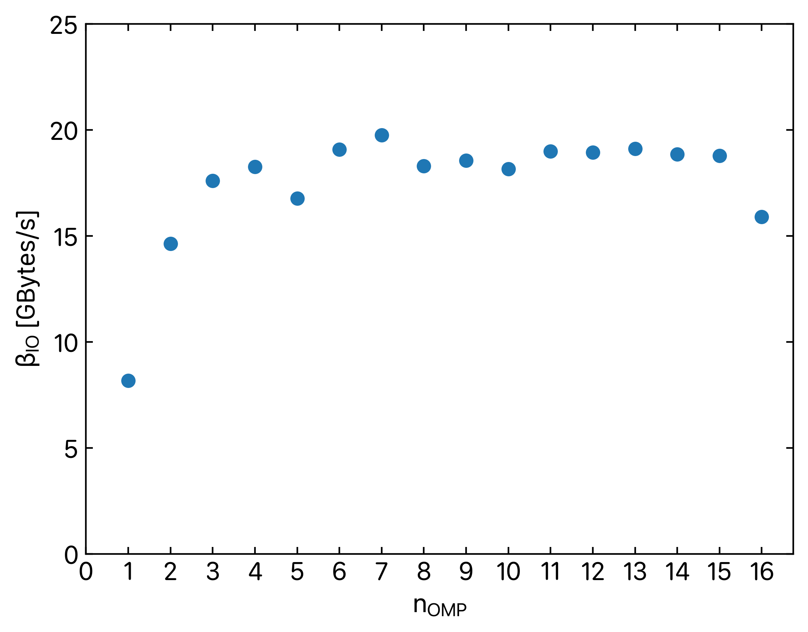
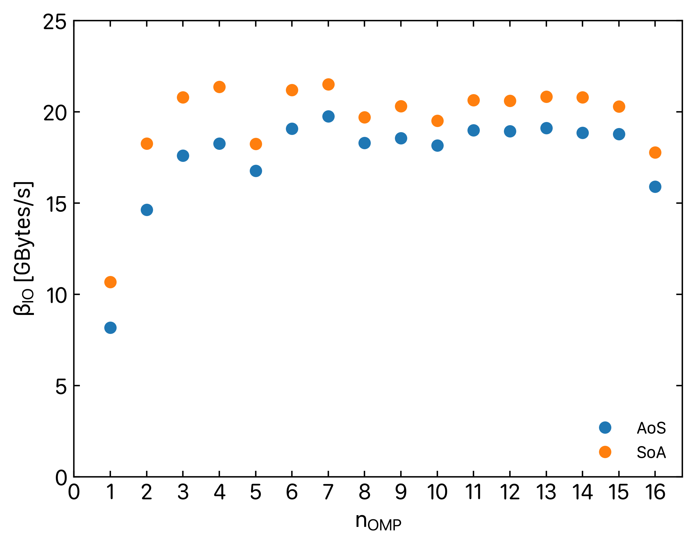
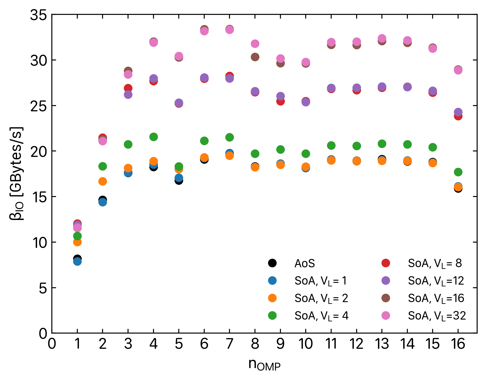

name: title
class: center, middle
layout: true
---
template: title

# Introduction to High Performance Computing

.red[\\\\\\]

.venue[

Engage Workshop on HPC and Data Science,

12$^{th}$ June $-$ 7$^{th}$ July 2023  

]

.red[\\\\\\]

.speaker[

Giannis Koutsou,

]

.sub[

Computation-based Science and Technology Research Center,

The Cyprus Institute

]
---
name: normal
layout: true
---

# Outline

### C programming best practices
- A short overview of C
  - Intended to refresh those already familiar with C 
  - Some "best practices" that will be used in the exercises
  
### Shared-memory parallel programming
- Introduction to OpenMP
  - Parallelizing programs across the cores of the same node

### Performance and optimization
- Assessing performance of programs
  - Floating point performance and memory I/O
  - Assessing bottlenecks
  
---
template: normal

# Programming in C: good practices

Some good practices when programming in C for this training

--

- The C programming language is rather low-level

--


- Many checks are omitted in favor of performance and are therefor left to the programmer  
  (here: _programmer_ `==`  _you_ )

--

- Common cases

--

	- Going off the end of an array:
```c
int A[10];
A[11] = 8;
```
--

    - Not checking the return value of a function:
```c
FILE *fp = fopen("file.txt", "r");
fscanf(fp, fmt, &var);
```  
when "file.txt" doesn't exits
--

    - Using `malloc()` and not checking the return value
```c
double *r = malloc(sizeof(double)*n);
r[0] = 1;
```  
when `malloc()` returned `NULL`

---

# Programming in C: good practices

In the following we will introduce some good practices when programming in C

--

- These are mostly functions we will define that wrap call system functions but also check their return value

--

- We will be reusing these repeatedly throughout the course

---

# Programming in C: good practices

### File I/O

- Opening files with `fopen()` does not fail gracefully in case of
  errors

```c
/***
 * Open file; print error if file pointer returned is NULL
 ***/
FILE *
uopen(const char *path, const char *mode)
{
  FILE *fp = fopen(path, mode);
  if(fp == NULL) {
    fprintf(stderr, "fopen(\"%s\", \'%s\') returned null; quitting...\n", path, mode);
    exit(-3);
  }
  return fp;
}
```

--

- We will regularly be using code in which the `fopen()` function is wrapped in a function that checks its return value 

---

# Programming in C: good practices

### Command-line arguments


- The length of `argv[]` is determined at run-time, meaning undefined
  behavior can occur if an insufficient number of arguments is
  specified on the command-line.

--

```c
/***
 * Print usage
 ***/
void
usage(char *argv[])
{
  fprintf(stderr, "usage: %s N\n", argv[0]);
  return;
}
```
-  You will regularly see examples using a function to print the program usage (i.e. the command-line arguments expected by the program)
---

template: normal

# Programming in C: good practices

- Here are these good practices applied to `pi.c`

.small[
```c
#include <stdlib.h>
#include <unistd.h>
#include <stdio.h>
#include <sys/types.h>

/* Print usage */
void
usage(char *argv[])
{
  fprintf(stderr, " Usage: %s N\n", argv[0]);  
  return;
}

int
main(int argc, char *argv[])
{
  if(argc != 2) {
    usage(argv);
    exit(1);
  }
  unsigned long int N = atol(argv[1]);
  char hname[256];
  pid_t p;
  gethostname(hname, 256);
  p = getpid();
  srand48(p);
  unsigned long int nhit = 0;
  for(unsigned long int i=0; i<N; i++) {
    double x = drand48();
    double y = drand48();
    if((x*x + y*y) < 1)
      nhit++;
  }
  double pi = 4.0 * (double)nhit/(double)N;  
  printf(" Hostname is: %s, process id is: %lu   N = %16d   pi = %lf\n", hname, p, N, pi);
  return 0;
}
```
]

---
template: normal

# Programming in C: pointers

## Pointers in C

### .center[A pointer is a variable that holds a memory address]

```c
int *ptr0;     /* <-- A pointer to a memory address that will hold an integer variable */
double *ptr1;  /* <-- A pointer to a memory address that will hold a double precision variable */
```

--

- Pointers are important in C because arrays are defined using offsets from a starting memory address
```c
int *ptr0 = malloc(sizeof(int)*7);
```
Allocates memory that can hold seven integers and returns the starting memory address into `ptr0`

--

- Accessing elements is the same as calculating offsets from the starting memory address
```c
int element_3 = ptr0[3];
```
is equivalent to:
```c
int element_3 = *(ptr0+3);
```

---
template: normal

# Programming in C: pointers

## Pointers in C

### .center[A pointer is a variable that holds a memory address]

```c
int *ptr0;     /* <-- A pointer to a memory address that will hold an integer variable */
double *ptr1;  /* <-- A pointer to a memory address that will hold a double precision variable */
```

- This also works when assigning:
```c
ptr0[3] = 42;
```
is equivalent to:
```c
*(ptr0+3) = 42;
```

--

- Note that pointer offsets take into account the type of the pointer, e.g.:
```c
int element_2 = *(ptr0+2);
```
adds `2*sizeof(int)` to the address pointed to by `ptr0` because `ptr0` is a pointer to an `int`, whereas:
```c
double element_4 = *(ptr1+4);
```
adds `4*sizeof(double)` to the address pointed to by `ptr1` because `ptr1` is a pointer to a `double`.

---
template: normal

# Programming in C: pointers

## Pointers in C

### .center[A pointer is a variable that holds a memory address]

```c
int *ptr0;     /* <-- A pointer to a memory address that will hold an integer variable */
double *ptr1;  /* <-- A pointer to a memory address that will hold a double precision variable */
```


- Note also the ampersand operator (`&`) which is in some way the inverse to `*`:
```c
double *ptr_to_element_4 = ptr1+4;
```
is equivalent to:
```c
double *ptr_to_element_4 = &(ptr1[4]);
```


---

template: normal

# Programming in C: pointers

## Pointers in C

### .center[A pointer is a variable that holds a memory address]

```c
int *ptr0;     /* <-- A pointer to a memory address that will hold an integer variable */
double *ptr1;  /* <-- A pointer to a memory address that will hold a double precision variable */
```

- The C compiler and runtime do not check whether a pointer being dereferenced is pointing to allocated memory. E.g.:
```c
int *ptr0;
int element_3 = ptr0[3];
```
The above code will compile and may even run. The value stored in `element_3` is undefined and using it may cause errors difficult to debug:

	- It may cause a generic error, such as `segmentation fault`
	- It may cause an error at a later stage in the program

--

- This feature of C contributes to its efficiency while requiring more care taken from the programmer
	- No runtime required to keep count of allocated space, array bounds, etc. every time you access or modify an array
	- Easier to introduce bugs that are especially hard to track

---

template: normal

# Programming in C: arrays

## Arrays in C: Static vs Dynamic allocation

- Statically allocated arrays  
```c
char line[256];
double x[10];
```
	- Allocated on the stack
   - Length known at compile time
   - Limited in size

--

- Dynamically allocated arrays  
```c
char *line;
double *x;
line = malloc(256*sizeof(char));
x = malloc(10*sizeof(double));
...
free(x);
free(line);
```
	- Allocated on the heap
	- Length known at run time (unknown at compile time)
	- Size restricted only by RAM constraints (e.g. maximum available contiguous RAM)

--
  
 If `malloc()` fails, it will return `NULL`

--

- Another good practice: always wrap `malloc()` in own function that checks return value is not `NULL`

---

template: normal

# Programming in C: good practices

## Arrays in C: Static vs Dynamic allocation

```c
/***
 * Allocate memory; print error if NULL is returned
 ***/
void *
ualloc(size_t size)
{
  void *ptr = malloc(size);
  if(ptr == NULL) {
    fprintf(stderr, "malloc() returned null; quitting...\n");
    exit(-2);
  }
  return ptr;
}

...

int
main(int argc, char *argv[])
{
	...
	char *line;
	double *x;
	x = ualloc(10*sizeof(double));
	line = ualloc(256*sizeof(char));
	...
	free(x);
	free(line);
	return 0;
}
```
---
template: title

# Parallel programming using OpenMP
 Introduction with examples 

---
template: normal

# Parallel programming
### Over the next three days we will introduce three models
- Shared memory programming via the use of OpenMP (today)
- Distributed memory programming via the use of MPI
- GPU programming with CUDA


---
template: normal

# OpenMP introduction

<style type="text/css">
img[alt=horiz]{width: 90%; float: center; padding: 25px}
</style>

.center[]

### OpenMP
- _Shared memory_ parallelization
- Use multiple threads that share a common memory address space
- Pragma-based, i.e. uses directives rather than functions (mostly) 
- Also an API, i.e. some simple functionality through function calls 

---
template: normal

# OpenMP introduction

<style type="text/css">
img[alt=omp]{width: 50%; float: right; padding: 25px}
</style>

.right-column-50[
.center[]
]

.left-column-50[
- Starts with a single thread
- Define _parallel regions_
- More than one parallel regions can be defined
- So-called _fork-join_ concept
]

---

template: normal

# OpenMP introduction

<style type="text/css">
img[alt=omp]{width: 50%; float: right; padding: 25px}
</style>

.right-column-50[
.center[]
]

.left-column-50[
- Starts with a single thread
- Define _parallel regions_
- More than one parallel regions can be defined
- So-called _fork-join_ concept

```c
int
main()
{
  /* ...
	 work to do outside parallel region
	 ... */
#pragma omp parallel
  {
	/* ...
	   work to do in parallel
	   ... */
  }
  /* ...
	 more work outside parallel region
	 ... */
  return 0;
}
```
]

---

template: normal

# OpenMP introduction


.right-column[
```c
int
main()
{
  /* ...
	 work to do outside parallel region
	 ... */
#pragma omp parallel
  {
	/* ...
	   work to do in parallel
	   ... */
  }
  /* ...
	 more work outside parallel region
	 ... */
  return 0;
}
```
]

.left-column[
Parallel regions:
- No jumping in or out (e.g. `goto`)
- No branching in or out (e.g. inside `if-else` block)
- A thread can terminate the program from within a block

OpenMP
- OpenMP _runtime_ takes care of thread management, forking, joining, etc.
- Specify number of threads via environment variable `OMP_NUM_THREADS`
]


---

template: normal

# OpenMP introduction


.right-column[
```c
int
main()
{
  /* ...
	 work to do outside parallel region
	 ... */
#pragma omp parallel
  {
	/* ...
	   work to do in parallel
	   ... */
  }
  /* ...
	 more work outside parallel region
	 ... */
  return 0;
}
```

```c
#include <omp.h>
...
/* Return a unique thread ID for each thread */
int tid = omp_get_thread_num();
...
/* Return the total number of threads */
int nth = omp_get_num_threads();
```
]

.left-column[
Parallel regions:
- No jumping in or out (e.g. `goto`)
- No branching in or out (e.g. inside `if-else` block)
- A thread can terminate the program from within a block

OpenMP
- OpenMP _runtime_ takes care of thread management, forking, joining, etc.
- Specify number of threads via environment variable `OMP_NUM_THREADS`
- In parallel region, use: `omp_get_thread_num()` and `omp_get_num_threads()`
]

---

template: normal

# OpenMP introduction

## Compiling and running


- Using GNU or Intel compilers, compile via:
```sh
[ikoutsou@front02 ~]$ cc -fopenmp program.c -o program
```

--

- Note that, depending on the compiler, the `#pragma` may not cause an
error **even** if you accidentally omit `-fopenmp`. You will just produce a scalar code.

--

- Run via:
```sh
[ikoutsou@front02 ~]$ export OMP_NUM_THREADS=8
[ikoutsou@front02 ~]$ ./program
```
or
```sh
[ikoutsou@front02 ~]$ OMP_NUM_THREADS=8 ./program
```
--
This will run on the frontend node.

---

template: normal

# OpenMP introduction

## Example: every thread says hi

- Make a directory for this part of the training, e.g. `omp`:
```sh
[ikoutsou@front02 engage-training]$ mkdir omp
[ikoutsou@front02 engage-training]$ cd omp
```

- Copy first exercise (`ex01`):
```sh
[ikoutsou@front02 omp]$ cp -r /nvme/scratch/engage/omp/ex01 .
[ikoutsou@front02 omp]$ cd ex01
```

- Inspect file `a.c`, compile it, and run on one node with `srun`:
```sh
[ikoutsou@front02 omp]$ more a.c
...
[ikoutsou@front02 omp]$ srun -N 1 -p p100 ./a
```
---

template: normal

# OpenMP introduction

## Example: every thread says hi

Now, let's add a parallel region around the print statement:

- Add the parallel region:

```c
#include <stdio.h>

int
main()
{
#pragma omp parallel
	{
		printf("Hi\n");
	}
	return 0;
}
```

- Compile, adding the `-fopenmp` option, then run:

```sh
[ikoutsou@front02 omp]$ cc -fopenmp -o a a.c
[ikoutsou@front02 omp]$ srun -N 1 -p p100 ./a
Hi
Hi
```
you should see 2 `Hi`s
---

template: normal

# OpenMP introduction

## Example: every thread says hi

The _default number of threads_ is 2, but we can control this with `OMP_NUM_THREADS`:

- Set `OMP_NUM_THREADS` before running. No need to compile again:

```sh
[ikoutsou@front02 omp]$ OMP_NUM_THREADS=1 srun -N 1 -p p100 ./a
Hi
[ikoutsou@front02 omp]$ OMP_NUM_THREADS=2 srun -N 1 -p p100 ./a
Hi
Hi
[ikoutsou@front02 omp]$ OMP_NUM_THREADS=3 srun -N 1 -p p100 ./a
Hi
Hi
Hi
```

- You can also set `OMP_NUM_THREADS` to something larger than 32. You
will simply be _over-subscribing_ the cores, i.e. more than one thread
will run per core.

```sh
[ikoutsou@front02 omp]$ OMP_NUM_THREADS=256 srun -N 1 -p p100 ./a
Hi
... (254 lines suppressed)
Hi
```

---

template: normal

# OpenMP introduction

## Example: every thread says hi

Now let's see how to use the OpenMP API. We want each thread that says
`Hi`, to also write its thread id and the total number of threads.

- Add the following:
1. Include `<omp.h>` in the beginning of the source code
1. Get the thread id with `omp_get_thread_num()`
1. Get the number of threads with `omp_get_num_threads()`

---

template: normal

# OpenMP introduction

## Example: every thread says hi

.small[
```c
#include <stdio.h>
#include <omp.h>

int
main()
{
#pragma omp parallel
	{
		int tid = omp_get_thread_num();
		int nth = omp_get_num_threads();
		printf("Hi, I am thread: %2d of %2d\n", tid, nth);
	}
	return 0;
}
```
]

- Compile and run as usual. You should see something like:

.small[
```sh
[ikoutsou@front02 omp]$ OMP_NUM_THREADS=5 srun -N 1 -p p100 ./a
Hi, I am thread:  0 of  5
Hi, I am thread:  3 of  5
Hi, I am thread:  4 of  5
Hi, I am thread:  1 of  5
Hi, I am thread:  2 of  5
```
]

- Note that the order by which each thread reaches the `printf()` statement is
**non-deterministic**

- Indeed, you should make no assumptions on the order by which each thread runs

---

template: normal

# OpenMP overview

We will overview some OpenMP pragmas that will be used in the
exercises and examples that follow

- The list is non-exhaustive. We will look at a subset of pragmas that
are more commonly used
- The latest specification is OpenMP version 5. The full reference can
be found here:
[OpenMP reference guide](https://www.openmp.org/wp-content/uploads/OpenMPRef-5.0-0519-web.pdf)
- Note that OpenMP is a _specification_. It defines a set of pragmas
and their functionality. Most compilers implement some version of
the specification, but not all implement the latest version

---

template: normal

# OpenMP overview

- For loops  
```c
#pragma omp parallel for
for(int i=0; i<n; i++){
			...
}
```
will split the `n` iterations over the available threads

.small[

- Static scheduling, e.g.:
.small[
```c
#pragma omp parallel for schedule(static, 10)
```
]
a chunk is 10 iterations. Threads receive a chunk to work on in order.

- Dynamic scheduling, e.g.:
.small[
```c
#pragma omp parallel for schedule(dynamic, 10)
```
]
a chunk is 10 iterations. The next available thread receives a chunk to work on until all are exhausted.

- Guided scheduling, e.g.:
.small[
```c
#pragma omp parallel for schedule(guided)
```
]
chunk size is modified as iterations are consumed.
]

---

template: normal

# OpenMP overview

- For loops
```c
#pragma omp parallel
	{
	#pragma omp for
		for(int i=0; i<n; i++){
			...
		}
	}
```
use within a parallel region, i.e. when a parallel region is already open.

- Reduction within for loop:
```c
int sum_variable = 0;
#pragma omp parallel for reduction(+: sum_variable)
for(int i=0; i<n; i++){
		sum_variable += ...;
		...
}
```
outside the parallel region, `sum_variable` contains the sum over all threads

---

template: normal

# OpenMP overview

- Critical regions: each thread should run the region one-at-a-time
```c
#pragma omp parallel
{
		#pragma omp critical
		{
			... code to be run by each thread, one-at-a-time ...
		}
}
```
of course, critical regions are **serialized**

- Single regions: within a parallel region, run by one thread
```c
#pragma omp parallel
{
		#pragma omp single
		{
			printf("Hi\n");
		}
}
```

---

template: normal

# OpenMP overview

- Tasks: define a block of code, a _task_ to be run by a thread:
```c
#pragma omp task
{
		...
}
```

- Usually we want one thread to create tasks. This is done within a `single` region
```c
int a = 1;
int b = 2;
#pragma omp parallel
{
	#pragma omp single
	{
		#pragma omp task
		{
			/* This task is created by the thread that enters the single region
			   and will be consumed by one of the threads of the pool */
			a = a+1;
		}
		#pragma omp task
		{
			/* This task is created by the thread that enters the single region
			   and will be consumed by one of the threads of the pool */
			b = b+1;
		}
	}
}
```

---

template: normal

# OpenMP overview

- Data sharing attributes
```c
int a = 1;
int b = 2;
#pragma omp parallel private(a) shared(b)
{
		...
}
```

- Each thread will have a local copy of `a`. Modifying `a` within the
parallel region?
- The variable `b` is shared between threads. Each thread can modify
it and all threads will see the same data

- You can also set a default attribute for data sharing
```c
int a = 1, b = 2, c = 3, d = 4, e = 5;
# pragma omp parallel default(shared) private(b)
{
		...
}
```

- All variables are shared, except `b` which is private

---

template: normal

# OpenMP Examples

### Data sharing example

- Copy `ex02` as before:
```sh
[ikoutsou@front02 ex01]$ cd ../
[ikoutsou@front02 omp]$ cp -r /nvme/scratch/engage/omp/ex02 .
[ikoutsou@front02 omp]$ cd ex02
```

- Inspect, compile, and run `a.c`:
```sh
[ikoutsou@front02 ex02]$ cc -fopenmp -o a a.c
```
--
```sh
[ikoutsou@front02 omp]$ OMP_NUM_THREADS=5 srun -N 1 -p p100 ./a
Thread:  2 of  5, some_var = 42
Thread:  4 of  5, some_var = 42
Thread:  0 of  5, some_var = 42
Thread:  1 of  5, some_var = 42
Thread:  3 of  5, some_var = 42
```
all threads have `some_var` set to the value `42`

---

template: normal

# OpenMP Examples

### Data sharing example

- Now change the code so that the variable is modified within the parallel block, for example:

```c
#include <stdio.h>
#include <omp.h>

int
main()
{
  int some_var = 42;
#pragma omp parallel
  {
	int tid = omp_get_thread_num();
	some_var = tid;
	int nth = omp_get_num_threads();
	printf("Thread: %2d of %2d, some_var = %d\n", tid, nth, some_var);
  }
  return 0;
}
```
--

- Compile and run. Run it a few times. The output is non-deterministic, for example:

.small[
```sh
[ikoutsou@front02 ex02]$ OMP_NUM_THREADS=5 srun -N 1 -p p100 ./a
Thread:  3 of  5, some_var = 3
Thread:  4 of  5, some_var = 4
Thread:  2 of  5, some_var = 4
Thread:  1 of  5, some_var = 1
Thread:  0 of  5, some_var = 3
```
]

---

template: normal

# OpenMP Examples

### Data sharing example

- Set the variable to private, to avoid this _race condition_

```c
#include <stdio.h>
#include <omp.h>

int
main()
{
  int some_var = 42;
#pragma omp parallel private(some_var)
  {
	int tid = omp_get_thread_num();
	some_var = tid;
	int nth = omp_get_num_threads();
	printf("Thread: %2d of %2d, some_var = %d\n", tid, nth, some_var);
  }
  return 0;
}
```
--

```sh
[ikoutsou@front02 ex02]$ OMP_NUM_THREADS=5 srun -N 1 -p p100 ./a
Thread:  0 of  5, some_var = 0
Thread:  4 of  5, some_var = 4
Thread:  2 of  5, some_var = 2
Thread:  3 of  5, some_var = 3
Thread:  1 of  5, some_var = 1
```

--

- What is the value of `some_var` after the parallel region ends?

---

template: normal

# OpenMP Examples

### Data sharing example

- Initial value of a private variable

```c
#include <stdio.h>
#include <omp.h>

int
main()
{
  int some_var = 42;
#pragma omp parallel private(some_var)
  {
	int tid = omp_get_thread_num();
	some_var = some_var+tid;
	int nth = omp_get_num_threads();
	printf("Thread: %2d of %2d, some_var = %d\n", tid, nth, some_var);
  }
  return 0;
}
```

- What does this code to produce?

--

- `some_var` is uninitialized in the parallel region. Its initial value is undefined and not guaranteed to be zero.

--

- Replace `private(some_var)` with `firstprivate(some_var)`.

---

template: normal

# OpenMP Examples

### Data sharing example

- Shared vs private array

.small[
```c
#include <stdio.h>
#include <omp.h>

int
main()
{
  int arr[32] = {0,0,0,0,0,0,0,0,0,0,0,0,0,0,0,0,0,0,0,0,0,0,0,0,0,0,0,0,0,0,0,0};
#pragma omp parallel shared(arr)
  {
	int tid = omp_get_thread_num();
	int nth = omp_get_num_threads();
	arr[tid] = tid;
  }
  
  for(int i=0; i<32; i++) {
	printf("arr[%d] = %d\n", i, arr[i]);
  }
  return 0;
}
```
]

- What do you expect the output of this program to be?

--

.small[
```sh
[ikoutsou@front02 ex02]$ OMP_NUM_THREADS=5 srun -N 1 -p p100  ./a
arr[0] = 0
arr[1] = 1
arr[2] = 2
arr[3] = 3
arr[4] = 4
arr[5] = 0
arr[6] = 0
...
arr[30] = 0
arr[31] = 0
```
]
---

template: normal

# OpenMP Examples

### The `task` directive

- Copy `ex03` as before:

```sh
[ikoutsou@front02 ex02]$ cd ../
[ikoutsou@front02 omp]$ cp -r /nvme/scratch/engage/omp/ex03 .
[ikoutsou@front02 omp]$ cd ex03
```

--

- Inspect, compile, and run `a.c`:

--

```sh 
[ikoutsou@front02 ex03]$ cc -std=c99 -fopenmp -o a a.c
[ikoutsou@front02 ex03]$ OMP_NUM_THREADS=5 srun -N 1 -p p100 ./a
Hi, I am thread:  0 of  5
Hi, I am thread:  1 of  5
Hi, I am thread:  4 of  5
Hi, I am thread:  3 of  5
Hi, I am thread:  2 of  5
```

---

template: normal

# OpenMP Examples

### The `task` directive

- Enclose the print statement in an `omp single` region:

```c
  #pragma omp parallel
  {
    #pragma omp single
    {
      int tid = omp_get_thread_num();
      int nth = omp_get_num_threads();
      printf("Hi, I am thread: %2d of %2d\n", tid, nth);
    }
  }
```

--

- Compile and run a few times:

--

```sh 
[ikoutsou@front02 ex03]$ OMP_NUM_THREADS=5 srun -N 1 -p p100 ./a
Hi, I am thread:  0 of  5
[ikoutsou@front02 ex03]$ OMP_NUM_THREADS=5 srun -N 1 -p p100 ./a
Hi, I am thread:  1 of  5
[ikoutsou@front02 ex03]$ OMP_NUM_THREADS=5 srun -N 1 -p p100 ./a
Hi, I am thread:  3 of  5
[ikoutsou@front02 ex03]$ OMP_NUM_THREADS=5 srun -N 1 -p p100 ./a
Hi, I am thread:  0 of  5
[ikoutsou@front02 ex03]$ OMP_NUM_THREADS=5 srun -N 1 -p p100 ./a
Hi, I am thread:  3 of  5
```

--

- Each time a single thread calls the `printf()`. Which thread this is, is random.

---

template: normal

# OpenMP Examples

### The `task` directive

- Now try the following:

.small[
```c
#include <stdio.h>
#include <omp.h>

void
hi(int i)
{
  int tid = omp_get_thread_num();
  int nth = omp_get_num_threads();
  printf("%d: Hi, I am thread: %2d of %2d\n", i, tid, nth);
  return;
}

int
main()
{
  #pragma omp parallel
  {
#pragma omp single
    {
      hi(0);
#pragma omp task 
      {
	     hi(1);
      }
      
#pragma omp task 
      {
	     hi(2);
      }
    }
  }
  return 0;
}
```
]


- Compile and run a few times

---

template: normal

# OpenMP Examples

### The `task` directive

- Run a few times:

```sh
[ikoutsou@front02 ex03]$ OMP_NUM_THREADS=5 srun -N 1 -p p100 ./a
1: Hi, I am thread:  2 of  5
2: Hi, I am thread:  0 of  5
[ikoutsou@front02 ex03]$ OMP_NUM_THREADS=5 srun -N 1 -p p100 ./a
1: Hi, I am thread:  4 of  5
2: Hi, I am thread:  2 of  5
[ikoutsou@front02 ex03]$ OMP_NUM_THREADS=5 srun -N 1 -p p100 ./a
2: Hi, I am thread:  2 of  5
1: Hi, I am thread:  4 of  5
```

--

- Explanation:

	- The thread within the `omp single` region encounters a `task` and
   dispatches it to idle threads to run

	- Which thread picks up the task is random

	- Which task of the two is run first is also random

---

template: normal

# OpenMP Examples

### The `task` directive

- The `taskwait` directive can be used to ensure the order in which tasks are run:

.smaller[
```c
#include <stdio.h>
#include <omp.h>

void
hi(int i)
{
  int tid = omp_get_thread_num();
  int nth = omp_get_num_threads();
  printf("%d: Hi, I am thread: %2d of %2d\n", i, tid, nth);
  return;
 }

int
main()
{
#pragma omp parallel
  {
#pragma omp single
    {
      hi(0);
#pragma omp task 
      {
		hi(1);
      }
#pragma omp taskwait

#pragma omp task 
      {
		hi(2);
      }
    }
  }
  return 0;
}
```
]

- This way, the first `printf()` is always run first

---
# OpenMP Examples

### Linear algebra

Operation:
$$
z_i = a x_i + y_i
$$

- Copy `ex04` as before:

```sh
[ikoutsou@front02 ex03]$ cd ../
[ikoutsou@front02 omp]$ cp -r /nvme/scratch/engage/omp/ex04 .
[ikoutsou@front02 omp]$ cd ex04
```

- Inspect, compile, and run `axpy.c`:

```sh
[ikoutsou@front02 ex04]$ cc -std=c99 -fopenmp -o axpy axpy.c
[ikoutsou@front02 ex04]$ OMP_NUM_THREADS=5 srun -N 1 -p p100 ./axpy $((1024*1024*32))
t0 = 0.184823 sec, t1 = 0.183408 sec, diff z norm = 0.000000e+00
```

--

- Use an OpenMP pragma to parallelize the second occurrence of the main for loop

---

template: normal

# OpenMP Examples

### Linear algebra

Operation:
$$
z_i = a x_i + y_i
$$

- Change:

.left-column[

```c

for(int i=0; i<n; i++) {
  z_1[i] = a*x[i] + y[i];
}	
```

]

.right-column[

```c
#pragma omp parallel for
for(int i=0; i<n; i++) {
  z_1[i] = a*x[i] + y[i];
}
```

]

--

.one-column[

- It's also useful to report the total number of threads:

```c
#pragma omp parallel
{
	int nth = omp_get_num_threads();
#pragma omp single
	printf(" nth = %2d, t0 = %lf sec, t1 = %lf sec, diff z norm = %e\n", nth, t0, t1, norm);
}
```

]

---

template: normal

# OpenMP Examples

### Linear algebra

Operation:
$$
z_i = a x_i + y_i
$$

- Run for `OMP_NUM_THREADS` from 1, 2, and 4

--
```sh
[ikoutsou@front02 ex04]$ OMP_NUM_THREADS=1 srun -N 1 -p p100 ./axpy $((1024*1024*32))
nth =  1, t0 = 0.189664 sec, t1 = 0.190893 sec, diff z norm = 0.000000e+00
```
--
```sh
[ikoutsou@front02 ex04]$ OMP_NUM_THREADS=2 srun -N 1 -p p100 ./axpy $((1024*1024*32))
 nth =  2, t0 = 0.189602 sec, t1 = 0.208421 sec, diff z norm = 0.000000e+00
```
--
```sh
[ikoutsou@front02 ex04]$ OMP_NUM_THREADS=4 srun -N 1 -p p100 ./axpy $((1024*1024*32))
nth =  4, t0 = 0.189870 sec, t1 = 0.177122 sec, diff z norm = 0.000000e+00
```
--

- If you see no improvement (like above), this is because of default
  configuration of Slurm which is reserving only on CPU core for all threads

--

- Use `--cpus-per-task`
```sh
[ikoutsou@front02 ex04]$ OMP_NUM_THREADS=4 srun -N 1 --cpus-per-task=8  -p p100 ./axpy $((1024*1024*32))
 nth =  4, t0 = 0.190278 sec, t1 = 0.076620 sec, diff z norm = 0.000000e+00
```

---

template: normal

# OpenMP Examples

### Linear algebra

Operation:
$$
z_i = a x_i + y_i
$$

- Run for `OMP_NUM_THREADS` from 1,...,16. How does the runtime scale?

--

```sh
[ikoutsou@front02 ex04]$ for ((n=1;n<=16;n++))
> do
> OMP_NUM_THREADS=$n srun -N 1 --cpus-per-task=16 -p p100 ./axpy $((1024*1024*32))
> done
```
--
```sh
 nth =  1, t0 = 0.193750 sec, t1 = 0.188692 sec, diff z norm = 0.000000e+00
 nth =  2, t0 = 0.189765 sec, t1 = 0.100701 sec, diff z norm = 0.000000e+00
 nth =  3, t0 = 0.190360 sec, t1 = 0.069096 sec, diff z norm = 0.000000e+00
 nth =  4, t0 = 0.190162 sec, t1 = 0.054089 sec, diff z norm = 0.000000e+00
 nth =  5, t0 = 0.190272 sec, t1 = 0.046232 sec, diff z norm = 0.000000e+00
 nth =  6, t0 = 0.190350 sec, t1 = 0.043563 sec, diff z norm = 0.000000e+00
 nth =  7, t0 = 0.189885 sec, t1 = 0.046004 sec, diff z norm = 0.000000e+00
 nth =  8, t0 = 0.190094 sec, t1 = 0.049178 sec, diff z norm = 0.000000e+00
 nth =  9, t0 = 0.190417 sec, t1 = 0.053296 sec, diff z norm = 0.000000e+00
 nth = 10, t0 = 0.190363 sec, t1 = 0.052475 sec, diff z norm = 0.000000e+00
 nth = 11, t0 = 0.190555 sec, t1 = 0.049990 sec, diff z norm = 0.000000e+00
 nth = 12, t0 = 0.190282 sec, t1 = 0.052795 sec, diff z norm = 0.000000e+00
 nth = 13, t0 = 0.190432 sec, t1 = 0.047412 sec, diff z norm = 0.000000e+00
 nth = 14, t0 = 0.190005 sec, t1 = 0.050105 sec, diff z norm = 0.000000e+00
 nth = 15, t0 = 0.190366 sec, t1 = 0.052813 sec, diff z norm = 0.000000e+00
 nth = 16, t0 = 0.189355 sec, t1 = 0.055658 sec, diff z norm = 0.000000e+00
```

---

# OpenMP Examples

### Linear algebra

Operation:
$$
z_i = a x_i + y_i
$$

How many floating point operations are carried out?

---


# OpenMP Examples

### Linear algebra

Operation:
$$
z_i = a x_i + y_i
$$

How many floating point operations are carried out?

--

- For each iteration, i.e. for each element `i`

--
  - One multiplication ($ax_i$)

--
  - One addition ($+y_i$)
  
--
- Therefore, in total, `2*n` floating point operations, irrespective of the number of processes

--
- Modify the code to also report the _sustained Gflop/s_ of the parallelized `axpy` part

--

.small[
```c
double p = 2.0*n/t1/1e9;
printf(" nth = %2d, t0 = %lf sec, t1 = %lf sec, diff z norm = %e, perf = %lf Gflop/s\n", nth, t0, t1, norm, p);
```
]

--

.small[
```sh
 nth =  1, t0 = 0.190348 sec, t1 = 0.191444 sec, diff z norm = 0.000000e+00, perf = 0.350541 Gflop/s
 nth =  2, t0 = 0.189958 sec, t1 = 0.100351 sec, diff z norm = 0.000000e+00, perf = 0.668741 Gflop/s
 nth =  3, t0 = 0.190160 sec, t1 = 0.069478 sec, diff z norm = 0.000000e+00, perf = 0.965900 Gflop/s
 nth =  4, t0 = 0.190210 sec, t1 = 0.053918 sec, diff z norm = 0.000000e+00, perf = 1.244649 Gflop/s
 nth =  5, t0 = 0.190225 sec, t1 = 0.047717 sec, diff z norm = 0.000000e+00, perf = 1.406397 Gflop/s
 nth =  6, t0 = 0.190323 sec, t1 = 0.046019 sec, diff z norm = 0.000000e+00, perf = 1.458291 Gflop/s
 nth =  7, t0 = 0.190325 sec, t1 = 0.043696 sec, diff z norm = 0.000000e+00, perf = 1.535815 Gflop/s
 nth =  8, t0 = 0.189879 sec, t1 = 0.047487 sec, diff z norm = 0.000000e+00, perf = 1.413204 Gflop/s
 ...
 nth = 15, t0 = 0.190361 sec, t1 = 0.046568 sec, diff z norm = 0.000000e+00, perf = 1.441097 Gflop/s
 nth = 16, t0 = 0.190455 sec, t1 = 0.057025 sec, diff z norm = 0.000000e+00, perf = 1.176833 Gflop/s
```
]

---

template: normal

# OpenMP Examples

### Linear algebra

Dot product operation:
$$
r = x^T y = \sum_{i=0}^{n-1} x_i  y_i
$$

- Copy `ex05` as before:

```sh
[ikoutsou@front02 ex04]$ cd ../
[ikoutsou@front02 omp]$ cp -r /nvme/scratch/engage/omp/ex05 .
[ikoutsou@front02 omp]$ cd ex05
```

--

- Inspect, compile, and run `xdoty.c`:

```sh 
[ikoutsou@front02 ex05]$ cc -std=c99 -o xdoty xdoty.c
[ikoutsou@front02 ex05]$ srun -N 1 -p p100 ./xdoty $((32*1024*1024))
 t0 = 0.115235 sec, t1 = 0.116372 sec, norms = 8.387960e+06, 8.387960e+06
```

--

- Use an OpenMP pragma to parallelize the second occurrence of the main for loop

---

template: normal

# OpenMP Examples

### Linear algebra

Dot product operation:
$$
r = x^T y = \sum_{i=0}^{n-1} x_i  y_i
$$

.left-column[

```c
double norm_1 = 0;

for(int i=0; i<n; i++) {
   norm_1 += x[i]*y[i];
}
```

]

.right-column[

```c
double norm_1 = 0;
#pragma omp parallel for reduction(+:norm_1)
for(int i=0; i<n; i++) {
   norm_1 += x[i]*y[i];
}
```

]

--

.one-column[

- Try, e.g. 4 threads

```sh
[ikoutsou@front02 ex05]$ OMP_NUM_THREADS=4 srun -N 1 --cpus-per-task=16 -p p100 ./xdoty $((32*1024*1024))
nthr =   4, t0 = 0.123636 sec, t1 = 0.034272 sec, norms = 8.387960e+06, 8.387960e+06
```
]
 

---

template: normal

# OpenMP Examples

### Linear algebra

Dot product operation:
$$
r = x^T y = \sum_{i=0}^{n-1} x_i  y_i
$$

How many floating point operations are carried out?

--

- Modify the code to also report the _sustained Gflop/s_ of the parallelized `xdoty` part

---
# Understanding Performance

### Performance analysis and optimization
- Understanding of program performance
- Understanding of hardware characteristics in terms of performance
- Understanding of _potential_ performance of a program given the hardware characteristics
- Optimization steps to approach potential performance

---

# OpenMP Examples
### Linear algebra

Operation:
$$
z_i = a x_i + y_i
$$

--

.center[Number of _floating point operations_]

--
- For each iteration, i.e. for each element `i`

--
  - One multiplication ($ax_i$)
  
--
  - One addition ($+y_i$)

--
- Therefore, a total of 2 floating point operations per iteration


--

- For `n` iterations, `2*n` floating point operations (flops) in total

--

- If the `2*n` flops require `t1` seconds, the floating point rate is: `2*n/t1` flops/s

--

- Equivalently `2*n/t1/1e9` Gflops/s

--

.small[
```c
double p = 2.0*n/t1/1e9;
printf(" nth = %2d, t0 = %lf sec, t1 = %lf sec, diff z norm = %e, perf = %lf Gflop/s\n", nth, t0, t1, norm, p);
```
]

---
# OpenMP Examples
### Linear algebra

Operation:
$$
r = \sum_{i=0}^{n-1} x_i\cdot  y_i
$$

--

.center[Number of _floating point operations_]

--
- For each iteration, i.e. for each element `i`

--
  - One multiplication ($x_i\cdot y_i$)
  
--
  - One addition ($r = r + x_i\cdot y_i$)

--
- Therefore, a total of 2 floating point operations per iteration

--
- For `n` iterations, `2*n/t1/1e9` in Gflops/s


---

# OpenMP for linear algebra

```sh
[ikoutsou@cyclamen ex01]$ for ((n=1; n<=16; n++))
> do OMP_NUM_THREADS=${n} srun -N 1 -p phi --cpus-per-task=16 ./axpy $((32*1024*1024))
> done
```
--
Similarly for `xdoty`
--

.left-column[
.center[
.small[
$n_{OMP}$  | `axpy` [Gflop/s] | `xdoty` [Gflop/s]   
-----------:|--------:| ------:  
  1         | 0.36| 0.57
  2         | 0.70| 1.11
  3         | 0.98| 1.61
  4         | 1.24| 1.98
  5         | 1.49| 2.44
  6         | 1.67| 2.90
  7         | 1.74| 3.21
  8         | 1.59| 3.59
  9         | 1.38| 2.54
 10         | 1.47| 2.78
 11         | 1.54| 3.03
 12         | 1.42| 2.93
 13         | 1.55| 3.47
 14         | 1.46| 3.27
 15         | 1.48| 2.56
 16         | 1.47| 2.80
 ]
 ]
]

--
<style type="text/css">
img[alt=scaling]{width: 80%; float: center; padding: 5px}
</style>

.right-column[
.center[]
]

--

.right-column[
- See `/nvme/scratch/engage/omp/ex06/`
]

---
template: title

# Performance Analysis

---
template: normal
# Performance analysis 

## Understand performance and hardware to evaluate the potential performance of your code

- Performance analysis: analysis of the performance of a code; comparison to what is expected

- Identification of bottlenecks

- Identification of improvements that can be made

--

## Hardware characteristics

--

.left-column[
### Peak floating point rate
- The theoretical, highest number of floating point operations that
  can be carried out by a computational unit
- Depends on: clock rate, vector length, FPUs per core, cores per socket
]

--

.right-column[
### Peak bandwidth
- The theoretical, highest number of bytes that can be read/written
  from/to some level of memory (L1,2,3 cache, RAM, etc.)
- For RAM: data rate, channels, ranks, banks
]

--

.one-column[.red[When optimizing, it is important to have these numbers in mind for the machine you're running on]]

---

# Phi GPU nodes
#### On Linux, you can obtain processor details via `cat /proc/cpuinfo`:

```bash
processor       : 0
vendor_id       : GenuineIntel
...
model name      : Intel(R) Xeon(R) Gold 6130 CPU @ 2.10GHz
...
cpu MHz         : 1435.371
cache size      : 22528 KB
physical id     : 0
siblings        : 32
core id         : 0
cpu cores       : 16
...
flags           : fpu vme de pse tsc msr pae mce cx8 ... 
```
Look up the processor on [https://ark.intel.com](https://ark.intel.com)

---

# Peak performance

- Peak Floating Point rate
  - 16-cores per socket, 2 sockets per node, clock: 2.1 GHz
  - Best case: two 512-bit multiply-and-add per cycle (AVX-512 FMA)
	- In double precision: 2$\times$(8 `mul` + 8 `add`) per cycle = 32 flop/cycle
	- Therefore: 2.1x10$^9$ cycles/s $\times$ 32 flop/cycle = 67.2 Gflop/s per core
	- 2.1 Tflop/s per node
- Peak BW
  - 128 GB/s to RAM (per socket)
  - Assuming all channels filled, two sockets $\Rightarrow$ 256 GB/s
- Some (semi-)standard tools
  - On Linux, you can obtain processor details via `cat /proc/cpuinfo`.
  - You can obtain topology and memory info e.g. `hwloc`, `dmidecode`
    (latter requires access to `/dev/mem`)

---
# Computational kernels

### Sustained performance
- Sustained FP-rate: the measured, average number of floating point
  operations carried out by the kernel per unit time
  - `add`, `sub`, and `mul` count as 1 flop
  - `dev`, `sqrt`, `sin`, etc. count $\ge$ 2 flops. Depends on architecture
  - Count number of flops in kernel and divide by runtime
  - Alternatively, or for more complex codes, use performance counters

#### In our examples we will see cases of kernels where the flops are countable

- Sustained BW: the measured, average bytes read/written from main memory per unit time
  - As in the case of FP-rate, count bytes needed to be read and bytes
    needed to be written to and from RAM and divide by run time
  - .red[_Maximum data reuse_] assumption: "local" data, once read
     from RAM, never needs to be re-read

---
# Maximum data reuse

- A (hopefully) familiar example:

  $y_{i} = a \cdot x_i + y_i$, $i = 0,...,L-1$

- It's implementation in C:

.left-column[

```c
double y[L]; /* Or malloc() */
double x[L]; /* Or malloc() */
double a;

/* ...  Some initialization of a, x, and y
 *  omitted here ...
 */

for(int i=0; i<L; i++) {
  y[i] = a*x[i] + y[i];
}
```
]

--

.right-column[
- Number of flops
    - $N_{fp} = L \cdot 2$
- Number of bytes of I/O
	- $N_{IO} = w\cdot (3\cdot L)$
		- Read each element of $y$ once
		- Read each element of $x$ once
		- Write an element of $y$ once
    - $w$: word-length in bytes, e.g. 
        - $w=4$ bytes for single precision,
        - $w=8$ bytes for double, etc.

]

--
.left-column[

- How about the memory accesses of $a$?

- Maximum data reuse assumption: $a$ is read only in the first
iteration and remains in _cache_ for all following iterations

]

---
# Maximum data reuse

- Another example:

  $$
  y\_{i} = \sigma \cdot (x\_i - x_{i-1}),\;\;\;\; i = 1,...,L-1
  $$

- It's implementation in C:

```c
double y[L]; /* Or malloc() */
double x[L]; /* Or malloc() */
double sigma;

/* ...  Some initialization of sigma, x, and y omitted here ...
 */

for(int i=1; i<L; i++) {
  y[i] = sigma*(x[i] - x[i-1]);
}
```

- Number of flops
    - $N_{fp} = (L-1) \cdot 2$	
--
    - For practical purposes, when $L\gg$, this is $N_{fp}\simeq L\cdot 2$
--
- Number of bytes of I/O
	- In each iteration, read two elements of $x$ and write one of $y$

--
	- **But**, one element of $x$ has been read during previous iteration  
	
--
	$\Rightarrow$ $N_{IO} = w\cdot(2 \cdot (L - 1) + 1)\simeq w\cdot 2\cdot L$


---
# Maximum data reuse

For counting $N_{IO}$, looking at the iteration unrolled may help to
reveal data reuse

```c
y[  1] = sigma*(x[  1] - x[  0]);
y[  2] = sigma*(x[  2] - x[  1]);
y[  3] = sigma*(x[  3] - x[  2]);
...
y[L-1] = sigma*(x[L-1] - x[L-2]);
```

`sigma` and elements of `x[]` are required multiple times. However we
assume they only need to be read once.

--

- Given some measurement of the run-time $\bar{T}$

  - FP-rate: $\beta\_{fp} = \frac{N\_{fp}}{\bar{T}}$
  
  - IO-rate: $\beta\_{IO} = \frac{N\_{IO}}{\bar{T}}$
  
--


- This motivates defining their ratio, which is referred to as *.red[intensity]* 


$$
I=\frac{N\_{fp}}{N\_{IO}}
$$


---
# Intensities

### Computational kernel intensity
- Ratio of kernel floating point operations to bytes of I/O
- For our previous example:
  - $I\_k=\frac{N\_{fp}}{N\_{IO}}=\frac{2 L}{2 w L} = 1/w$
  - Note how the problem size $L$ drops out $\Rightarrow$ constant
    $I\_k$ irrespective of problem size
  - E.g. for double precision ($w=8$), $I\_k$=0.125 flops/byte

### Machine flop/byte ratio

.left-column-40[
- Similarly to $I\_k$, we can define the _machine flop/byte ratio_ ($I\_m$)
- $I\_m=\frac{\gamma\_{fp}}{\gamma\_{IO}}$
- E.g. for Cyclamen nodes: $I\_m =$\~$8 \frac{flop}{byte}$
]

<style type="text/css">
	img[alt=vn]{width: 60%; float: center; padding: 5px}
</style>

.right-column-40[]

---

# Intensities

### Balance between kernel / hardware intensities

- $I\_k \gg I\_m$: Kernel is "compute-bound" on this
  architecture. Higher $\gamma\_{fp}$ would lead to higher
  performance, but higher $\gamma\_{IO}$ would not necessarily.
- $I\_k \ll I\_m$: Kernel is "bandwidth-" or "memory-bound" on this
  architecture. Higher $\gamma\_{IO}$ would lead to higher
  performance, but higher $\gamma\_{fp}$ would not necessarily.
- $I\_k \simeq I\_m$: Kernel is balanced on this architecture. Ideal situation.

#### For the example we have been studying
- $I\_k \ll I\_m$ $\Rightarrow$ the kernel is memory-bound 

### .red[Note the assumptions] that enter $I_k$ and $I_m$
- $\gamma\_{fp}$ considers all operations can be a sequence of multiply-and-add
- $\beta\_{IO}$ assumes maximum data reuse
- $I\_k$ constant if problem size $L$ drops out

---

# Kernel computational intensity

### Another example: matrix-matrix multiplication

- Consider a matrix-matrix multiplication: $C\_{M\times K}=A\_{M\times
  N}\cdot B\_{N\times K}$

.left-column[

```c
double C[M][K];
double A[M][N];
double B[N][K];

for(int m=0; m<M; m++) {
  for(int k=0; k<K; k++) {		  
	C[m][k] = 0;
    for(int n=0; n<N; n++) {
	  C[m][k] += A[m][n]*B[n][k];
    }
  }
}
```

]

--

.right-column[

- $N_{fp} = 2\cdot M\cdot K\cdot N$

- $N_{IO} = w\cdot(M\cdot K + M\cdot N + N\cdot K)$

- $I_{k} = \frac{2}{w}\dfrac{1}{\frac{1}{M} + \frac{1}{N} + \frac{1}{K}}$

- E.g. for a square problem $M=N=K$, $\Rightarrow I_k=\frac{2}{3}\dfrac{N}{w}$

]

--

.one-column[

- This is an example of a kernel where $I_k$ .green[depends on the problem size].

- On a given architecture with $I\_m$, the kernel transitions from
bandwidth-bound to compute-bound as $N$ increases.

- The kernel is balanced when $N\simeq 48$.]

---

# Optimization

### Given a code you wish to optimize, for an architecture with $I\_m$

- What is $N\_{fp}$ and $N\_{IO}$ and what is the resulting $I\_k$?
- Is the kernel memory or compute bound on this architecture?
- What do you obtain for $\beta\_{fp}$ and $\beta\_{IO}$
    - For this one requires measuring the performance on the targeted
      architecture
- What are the ratios $\frac{\beta\_{fp}}{\gamma\_{fp}}$ and
$\frac{\beta\_{IO}}{\gamma\_{IO}}$?

#### These are questions you need to answer before considering optimization ####

- After answering the above, we can start considering targeted
  optimizations for our kernel on the given machine
  - If your kernel is .green[memory-bound], we should be trying to optimize
  for .green[memory I/O]. Ideally we try to achieve
  a $\frac{\beta\_{IO}}{\gamma\_{IO}}\rightarrow 1$.
  - If your kernel is .green[compute-bound], we should be trying to
  optimize for a higher .green[FP-rate]. Ideally we try to achieve a
  $\frac{\beta\_{fp}}{\gamma\_{fp}}\rightarrow 1$.

---
# Performance analysis

## Back to our linear algebra kernels

`axpy`:
$$
y\_i \leftarrow a\cdot x\_i + y_i
$$

`xdoty`:
$$
r =  \sum\_i x\_i \cdot y_i
$$

--

- Take `xdoty.c` and `axpy.c` from `/nvme/scratch/engage/omp/ex06/`
  and modify them to report sustained bandwidth

--

- Run for 1 to 16 OpenMP threads and plot $\beta\_{IO}$ versus $n\_{OMP}$ for both programs on the same plot

--
<style type="text/css">
	img[alt=axpy]{width: 40%; float: center; padding: 5px}
</style>

.center[]

---

name: vec
layout: true

# Vectorization

### Most modern processors have some vectorization capabilities
- SSE, AVX, AltiVec, QPX, NEON
- Single Instruction Multiple Data -- SIMD

---
template: vec
name: vec-1

.left-column[
```c
for(int i=0; i<L; i++)
  y[i] = a*x[i] + y[i];
```
]
---
template: vec-1
name: vec-2

.right-column[
```c
for(int i=0; i<L; i+=4) {
  y[i  ] = a*x[i  ] + y[i  ];
  y[i+1] = a*x[i+1] + y[i+1];
  y[i+2] = a*x[i+2] + y[i+2];
  y[i+3] = a*x[i+3] + y[i+3];
}
```
]
---
template: vec-2
name: vec-3

.left-column[
```c
float4 va = {a,a,a,a};
for(int i=0; i<L; i+=4) {
  float4 vy;
  float4 vx;
  load4(vx, &x[i]);
  load4(vy, &y[i]);
  vy = va*vx + vy;
  store4(&y[i], vy);
}
```
##### .red[Note]: the above is pseudo-code, namely `load4`, `float4`, etc. are simplifications.
]

---
template: vec-3
name: vec-4

.right-column[
- In many case, the compiler will generate vector instructions (auto-vectorization)
- Can also be explicitly programmed using so-called *intrinsic functions*
]

---
layout: false

# Vectorization

### Intrinsics ###

- These are extensions to C and architecture-specific
- Many resources available for Intel intrinsics. The concepts are
  generalizable to other architectures. In the best case, they differ
  in the function naming convention
- For an exhaustive reference on Intel intrinsics, the best resource is at:
  https://software.intel.com/sites/landingpage/IntrinsicsGuide
  - Lists intrinsics for all versions of SSE to AVX and KNL

<style>
  img[alt=fmadd] { width: 45%; margin-left: 27.5%; margin-right: 27.5%;}
</style>


.center[`d = _mm256_fmadd_pd(a, b, c)`]

---
layout: false
name: datal
layout: true
# Data layout
---
template: datal

### Data layout transformations 

- Better cache locality
    - The data are ordered in a way as close to the order in which
      they will be accessed in your kernels as possible
    - The data are reordered such that when an element needs to be
      accessed multiple times, these multiple accesses are issued very
      close to each other
    - Optimizes for temporal and for spatial locality

- Easier vectorization
    - The data are ordered such that the same operation can be applied
      to consecutive elements
        - Assists the compiler in detecting auto-vectorization opportunities
        - Assists the programmer in implementing the intrinsics

---

### AoS to SoA

#### AoS: Array of structures

Arrays of structures arise naturally when mapping physical problems to
code. E.g. say you want to define an array of coordinates:
.left-column[
```C
typedef struct {
  float x;
  float y;
  float z;
} coords;
```
]

--

.right-column[
You can now allocate an array of `coords`:
```C
size_t L = 1000;
coords *arr = malloc(sizeof(coords)*L);
```
]

--

.one-column[
Now assume you would like to get an array of the distances of the
coordinates from the origin:
]
.left-column[
```C
for(int i=0; i<L; i++)
  rsq[i] = (
			arr[i].x*arr[i].x +
			arr[i].y*arr[i].y +
			arr[i].z*arr[i].z
			);
```
]

--

.right-column[

You can see how the choice of data layout makes auto-vectorization difficult. 


]

--

.one-column[
A common way around this is to use a .red[_Structure of Arrays_ (SoA)] rather than an Array of Structures.
]

---

### AoS to SoA

Define a structure of arrays.

```C
typedef struct {
  float *x, *y, *z;
} coords;
```

And now allocate each element of `coords` separately:
```C
coords arr;
arr.x = malloc(sizeof(float)*L);
arr.y = malloc(sizeof(float)*L);
arr.z = malloc(sizeof(float)*L);
```


You can see how it is more obvious vectorize the distance calculation
after unrolling:

```C
for(int i=0; i<L; i+=4) {
  rsq[i  ] = arr.x[i  ]*arr.x[i  ] + arr.y[i  ]*arr.y[i  ] + arr.z[i  ]*arr.z[i  ];
  rsq[i+1] = arr.x[i+1]*arr.x[i+1] + arr.y[i+1]*arr.y[i+1] + arr.z[i+1]*arr.z[i+1];
  rsq[i+2] = arr.x[i+2]*arr.x[i+2] + arr.y[i+2]*arr.y[i+2] + arr.z[i+2]*arr.z[i+2];
  rsq[i+3] = arr.x[i+3]*arr.x[i+3] + arr.y[i+3]*arr.y[i+3] + arr.z[i+3]*arr.z[i+3];
}
```


---
layout: false
name: aos-to-soa

# AoS to SoA

## Exercise `ex02`

- The kernel does the following:
  - assuming an array of 4-vectors: $a_i = (ct_i, x_i, y_i, z_i)$ 
  - compute the squared "norm": $ s\_i = (ct\_i)^2 - (x\_i^2 + y\_i^2 + z\_i^2) $


---

template: aos-to-soa

.left-column[

The computation of `s` is a loop over an array of `st_coords`:

```C
void
comp_s(st_coords *arr, int L)
{
#pragma omp parallel for
  for(int i=0; i<L; i++) {
    float x = arr[i].x;
    float y = arr[i].y;
    float z = arr[i].z;
    float t = arr[i].t;
    float s = t*t - (x*x + y*y + z*z);
    arr[i].s = s;
  }
  return;
}```

]


.right-column[
`x`, `y`, `z`, `t`, and `s` are elements of a `struct`

```c
typedef struct {
  float x, y, z, t;
  float s;
} st_coords;
```

]

---
template: normal
# AoS to SoA

Modify `space-time-aos.c` (instructions tagged with `_TODO_`).

Correct for `beta_fp` and `beta_io` and compile:

`module load gompic`<br/>
`make A`

```C
void
comp_s(st_coords *arr, int L)
{
#pragma omp parallel for
  for(int i=0; i<L; i++) {
    float x = arr[i].x;
    float y = arr[i].y;
    float z = arr[i].z;
    float t = arr[i].t;
    float s = t*t - (x*x + y*y + z*z);
    arr[i].s = s;
  }
  return;
}
...
double beta_fp = 0 /* _TODO_: insert number of Gflop/sec based on timing  */;
double beta_io = 0 /* _TODO_: insert number of Gbyte/sec based on timing  */;
```

--

- Run the code for `L=$((32 * 1024 * 1024))` and for 1, ..., 16 OpenMP threads

--

- Plot the sustained bandwidth vs $n_{OMP}$

---
# AoS to SoA
<style>
	img[alt=aos] { width: 70%; margin-left: 15%; margin-right: 15%;}
</style>



---

# AoS to SoA

.left-column[ Modify `space-time-soa.c`. First transfer the print statements from `space-time-aos.c`.

`space-time-soa.c` implements a structure of arrays of length `VL` rather than an array of structures:
```C
typedef struct {
  float x[VL];
  float y[VL];
  float z[VL];
  float t[VL];
  float s[VL];
} st_coords;
```

]
.right-column[
For the pieces tagged with `_TODO_` you need to implement `comp_s()`
to operate on this new data layout:

```C
/*
 * compute: s = t**2 - x**2 - y**2 - z**2,
 * with s, t, x, y, z member variables of
 * length VL of the st_coords structure
 */
void
comp_s(st_coords *arr, int L)
{
  /* _TODO_B_: complete the kernel */
  #pragma omp parallel for
  ...
```  

]


.left[
Once done:

`make B`

and run and plot the sustained bandwidth vs $n_{OMP}$ again.
]

---
# AoS to SoA




---
# AoS to SoA

## Optimal `VL`

We now will use the same program, `space-time-soa.c`, but run it for varying `VL`.

--

- Note that `space-time-soa.c` defines a macro `VL` that determines this "vector length"
```c
#ifndef VL
#define VL 4
#endif
```

--

- This pattern defines `VL` to be 4 if it is not already defined

--

- To set it to something else, we can define it _at compile time_, e.g.:
```sh
cc -O3 -fopenmp -DVL=8 -o space-time-soa space-time-soa.c
```

--

- You can also pass it to the makefile with the `-B` option, e.g.:
```bash
make -B VL=8 B
```
will compile passing the flag `-DVL=8` to `cc`

--

- Put this in a loop, so that you compile and run for `VL=1, 2, 4, 8, 12, 16,` and `32` 

--

- Plot $\beta\_{IO}$ vs $n\_{OMP}$, indicating with different colors the
  different values of `VL`. Which `VL` is optimal?

---
# AoS to SoA

<style>
	img[alt=soavl1] {width: 70%; float: center}
</style>

.center[]

---
# AoS to SoA

<style>
	img[alt=soavl2] {width: 45%; float: center; margin-right: 20%; margin-left: 20%}
</style>

.center[]

--

- Compare $\sim$35 GBytes/s to peak theoretical of 51.2 GBytes/s, $\sim$70%

--

- What is the intensity of the kernel? 

--

	- $\beta\_{fp}/\beta\_{IO}$ = $7/(5w)$ = 0.35

--

- Max sustained floating point performance is $\sim$$0.35$ flops/byte $\times 35 $GBytes/s = 12.25 Gflops/s

--

	- Compare 12.25 Gflops/s to peak theoretical of 128 Gflops/s or $\sim$10%

