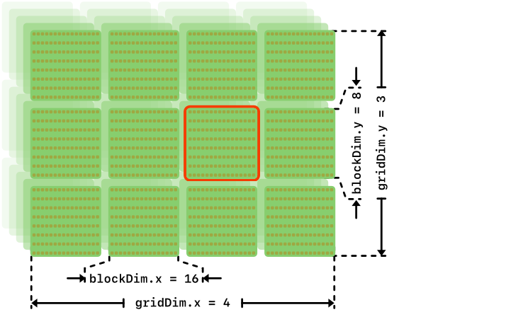
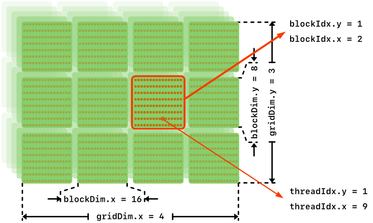

name: title
class: center, middle
layout: true
---
template: title

# Introduction to High Performance Computing

.red[\\\\\\]

.venue[

Engage Workshop on HPC and Data Science,

12$^{th}$ June $-$ 7$^{th}$ July 2023  

]

.red[\\\\\\]

.speaker[

Giannis Koutsou,

]

.sub[

Computation-based Science and Technology Research Center,

The Cyprus Institute

]
---
name: normal
layout: true
---

template: normal

# Outline

## Lecture part

- Review of GPU architecture
- Review of GPU programming and CUDA
- Some details of our training system, "Cyclamen"

--

## Hands-on - Practical examples on GPUs

Covering:
- GPU performance vs CPU performance
- Memory coalescing on GPUs
- Shared memory
- What is a warp and should you care

---
# GPU architecture

At a very high level:

<style>
      img[alt=gpu] { width: 60%; margin-left: 10%; margin-right: 10%;}
</style>

.center[]

.left-column[
### CPU
- Few heavy cores
- Large memory
- Moderate BW to memory
- Optimized for serial execution
]

.right-column[
### GPU
- Many light "cores"
- Smaller memory
- High BW to memory
- Optimized for parallel execution
]

---
# GPU programming model


.center[]

### Some numbers from the GPU partition of our Cyclamen cluster
**NVIDIA P100** _Pascal_ GPUs
- 56 Streaming Multiprocessors (SM) per GPU
- 64 "cores" per SM
- GPU memory: 16 GBytes
- Memory bandwidth: 732 GB/s
- Peak performance: 4 Tflop/s (double precision)

--

.red[We will come back to these numbers during the hands-on]

---
# GPU programming model

.center[]

### "Offload" model of programming
- CPU starts program (runs `main()`)
- CPU copies data to GPU memory (over e.g. PCIe, ~32 GB/s)
- CPU dispatches "kernels" for execution on GPU
  - Kernels read/write to GPU memory (~732 GB/s)
  - Kernels run on GPU threads (thousands) which share *fast* memory
    [$\mathcal{O}$(10) times faster compared to GPU memory]
- Kernel completes; CPU copies data back from GPU (over e.g. PCIe, ~32 GB/s)

---
# GPU programming model

.center[]

### GPU memory model (NVIDIA model)
- GPU threads: *slow* access to global, constant, and texture memory
- Each thread has *registers* (fast) and *local memory* (slow)
- Threads are grouped into *blocks*; Threads within the same block: *shared memory* (fast)
- Shared memory is limited. E.g. 64 KB per block for P100

---
# GPU programming model

.center[]

### GPU memory model (NVIDIA model); some numbers for context
- Threads per block: 1024 (max)
- Registers (per block): 64K
- Shared memory (per block): 64 KB
- Also, max. 255 registers per thread

---
# GPU programming model

.center[]

### GPU memory model (NVIDIA model)
- Assumptions about execution order
  - Threads within the same block can be assumed to run concurrently
  - No assumption about the order by which blocks are executed

---
# CUDA programming model

### NVIDIA programming framework for NVIDIA GPUs
- Compute Unified Device Architecture
- C-like programming language for writing *CUDA Kernels*
  - Includes C/C++ and Fortran variants
  - Compiler for  C/C++: `nvcc`
- Functions for transferring data to/from GPUs, starting kernels, etc.
- Some higher-level functionality also available (linear algebra, random number generations,  etc.)
- Concepts generalizable to other accelerator programming frameworks (OpenCL, OpenACC, HiP, etc.)

---
# CUDA programming basics

### Nomenclature
- "Host" is the CPU
- "Device" is the GPU

### Allocate memory on GPU

```C
err = cudaMalloc(&d_ptr, size);
```

- Call from *host* (CPU)
- Allocate `size` bytes of memory on GPU and store the starting address in `d_ptr`
- `d_ptr` is a variable that holds an address to GPU memory i.e. a "device pointer"
- If `err != cudaSuccess` then something went wrong

### Free GPU memory

```C
cudaFree(d_ptr);
```

---
# CUDA programming basics

### Nomenclature
- "Host" is the CPU
- "Device" is the GPU

### Copy data to GPU

```C
cudaMemcpy(d_ptr, ptr, size, cudaMemcpyHostToDevice);
```

- Call from *host* (CPU)
- Copy data on host pointed to by `ptr` to device at address pointed to by `d_ptr`
- Device memory should have been allocated using `cudaMalloc()` to obtain `d_ptr`

### Copy data from GPU

```C
cudaMemcpy(ptr, d_ptr, size, cudaMemcpyDeviceToHost);
```

- Call from *host* (CPU)
- Copy data on device pointed to by `d_ptr` to host at address pointed to by `ptr`
- Host memory should have been allocated using e.g. `malloc()` to obtain `ptr`

---
# CUDA programming basics

### Declare a CUDA kernel

Example:
```C
__global__ void
func(int n, double a, double *x)
{
	...
	return;
}
```

### Call a CUDA kernel

- Call from host. Example:
```c
func<<<nblck, nthr>>>(n, a, x);
```

- `nthr`: number of threads per block; can be scalar or a `dim3` type
- `nblck`: number of blocks; can be scalar or a `dim3` type
- Example of `dim3` type:
```C
dim3 nthr(1024, 8, 8); /* No. of threads in (x, y, z) */
```

---
# CUDA programming basics

### Call a CUDA kernel

- Call from host. Example:
```C
func<<<nblck, nthr>>>(n, a, x);
```

- `nthr`: number of threads per block; can be scalar or a `dim3` type
- `nblck`: number of blocks; can be scalar or a `dim3` type
- Example of `dim3` type:
```C
dim3 nthr(1024, 8, 8); /* No. of threads in (x, y, z) */
```

### Thread coordinates within kernel

Example:

```C
__global__ void
func(int n, double a, double *x)
{
	int idx = threadIdx.x + blockIdx.x*blockDim.x;
	...
	return;
}
```

---
name: blkthrds
layout: true

# CUDA programming basics

### Threads, blocks, grids

<style>
      img[alt=gpub] { width: 50%; margin-left: 10%; margin-right: 10%;}
</style>


```c
dim3 blcks( 4, 3, bz);
dim3 thrds(16, 8, tz);
func<<<blcks, thrds>>>(...);

```
---
template: blkthrds
.center[]
---
template: blkthrds
.center[]
---
template: blkthrds
.center[]
---
template: blkthrds
.center[]
---
template: blkthrds
.center[]
---
template: blkthrds
.center[]
---
template: blkthrds
.center[]
---
template: blkthrds
.center[]

### Variables available within kernel
.left-column[
- `threadIdx.{x,y,z}`
- `blockIdx.{x,y,z}`
]
.right-column[
- `blockDim.{x,y,z}`
- `gridDim.{x,y,z}`
]

---
name: normal
layout: true
---
template: normal

# CUDA, by example

### .red[Warm-up]: port a simple code to GPU and investigate performance 

Sources:  `/nvme/scratch/engage/gpu/`

- `ex01/axpy.cu` implements a so-called "axpy" operation
  (a-times-x-plus-y):
$$
y_i \leftarrow a\cdot x_i + y_i,\,\,\,i=0,...,n-1
$$
with $a$ scalar and $y$ and $x$ vectors of length $n$.

--

- Currently Implements this on the **CPU**. Uses OpenMP to
  multi-thread over the 16 cores (per socket) of the Cyclamen cluster
  nodes

--

- We will proceed step-by-step, to port this simple application to the GPU using CUDA

--

This will cover:

- Allocation of memory on the GPU; 

--

- Transferring memory to/from GPU;

--

- Invoking kernels;

--

- Placement of threads and memory access


---
# CUDA Example

### File: `ex01/axpy.cu`

- Contains the C program we will begin with: `axpy.cu`
- Even though the file extension is `.cu`, the program contains no
CUDA. Only OpenMP
- Allocates four arrays: `x0[n]`, `x1[n]`, `y0[n]`, and `y1[n]`, with `n` read from the command line
- `x0` and `y0` are initialized to random numbers 
- `x1` and `y1` are initialized to `x0`  and `y0` respectively
- The program:
  - performs `y0[:] = a*x0[:] + y0[:]` in the first part marked with `A:`
  - performs `y1[:] = a*x1[:] + y1[:]` in the second part marked with `B:`
  - reports the timing for part `A` and for `B`
  - reports the difference between `y0` and `y1`

--

.red[_Take some time to inspect `axpy.cu` before we compile and run_]

---
# CUDA Example

- Copy first exercise from this training's shared space:

```shell
[user@front02 ~]$ cp -r /nvme/scratch/engage/gpu/ex01 .
[user@front02 ~]$ cd ex01/
[user@front02 ex01]$ ls -1
axpy.cu
```

--

- Compile with `nvcc` including OpenMP:

```shell
[user@front02 ex01]$ module load gompi CUDA 
[user@front02 ex01]$ nvcc -O3 -Xcompiler -fopenmp -o axpy axpy.cu
```

- `-Xcompiler -fopenmp`: tells `nvcc` to pass `-fopenmp` to the underlying C compiler (here `gcc`)

--

- Run on the CPUs of a GPU node
- Use `srun` to run interactively, e.g.:

.small[
```shell
[user@front02 ex01] export OMP_PROC_BIND="close" 
[user@front02 ex01] export OMP_PLACES="cores" 
[user@front02 ex01] export OMP_NUM_THREADS=16 
[user@front02 ex01] srun -n 1 --cpus-per-task=16 -p p100 -A engage --gres=gpu:1 ./axpy $((1024*1024*64))
 CPU: nthr =   16   t0 = 0.0089 sec   P =  15.024 Gflop/s   B =  90.142 GB/s
 CPU: nthr =   16   t0 = 0.0086 sec   P =  15.667 Gflop/s   B =  94.000 GB/s
 Diff = 0.000000e+00
```
]

--

- Compare ~90 GB/s achieved vs ~130 GB/s peak memory bandwidth


---
# CUDA Example

### Use a GPU to replace part `B` of the calculation

- Edits outside of `main()`:
  1. Add the `cuda_runtime.h` header file
  2. Add the GPU `axpy` kernel, naming it `gpu_axpy()`
  3. Add a function similar to `ualloc()` that allocates memory on the
     GPU and checks whether an error occured

- Edits within `main()`:
  1. Allocate arrays on GPU
  2. Copy `x1[:]` and `y1[:]` to GPU
  3. Call `gpu_axpy()`
  4. Copy `y1[:]` from GPU

---
# CUDA Example

### Edits outside of `main()` 1/3

- Add the `cuda_runtime.h` header file on line 5:

```c
#include <cuda_runtime.h>
```

---
# CUDA Example

### Edits outside of `main()` 2/3

- Add the GPU `axpy` kernel, naming it `gpu_axpy()`, after the CPU `axpy`, around line 64:

```C
/***
 * Do y <- a*x + y on the GPU
 ***/
__global__ void
gpu_axpy(int n, float a, float *x, float *y)
{
  for(int i=0; i<n; i++)
	y[i] = a*x[i] + y[i];
  
  return;
}
```


---

# CUDA Example

### Edits outside of `main()` 3/3

- At around line 30 add a function similar to `ualloc()` that allocates memory on the GPU and checks whether an error occurred

```c
/***
 * Allocate memory on GPU; print error if not successful
 ***/
void *
gpu_alloc(size_t size)
{
  void *ptr;
  cudaError_t err = cudaMalloc(&ptr, size);
  if(err != cudaSuccess) {
	fprintf(stderr, "cudaMalloc() returned %d; quitting...\n", err);
	exit(-2);
  } 
  return ptr;
}
```

---

# CUDA Example

### Edits within `main()` 1/4

- Allocate arrays on GPU, within `B` part. Free arrays before closing `B` part:

```c
/*
 * B: Run axpy(), return to y1, report performance
 */
  {
	/* Allocate GPU memory */
	float *d_x = (float *)gpu_alloc(n*sizeof(float));
	float *d_y = (float *)gpu_alloc(n*sizeof(float));
	...
	cudaFree(d_x);
	cudaFree(d_y);
  }
```

---

# CUDA Example

### Edits within `main()` 2/4

- Copy `x1[:]` and `y1[:]` to GPU

```C
  cudaMemcpy(d_x, x1, sizeof(float)*n, cudaMemcpyHostToDevice);
  cudaMemcpy(d_y, y1, sizeof(float)*n, cudaMemcpyHostToDevice);
```

---

# CUDA Example

### Edits within `main()` 3/4

- Call `gpu_axpy()`. For the moment use 1 thread and 1 block. Replace
  `axpy(n, a, x, y)` of part `B` with:


```C
    double t0 = stop_watch(0);
	gpu_axpy<<<1, 1>>>(n, a, d_x, d_y);
    t0 = stop_watch(t0);
```


Note we need to pass the *device pointers* since it is these pointers
that point to the memory allocated on the GPU

---

# CUDA Example

### Edits within `main()` 4/4

- Copy `y1[:]` from GPU:
```C
  /* Copy y1 back from GPU */
  cudaMemcpy(y1, d_y, sizeof(float)*n, cudaMemcpyDeviceToHost);	
```

- Also change:
```C
	printf(" CPU: nthr = %4d   ...);
```
to:
```C
	printf(" GPU:              ...);
```
and remove OpenMP parallel region.

---

# CUDA Example

### Compile and run

- Compile as before:

```shell
   [user@front02 ex01]$ nvcc -O3 -Xcompiler -fopenmp -arch sm_60 -o axpy axpy.cu
```

- Run as before (I'm assuming `OMP_BIND`, `OMP_PLACES`, and `OMP_NUM_THREADS` were set before):

.small[
```shell
[user@front02 ex01]$ srun -n 1 --cpus-per-task=10 -p p100 -A engage --gres=gpu:1 ./axpy $((1024*1024*64))
 CPU: nthr =   16   t0 = 0.0089 sec   P =  15.035 Gflop/s   B =  90.212 GB/s
 GPU:               t0 = 0.0000 sec   P = 3198.579 Gflop/s   B = 19191.476 GB/s
 Diff = 1.021564e-15
```
]

This performance is infeasible. What's going on?

---

# CUDA Example

### Edits within `main()` 3/4

- The problem is here:

```C
    double t0 = stop_watch(0);
	gpu_axpy<<<1, 1>>>(n, a, d_x, d_y);
	t0 = stop_watch(t0);
```

- CUDA kernels return **immediately**; the kernel is still being
  executed on the device when `stop_watch(t0)` is called. We are
  .red[**not**] timing the kernel execution time, but the time it
  takes to dispatch the kernel to the GPU.

- Correct this by adding `cudaDeviceSynchronize();` after the CUDA
kernel, which blocks until all running CUDA kernels are complete:

```C
    double t0 = stop_watch(0);
	gpu_axpy<<<1, 1>>>(n, a, d_x, d_y);
	cudaDeviceSynchronize();
	t0 = stop_watch(t0);
```

---
	
# CUDA Example

- Compile and run again:

.small[
```shell
[user@front02 ex01]$ nvcc -O3 -Xcompiler -fopenmp -arch sm_60 -o axpy axpy.cu
[user@front02 ex01]$ srun -n 1 --cpus-per-task=16 -p p100 -A engage --gres=gpu:1 ./axpy $((1024*1024*64))
 CPU: nthr =   16   t0 = 0.0088 sec   P =  15.199 Gflop/s   B =  91.193 GB/s
 GPU:               t0 = 3.9670 sec   P =   0.034 Gflop/s   B =   0.203 GB/s
 Diff = 1.021564e-15
```
]

--

- This performance is of course extremely poor;

--

- We're using only one GPU thread in the kernel

---
	
# CUDA Example

### Use more threads

- In this step, we will use 512 GPU threads. First, change the call to
  the GPU kernel:

```C
    double t0 = stop_watch(0);
	gpu_axpy<<<1, 512>>>(n, a, d_x, d_y);
	cudaDeviceSynchronize();
	t0 = stop_watch(t0);
```
--
- Then we need to change the kernel. We need in each GPU thread to calculate
which elements it will operate on:

```C
/***
 * Do y <- a*x + y on the GPU
 ***/
__global__ void
gpu_axpy(int n, float a, float *x, float *y)
{
  int ithr = threadIdx.x;
  int nthr = blockDim.x;
  int lt = n/nthr;
  for(int i=ithr*lt; i<(ithr+1)*lt; i++)
    y[i] = a*x[i] + y[i];
  return;
}
```

- With the above, each thread operated on `n/nthr` contiguous elements

---
	
# CUDA Example

- Compile and run again:

.small[
```shell
[user@front02 ex01]$ srun -n 1 --cpus-per-task=16 -p p100 -A engage --gres=gpu:1 ./axpy $((1024*1024*64))
 CPU: nthr =   16   t0 = 0.0064 sec   P =   2.628 Gflop/s   B =  15.765 GB/s
 GPU:               t0 = 0.1316 sec   P =   0.127 Gflop/s   B =   0.765 GB/s
 Diff = 1.022961e-15
```
]

- Better than before, but still very poor performance. Can we do  better?

---
	
# CUDA Example

### Optimized GPU memory access

**Always** keep in mind that on GPUs, it is more optimal if contiguous
threads access contiguous memory locations

<style>
	img[alt=access] { width: 100%; margin-left: 5%; margin-right: 5%;}
</style>

.left-column[

]

.right-column[
 This represents the order by which elements are accessed currently
 - The same thread accesses continuous elements
 - Very common approach on CPUs
 - On GPUs, this results in so-called _bank conflicts_
 - .red[*Suboptimal!*]
]

---
	
# CUDA Example

### Optimized GPU memory access

**Always** keep in mind that on GPUs, it is more optimal if contiguous
threads access contiguous memory locations

<style>
	img[alt=access] { width: 100%; margin-left: 5%; margin-right: 5%;}
</style>

.left-column[

]

.right-column[
 This represents an optimal data access pattern
 - Different threads accesses continuous elements
 - Each thread is served by a different memory bank
]

---
	
# CUDA Example

### Optimized GPU memory access

**Always** keep in mind that on GPUs, it is more optimal if contiguous
threads access contiguous memory locations

In our example:

```C
/***
 * Do y <- a*x + y on the GPU
 ***/
__global__ void
gpu_axpy(int n, float a, float *x, float *y)
{
  int ithr = threadIdx.x;
  int nthr = blockDim.x;
  for(int i=0; i<n; i+=nthr)
    y[i+ithr] = a*x[i+ithr] + y[i+ithr];
  return;
}
```

- Compile and run:

.small[
```shell
[user@front02 ex01]$ srun -n 1 --cpus-per-task=16 -p p100 -A engage --gres=gpu:1 ./axpy $((1024*1024*64))
 CPU: nthr =   16   t0 = 0.0097 sec   P =  13.788 Gflop/s   B =  82.730 GB/s
 GPU:               t0 = 0.0665 sec   P =   2.018 Gflop/s   B =  12.111 GB/s
 Diff = 1.021564e-15
```
]

---
	
# CUDA Example

### Blocks and threads

Now let's use blocks. Let's use as many blocks and threads as we can

- Upper limit of 1024 threads
- Upper limit of $2^{31}-1$ blocks

```C
	double t0 = stop_watch(0);
	int nthr = 1024;
	gpu_axpy<<<n/nthr, nthr>>>(n, a, d_x, d_y);
	cudaDeviceSynchronize();
	t0 = stop_watch(t0);
```

```C
/***
 * Do y <- a*x + y on the GPU
 ***/
__global__ void
gpu_axpy(int n, float a, float *x, float *y)
{
  int ithr = threadIdx.x;
  int nthr = blockDim.x;
  int iblk = blockIdx.x;
  int idx = ithr + iblk*nthr;
  y[idx] = a*x[idx] + y[idx];
  return;
}
```

---
	
# CUDA Example

### Blocks and threads

- Compile and run:

.small[
```shell
[user@front02 ex01]$ srun -n 1 --cpus-per-task=16 -p p100 -A engage --gres=gpu:1 ./axpy $((1024*1024*64))
 CPU: nthr =   16   t0 = 0.0088 sec   P =  15.188 Gflop/s   B =  91.129 GB/s
 GPU:               t0 = 0.0011 sec   P = 119.930 Gflop/s   B = 719.578 GB/s
 Diff = 1.021564e-15
```
]

- What percentage of peak bandwidth is this (i.e., of 732 GB/s)

--

- Try varying the number of threads per block


---

# CUDA, another example

### Exercise: rotate and shift an array of $(x, y)$ coordinates

- `ex02/rot.cu` calls, as before, the same kernel twice
- Operation is $\vec{v}_i = U\vec{r}_i + \vec{s}_i$
- Where:

$$
U = \left(\begin{array}{cc} \cos(\theta) & -\sin(\theta) \\\ \sin(\theta) & \cos(\theta) \end{array}\right)
$$

--

- Equivalently: 

$$v\_{i,x} = \cos(\theta) r\_{i,x} -\sin(\theta) r\_{i,y} + s\_{i,x} $$

$$v\_{i,y} = \sin(\theta) r\_{i,x} +\cos(\theta) r\_{i,y} + s\_{i,y} $$

---
name: rotate

# Coordinate transformation using CUDA


- $\vec{v}_i = U\vec{r}_i + \vec{s}_i \Rightarrow$

$$v\_{i,x} = \cos(\theta) r\_{i,x} -\sin(\theta) r\_{i,y} + s\_{i,x} $$

$$v\_{i,y} = \sin(\theta) r\_{i,x} +\cos(\theta) r\_{i,y} + s\_{i,y} $$


<style>
	img[alt=rot] { width: 40%; margin-left: 10%; margin-right: 10%;}
</style>

---
template: rotate
.center[]
---
template: rotate
.center[]
---
template: rotate
.center[]
---
template: rotate
.center[]
---
template: rotate
.center[]
---
template: rotate
.center[]
---
template: rotate
.center[]
---

# Coordinate transformation using CUDA

### TODO, for a first version

- Implement a CUDA version for the second call

- Each GPU thread operating on one point ($i$)

--

**Example:**
.small[
```shell
[user@front02 ex02] export OMP_PROC_BIND="close" 
[user@front02 ex02] export OMP_PLACES="cores" 
[user@front02 ex02] export OMP_NUM_THREADS=16 
[user@front02 ex02] srun -n 1 --cpus-per-task=16 -p p100 -A engage --gres=gpu:1 ./rot 32 $((1024*1024*128))
 CPU: nthr =   16   t0 = 0.0610 sec   P =  17.608 Gflop/s   B =  52.823 GB/s
 GPU: nthr =   32   t0 = 0.0069 sec   P = 155.683 Gflop/s   B = 467.049 GB/s
 Diff = 1.115821e-15
```
]

--

.small[
```c
/***
 * Do r <- U*r on the GPU using CUDA
 ***/
__global__ void
gpu_rotate(int n, coords *r_out, float theta, coords *r_in, coords *s)
{
  float ct = cos(theta);
  float st = sin(theta);
  
  int ithr = threadIdx.x;
  int nthr = blockDim.x;
  int iblk = blockIdx.x;
  int idx = (ithr + iblk*nthr);
  
  r_out[idx].x = ct*r_in[idx].x - st*r_in[idx].y + s[idx].x;
  r_out[idx].y = st*r_in[idx].x + ct*r_in[idx].y + s[idx].y;

  return;
}
```
]

---
# Coordinate transformation using CUDA

The optimal number of threads is not necessarily the maximum

- If we allow the number of threads to be a command line argument, we
  can easily scan for it

.small[
```shell
[user@font02 ex02]$ for((th=4; th<=1024; th*=2))
> do
> srun -n 1 --cpus-per-task=16 -p p100 -A engage --gres=gpu:1 ./rot $th $((1024*1024*128))
> done 2>&1|grep GPU
 GPU: nthr =    4   t0 = 0.0514 sec   P =  20.902 Gflop/s   B =  62.707 GB/s
 GPU: nthr =    8   t0 = 0.0266 sec   P =  40.389 Gflop/s   B = 121.168 GB/s
 GPU: nthr =   16   t0 = 0.0134 sec   P =  80.393 Gflop/s   B = 241.178 GB/s
 GPU: nthr =   32   t0 = 0.0067 sec   P = 159.498 Gflop/s   B = 478.495 GB/s
 GPU: nthr =   64   t0 = 0.0049 sec   P = 220.171 Gflop/s   B = 660.513 GB/s
 GPU: nthr =  128   t0 = 0.0049 sec   P = 217.839 Gflop/s   B = 653.516 GB/s
 GPU: nthr =  256   t0 = 0.0049 sec   P = 219.217 Gflop/s   B = 657.652 GB/s
 GPU: nthr =  512   t0 = 0.0048 sec   P = 222.818 Gflop/s   B = 668.454 GB/s
 GPU: nthr = 1024   t0 = 0.0048 sec   P = 221.852 Gflop/s   B = 665.557 GB/s
 ```
]

--

- Tops at ~670 GBytes/s or ~75%. Can we do better? 

---
# Coordinate transformation using CUDA

### Optimizations

- Note the loading of elements of `r[]` from global memory
  $\Rightarrow$ two continuous component per thread

- Optimization opportunity: use one thread per _component_

--

  $\Rightarrow$ Instead of each thread operating on one point, consider each thread
  operating on a single component of the coordinate
  
--

- In other words, have:
	- even threads computing the `x` coordinate part of `v[:]`
	- odd threads computing the `y` coordinate of `v[:]`
	
--

- This will demonstrate the use of *shared memory*, i.e. fast memory
  which all threads in a single block can access
  
--

- Shared memory is declared with the shared attribute, i.e.:
```C
   __shared__ float arr[SIZE];
```

--

- Note that here `SIZE` **must** be known at **compile time**

--

- Alternatively, we can have dynamic allocation of shared memory (relatively recent CUDA feature)

---

# Coordinate transformation using CUDA

### Optimizations

- Below is how we would like to organize this calculation:

.small[
```C
i2=2*i
(x coord. of elem. i + 0) thread = 0; v[i2+0] = r[i2+0]*ct - r[i2+1]*st + s[i2+0]
(y coord. of elem. i + 0) thread = 1; v[i2+1] = r[i2+1]*ct + r[i2+0]*st + s[i2+1]
(x coord. of elem. i + 1) thread = 2; v[i2+2] = r[i2+2]*ct - r[i2+3]*st + s[i2+2]
(y coord. of elem. i + 1) thread = 3; v[i2+3] = r[i2+3]*ct + r[i2+2]*st + s[i2+3]
(x coord. of elem. i + 2) thread = 4; v[i2+4] = r[i2+4]*ct - r[i2+5]*st + s[i2+4]
(y coord. of elem. i + 2) thread = 5; v[i2+5] = r[i2+5]*ct + r[i2+4]*st + s[i2+5]
(x coord. of elem. i + 3) thread = 6; v[i2+6] = r[i2+6]*ct - r[i2+7]*st + s[i2+6]
(y coord. of elem. i + 3) thread = 7; v[i2+7] = r[i2+7]*ct + r[i2+6]*st + s[i2+7]
...
```
]

- Notice that odd threads and even threads carry out different operations

- But on a GPU, it is important for performance to have all threads in
  a kernel execute the **same** operations

- In other words, try to avoid as much as possible constructs like:  
  `if(ithr % 2 == 0){ ... };`

---

# Coordinate transformation using CUDA

### Optimizations

- First define a macro at the beginning of the file:
```C
#define MAX_THR 1024
```

- Then, when invoking the kernel, change the call to use twice the number of blocks:
```C
gpu_rotate<<<2*n/n_gpu_thr, n_gpu_thr>>>(n, d_v, theta, d_r, d_s);
```

---
# Coordinate transformation using CUDA

### Optimizations

- In the kernel, declare a shared array, to be used to store the elements of `r[]`:

```C
__shared__ float rr[MAX_THR];
```

--

- We need a shared array for `r[]`, because different threads will
  need to access the same elements. In particular, whether odd or
  even, each thread needs to access both `x` and `y` components of
  `x[]`

- By reading `r[]` into `rr[]` once, we avoid each thread having to
  read elements of `r[]` twice from global memory, which is slow

--


- Read the elements of `r[]` corresponding to this block into `rr[]`:

```C
  int idx = iblk*nthr + ithr;
  rr[ithr] = r[idx];
```

--

This way, the loading is done parallel: each thread reads in one component of `r[]`
  
---
# Coordinate transformation using CUDA

### Optimizations

- Now insert the following, which only achieves the operation partially:

```C
float rs = s[idx] + ct*rr[ithr];
```

--

- The operation is  still incomplete; what we have achieved with the above is:
$$
v_x \leftarrow \cos(\theta)r_x + s_x
$$
$$
v_y \leftarrow \cos(\theta)r_y + s_y
$$

--

we are missing:
$$
v_x \leftarrow v_x - \sin(\theta) r_y
$$
$$
v_y \leftarrow v_y + \sin(\theta) r_x
$$

---
# Coordinate transformation using CUDA

### Optimizations

- We are missing:
$$
v_x \leftarrow v_x - \sin(\theta) r_y
$$
$$
v_y \leftarrow v_y + \sin(\theta) r_x
$$

--

- Consider the following:

```C
int sw = 1 - 2*(ithr & 1);
```

--

- `&` is a bitwise "and" operation, meaning  `ithr & 1` will evaluate to:
- `0` if `ithr` is even
- `1` if `ithr` is odd

--

`sw = 1 - 2*(ithr & 1)` therefore yields:  
```txt
ithr = 0,  1, 2,  3, ...
sw   = 1, -1, 1, -1, ...
```

---
# Coordinate transformation using CUDA

### Optimizations

- We are missing:
$$
v_x \leftarrow v_x - \sin(\theta) r_y
$$
$$
v_y \leftarrow v_y + \sin(\theta) r_x
$$

--

- Consider:

```C
rs =  rs - sw*st*rr[ithr+sw];
```

--

- Then read back into `out[]`:

```C
  out[idx] = rs;
```

---
# Coordinate transformation using CUDA

### Optimizations

- Compile and run, scanning the number of GPU threads (filtering only the GPU line):

```shell
[user@font02 ex02]$ for((th=4; th<=1024; th*=2))
> do 
> srun -n 1 --cpus-per-task=16 -p p100 -A engage --gres=gpu:1 ./rot $th $((1024*1024*128))
> done 2>&1|grep GPU
 GPU: nthr =    4   t0 = 0.1060 sec   P =  10.127 Gflop/s   B =  30.382 GB/s
 GPU: nthr =    8   t0 = 0.0513 sec   P =  20.913 Gflop/s   B =  62.738 GB/s
 GPU: nthr =   16   t0 = 0.0260 sec   P =  41.291 Gflop/s   B = 123.874 GB/s
 GPU: nthr =   32   t0 = 0.0134 sec   P =  80.130 Gflop/s   B = 240.389 GB/s
 GPU: nthr =   64   t0 = 0.0069 sec   P = 155.592 Gflop/s   B = 466.775 GB/s
 GPU: nthr =  128   t0 = 0.0041 sec   P = 258.738 Gflop/s   B = 776.215 GB/s
 GPU: nthr =  256   t0 = 0.0041 sec   P = 260.806 Gflop/s   B = 782.418 GB/s
 GPU: nthr =  512   t0 = 0.0041 sec   P = 259.933 Gflop/s   B = 779.799 GB/s
 GPU: nthr = 1024   t0 = 0.0042 sec   P = 257.069 Gflop/s   B = 771.208 GB/s
```

--

- Maximum performance saturates with 128 - 1024 threads at ~780 GB/s, or 87% of peak bandwidth


---

# Matrix-vector multiplication

We will look into another example, the matrix vector multiplication

$$
y = A x
$$

where $y$, $x$ are vectors (1-dimensional) and $A$ is a matrix (2-dimensional)

- In the general case $A$ is not square
- $A_{M\times N}$, $x_N$, $y_M$

--

$$
	y\_i = \sum\_{j=0}^{N-1} A\_{ij} x\_j,\,\,\,i=0,...,M
$$

--

```c
for(int i=0; i<m; i++) {
  y[i] = 0;
  for(int j=0; j<n; j++) {
	y[i] = y[i] + A[i][j] * x[j];
  }
}
```
--

```c
for(int i=0; i<m; i++) {
  y[i] = 0;
  for(int j=0; j<n; j++) {
	y[i] += A[i*n + j] * x[j];
  }
}
```

---

# Matrix-vector multiplication

Take `/nvme/scratch/engage/gpu/ex03/.` for the CPU code:

.small[
```sh
[user@front02 ~]$ cp -r /nvme/scratch/engage/gpu/ex03 .
[user@front02 ~]$ cd ex03/.
[user@front02 ex03]$ nvcc -O3 -Xcompiler -fopenmp -arch sm_60 -o matvec matvec.cu
[user@front02 ex03]$ export OMP_PLACES="cores"
[user@front02 ex03]$ export OMP_PROC_BIND="close"
[user@front02 ex03]$ export OMP_NUM_THREADS=16
[user@front02 ex03]$ srun -n 1 --cpus-per-task=16 -p p100 -A engage --gres=gpu:1 ./matvec 4096 8192
 CPU: nthr =   16   t0 = 0.0029 sec   P =  23.253 Gflop/s   B =  46.523 GB/s
 CPU: nthr =   16   t0 = 0.0022 sec   P =  30.341 Gflop/s   B =  60.705 GB/s
```
]

---

# Matrix-vector multiplication

Our task is to modify the second call of the `Ax()` function to run on the GPU.

<style>
   img[alt=mv] { width: 60%; margin-left: 10%; margin-right: 10%;}
</style>

--

.center[]

--

Straight-forward approach to begin with: 
- Each thread is responsible for one element of `y[]`
  - Each thread must read all elements of the corresponding row of `A[]`
  - Each thread must read all elements of `x[]`
  
--

E.g., using 256 GPU threads:

```sh
[user@front02 ex03]$ srun -n 1 --cpus-per-task=16 -p p100 -A engage --gres=gpu:1 ./matvec 4096 8192
 CPU: nthr =   16   t0 = 0.0028 sec   P =  23.771 Gflop/s   B =  47.560 GB/s
 GPU: nthr =  256   t0 = 0.0018 sec   P =  36.513 Gflop/s   B =  73.052 GB/s
 Diff = 2.603650e-15
```

---

# Matrix-vector multiplication


Now use a _shared array_ to share the elements of `x[]`. Name the shared array `xb[]`:


.center[]

--

Notice that the shared array is of the size of the number of threads (`blockDim.x`) and therefore smaller than `x[]`
- Within each block, use all threads to read in the elements of `xb[]`
- This requires splitting the matrix-vector multiplication of the block into steps
  
--

Using 256 GPU threads:

```sh
[user@front02 ex03]$ srun -n 1 --cpus-per-task=16 -p p100 --gres=gpu:1 -A engage ./matvec 4096 8192
 CPU: nthr =   16   t0 = 0.0031 sec   P =  21.982 Gflop/s   B =  43.979 GB/s
 GPU: nthr =  256   t0 = 0.0018 sec   P =  36.550 Gflop/s   B =  73.128 GB/s
 Diff = 2.603650e-15
```

---

# Matrix-vector multiplication


Now use a _shared array_ for both `A[]` and `x[]`. Name them `Ab[]` and `xb[]`:


.center[]

--

Use a 2-dimensional thread block
- All threads are used to fill in `Ab[]`
- Only some threads fill in `xb[]`
- Only some threads carry out the computation for `y[]` 
  
--

Using thread-blocks of, e.g. 16$\8:

```sh
[user@front02 ex03]$ srun -n 1 --cpus-per-task=16 -p p100 -A engage --gres=gpu:1 ./matvec 4096 8192
 CPU: nthr =   16        t0 = 0.0028 sec   P =  23.713 Gflop/s   B =  47.444 GB/s
 GPU: nthr = ( 16,  8)   t0 = 0.0007 sec   P =  97.396 Gflop/s   B = 194.864 GB/s
 Diff = 2.603650e-15
```

---

# Matrix-vector multiplication


Now let's see what we get when using CUDA's implementation of the same kernel 
- The matrix-vector multiplication is implemented as part of CUDA's BLAS implementation

```c
#include <cublas_v2.h>
```

- The function to use is `cublasSgemv()` -- see: [https://docs.nvidia.com/cuda/cublas/index.html#cublas-lt-t-gt-gemv](https://docs.nvidia.com/cuda/cublas/index.html#cublas-lt-t-gt-gemv)

--

- This function is general and computes: .red[$y = \alpha A x + \beta y$], where $\alpha$ and $\beta$ are scalars

--

- In our case, we need: $\alpha = 1$ and $\beta = 0$.

---
# Matrix-vector multiplication

Call the CUBLAS function via:

```c
cublasSgemv(handle, CUBLAS_OP_T, n, m, &alpha, d_A, n, d_x, 1, &beta, d_y, 1);
```

--

- `CUBLAS_OP_T` means transpose `A`, because CUBLAS expects matrices with the row index running fastest

--

- `handle` is just the CUBLAS context: 

```c
    cublasHandle_t handle;
    cublasCreate(&handle);
```

- Add `-lcublas` to the compile command

--

Now CUBLAS chooses the number of threads for us:
```sh
[user@front02 ex03]$ srun -n 1 --cpus-per-task=16 -p p100 -A engage --gres=gpu:1 ./matvec 4096 8192
 CPU: nthr =   16   t0 = 0.0030 sec   P =  22.302 Gflop/s   B =  44.621 GB/s
 GPU:               t0 = 0.0013 sec   P =  50.344 Gflop/s   B = 100.725 GB/s
 Diff = 1.370746e-12
```
