name: title
class: center, middle
layout: true
---
template: title

# Introduction to High Performance Computing

.red[\\\\\\]

.venue[

Engage Workshop on HPC and Data Science,

12$^{th}$ June $-$ 7$^{th}$ July 2023  

]

.red[\\\\\\]

.speaker[

Giannis Koutsou,

]

.sub[

Computation-based Science and Technology Research Center,

The Cyprus Institute

]
---
name: normal
layout: true
---

template: normal

# MPI $-$ Outline

- Overview of the Message Passing Interface (MPI)

- Basics of MPI
    - Distributed memory paradigm (as compared to shared memory)
    - Start-up and initialization

- Synchronization 

- Collectives

- Point-to-point communication


---

# The Message Passing Interface

- MPI: An Application Programmer Interface (API)
  - A _library specification_; determines functions, their names and arguments, and
    their functionality
- A _de facto_ standard for programming _distributed memory_ systems
- Current specification is version 4 (MPI-4.0), released June 9, 2021
  - For most systems you can reliably assume MPI-3.1 is in place
- Several free (open) or vendor-provided implementations, e.g.:
  - Mvapich
  - OpenMPI
  - IntelMPI

--

## Distributed memory programming
- Each process has its own memory domain
- MPI functions facilitate:
  - Obtaining environment information about the running process, e.g., process id, number of processes, etc.
  - Achieving _communication_ between processes, e.g. synchronization, copying of data, etc.

---

# Shared vs Distributed memory paradigm

.left-column[

## Shared memory
<style type="text/css">
	img[alt=le]{width: 30%; float: center; padding: 0px}
</style>

.center[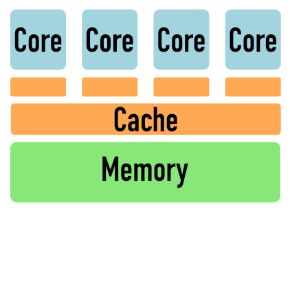]

]

.right-column[

</br>

- Multiple processes share common memory (common _memory address space_)

- E.g. multi-core CPU, multi-socket node, GPU threads, etc.

- Programming models: OpenMP, pthreads, MPI, CUDA (sort of)

]

--

.one-column[]

.left-column[

## Distributed memory
<style type="text/css">
	img[alt=ri]{width: 75%; float: center; padding: 0px}
</style>

.center[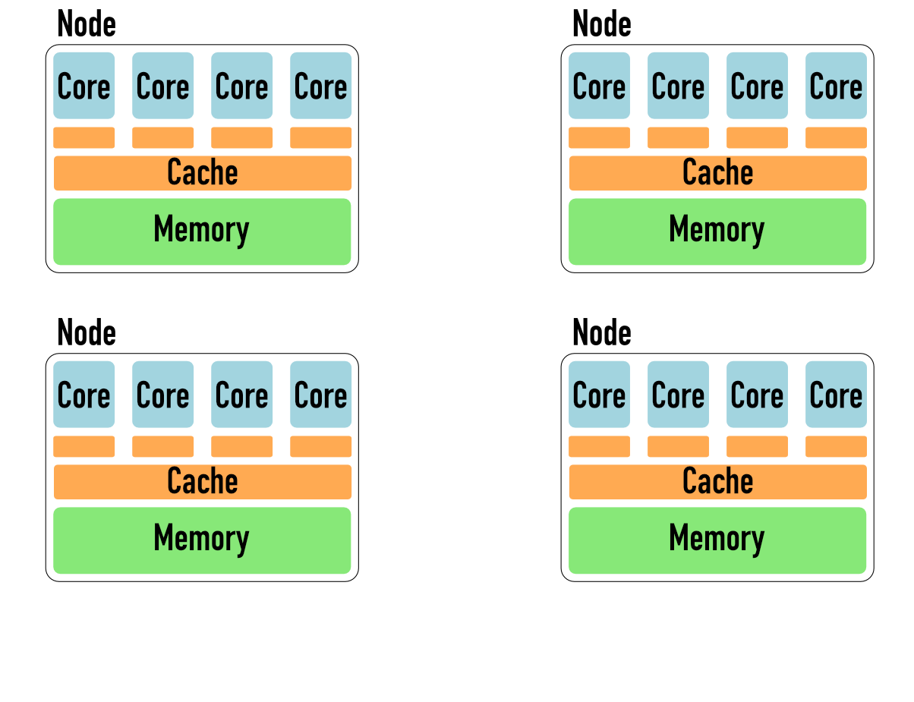]

]

.right-column[

</br>

- Processes have distinct memory domains (different _memory address space_)

- E.g. multiple nodes within a cluster, multiple GPUs within a node

- Programming models: **MPI**

]


---

# Shared vs Distributed memory paradigm

.left-column[

## Shared memory

.center[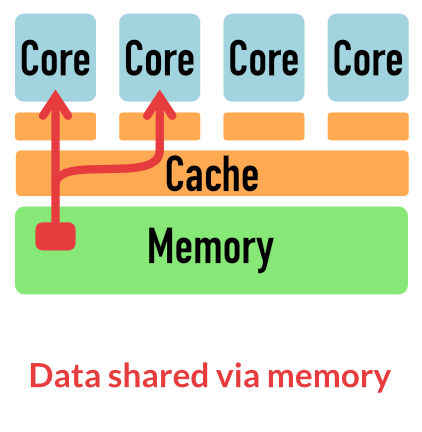]

]

.right-column[

</br>

- Multiple processes share common memory (common _memory address space_)

- E.g. multi-core CPU, multi-socket node, GPU threads, etc.

- Programming models: OpenMP, pthreads, MPI, CUDA (sort of)

]

.one-column[]

.left-column[

## Distributed memory
.center[]

]

.right-column[

</br>

- Processes have distinct memory domains (different _memory address space_)

- E.g. multiple nodes within a cluster, multiple GPUs within a node

- Programming models: **MPI**

]

---

# Shared vs Distributed memory paradigm

.left-column[

## Shared memory
.center[]

]

.right-column[

</br>

- Multiple processes share common memory (common _memory address space_)

- E.g. multi-core CPU, multi-socket node, GPU threads, etc.

- Programming models: OpenMP, pthreads, MPI, CUDA (sort of)

]

.one-column[]

.left-column[

## Distributed memory
.center[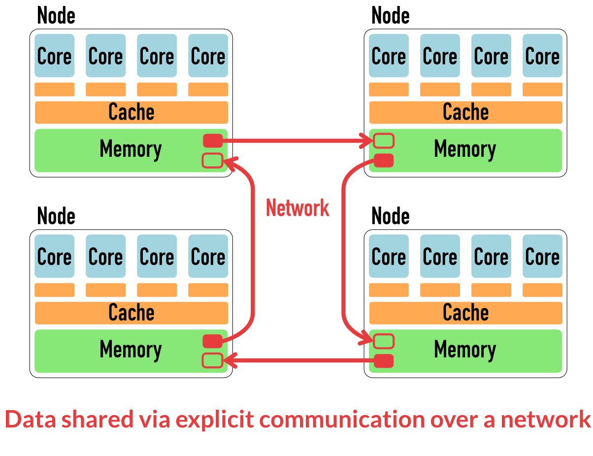]

]

.right-column[

</br>

- Processes have distinct memory domains (different _memory address space_)

- E.g. multiple nodes within a cluster, multiple GPUs within a node

- Programming models: **MPI**

]

---

# Running a program in parallel

- Trivially, in Linux it is simple to run a program in parallel
```sh
ssh node01 ./my_program &
ssh node02 ./my_program &
ssh node03 ./my_program &
```
`my_program` will run on each node identically

--

- An MPI program is run in a similar way, but via a wrapper script
  that also initializes the parallel environment (environment variables, etc.)
  ```sh
  mpirun -H node01,node02,node03 ./my_mpi_program
  ```

--

- In practice, a scheduler is used which determines which nodes you
  are currently allocated, meaning you usually will not need to
  explicitly specify the hostnames
  ```sh
  mpirun ./my_mpi_program
  ```

--

- Depending on the system, instead of `mpirun` you may be required
  `mpiexec` or `srun` which take similar (but not identical) arguments


---

# Compiling an MPI program

- An MPI program includes calls to MPI functions

--
	- In C, we include a single header file with all function definitions, macros, and constants
```C
#include <mpi.h>
```
--
	- Need to link against MPI libraries; precise invocation depends on the compiler, the MPI implementation used, its version, etc., e.g.:
```sh
gcc -o my_mpi_program my_mpi_program.c -I/opt/mpi/include -L/opt/mpi/lib -lmpi
```
--
- Thankfully, knowing the locations of the MPI library and include files is never
  needed in practice; implementations come with wrappers that set the
  appropriate include paths and linker options:
```sh
mpicc -o my_mpi_program my_mpi_program.c
```

---

# Initialization

- MPI functions begin with the `MPI_` prefix in C

--

- Call `MPI_Init()` first, before any other MPI call:
  ```c
  MPI_Init(&argc, &argv);
  ```
  where `argc` and `argv` are the typical names used for the command line variables passed to `main()`

--

- Before the end of the program, call `MPI_Finalize()`, otherwise the
  MPI runtime may assume your program finished in error
  
--
  
```c
#include <mpi.h>

int
main(int argc, char *argv[])
{
  MPI_Init(&argc, &argv);
  /*
	...
	...
	...
  */
  MPI_Finalize();
  return 0;
}
```
  
---
name: ini

# Initialization

- Two functions you will almost always call
  - `MPI_Comm_size()`: gives the number of parallel process running ($n_{proc}$)
  - `MPI_Comm_rank()`: determines the _rank_ of the process, i.e. a
    unique number between $0$ and $n_{proc}-1$ that identifies the
    calling process
	
- A complete example:

```c
#include <stdio.h>
#include <mpi.h>

int
main(int argc, char *argv[])
{
  MPI_Init(&argc, &argv);
  int nproc, rank;
  MPI_Comm_size(MPI_COMM_WORLD, &nproc);
  MPI_Comm_rank(MPI_COMM_WORLD, &rank);
  printf(" This is rank = %d of nproc = %d\n", rank, nproc);
  MPI_Finalize();
  return 0;
}
```

--

- `MPI_COMM_WORLD` is an _MPI communicator_. This specific
  communicator is the default communicator, defined in `mpi.h`, and
  trivially specifies _all_ processes

- A user can partition processes into subgroups by defining custom
  communicators, but this will not be covered here

---

template: ini

- .red[No assumptions] can safely be made about the order in which the
  `printf()` statements occur, i.e. the order in which each process
  prints is .red[practically random]

---

template: normal

# Synchronization

- Compiling and running the previous program (assuming it is saved as `example.c`)

```sh
[user@front02 ~]$ mpicc -o example example.c
[user@front02 ~]$ mpirun -n 5 example
 This is rank = 3 of nproc = 5
 This is rank = 1 of nproc = 5
 This is rank = 2 of nproc = 5
 This is rank = 4 of nproc = 5
 This is rank = 0 of nproc = 5
```

--

- Note that the order is random; Synchronization between processes can be achieved using the `MPI_Barrier()` function

--

- All processes must call `MPI_Barrier()`

--

- For any process to exit the barrier, all processes must have entered the barrier first

---
count: false
name: synch

# Synchronization

- Compiling and running the previous program (assuming it is saved as `example.c`)

```sh
[user@front02 ~]$ mpicc -o example example.c
[user@front02 ~]$ mpirun -n 5 example
 This is rank = 3 of nproc = 5
 This is rank = 1 of nproc = 5
 This is rank = 2 of nproc = 5
 This is rank = 4 of nproc = 5
 This is rank = 0 of nproc = 5
```

- Note that the order is random; Synchronization between processes can be achieved using the `MPI_Barrier()` function

- All processes must call `MPI_Barrier()`

- For any process to exit the barrier, all processes must have entered the barrier first

---
count: false
template: synch

<style type="text/css">
	img[alt=sy]{width: 80%; float: center; padding: 0px}
</style>

.center[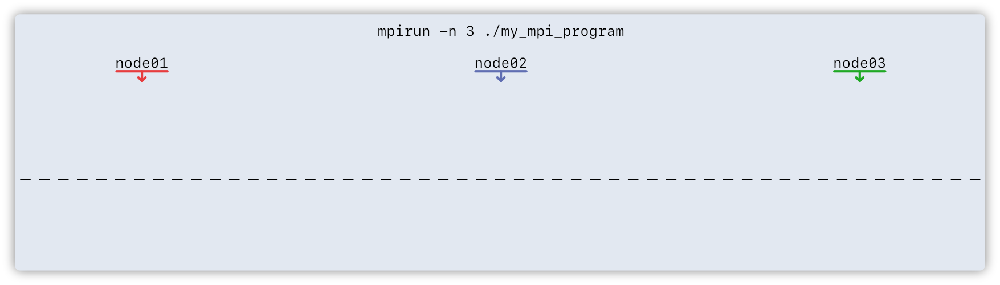]

---
count: false
template: synch
.center[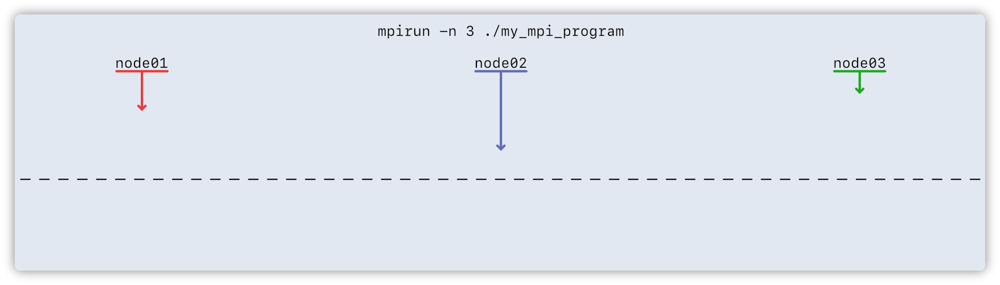]
---
count: false
template: synch
.center[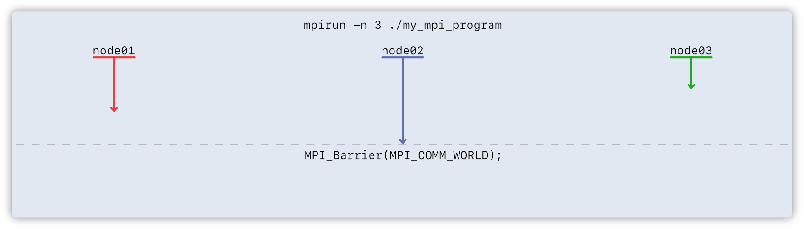]
---
count: false
template: synch
.center[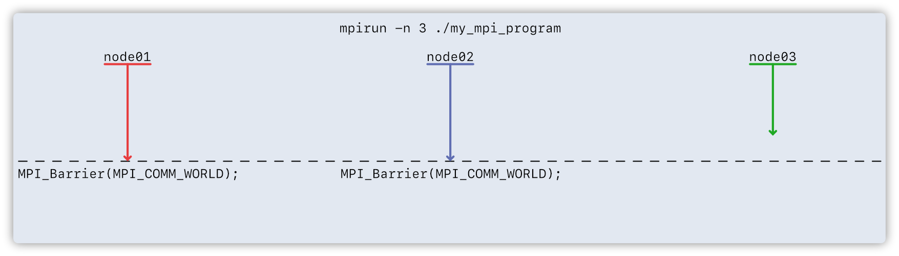]
---
count: false
template: synch
.center[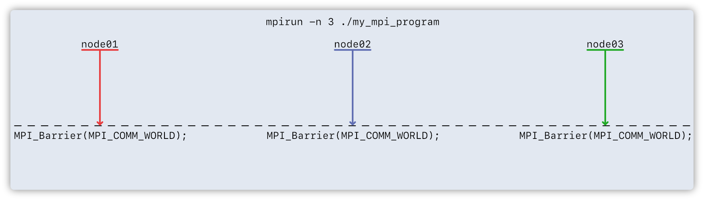]
---
count: false
template: synch
.center[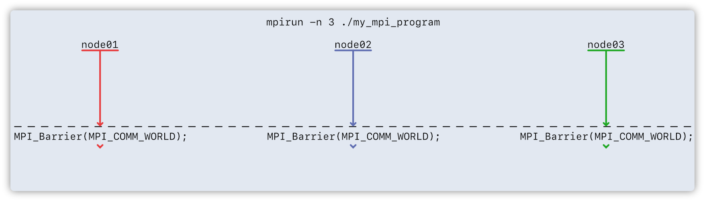]
---
count: false
template: synch
.center[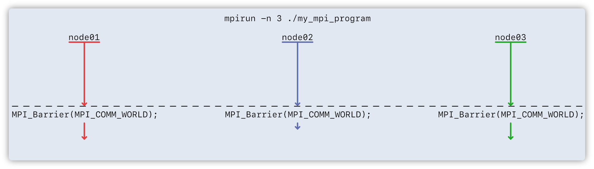]
---
count: false
template: synch
.center[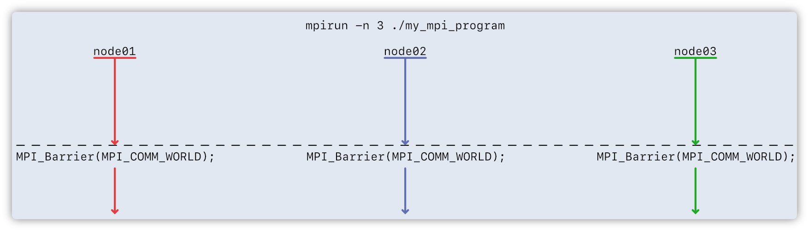]
---
template: normal

# Collective operations

- The first set of communication functions we will look at are _collective operations_
- Collective: all processes must be involved in the operation (as opposed to _point-to-point_ communications)
- Examples (this list is not exhaustive!):
  - Broadcast a variable from one process to all processes (Broadcast)
  - Distribute elements of an array on one process to multiple processes (Scatter)
  - Collect elements of arrays scattered over processes into a single process (Gather)
  - Sum a variable over all processes (Reduction)
<style type="text/css">
	img[alt=co]{width: 70%; float: center; padding-left: 10px; padding-right: 10px}
</style>

--

.column-thrd[
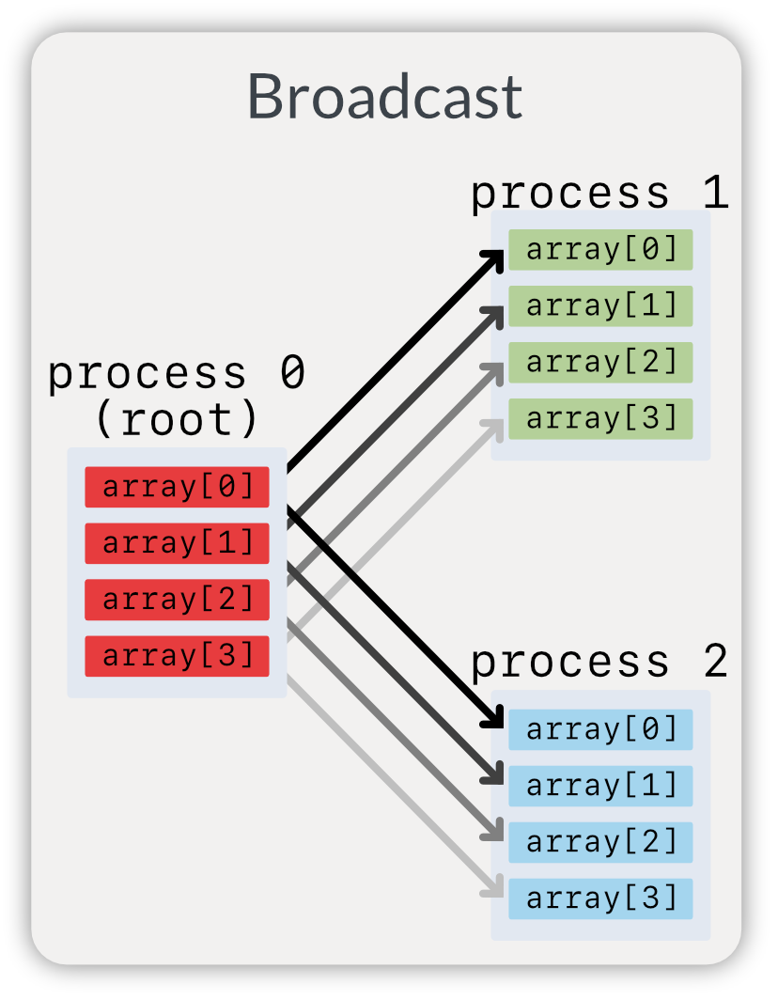
]

--

.column-thrd[
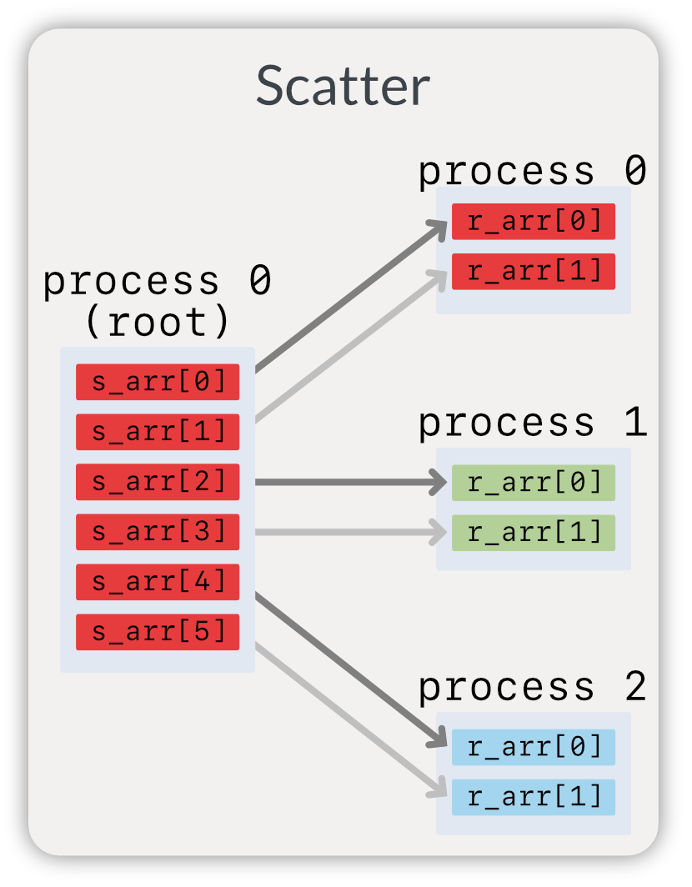
]

--

.column-thrd[
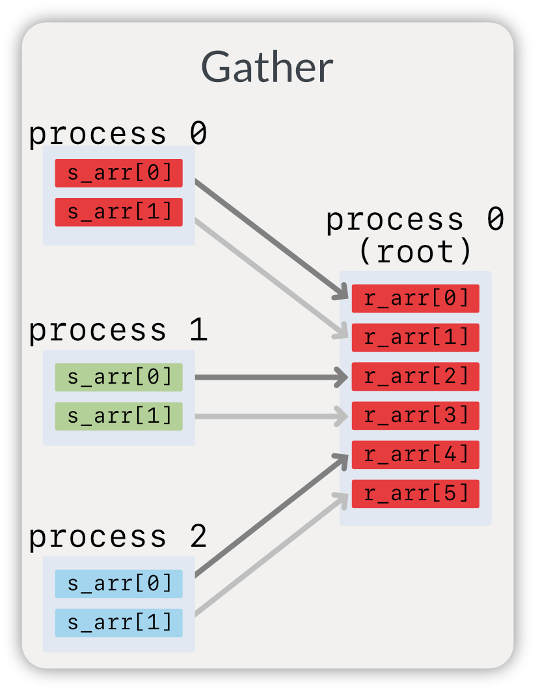
]

---
template: normal
# Collective operations: Broadcast

- Broadcast:
  ```c
  MPI_Bcast(void *buffer, int count, MPI_Datatype datatype, int root, MPI_Comm comm);
  ```
  
--
  
  - _Example_: Broadcast from rank 0 (root), the four-element, double precision array `arr[]`
  ```c
  MPI_Bcast(arr, 4, MPI_DOUBLE, 0, MPI_COMM_WORLD);
  ```
  
--
  
  - _Example_: Broadcast from rank 0 (root), the scalar integer variable `var`
  ```c
  MPI_Bcast(&var, 1, MPI_INT, 0, MPI_COMM_WORLD);
  ```

--

- The `MPI_Datatype` is important since MPI uses it to estimate the size in bytes that need to be transfered

--

- Full list of types available in MPI documentation. E.g. see: [https://www.mpich.org/static/docs/latest/www3/Constants.html]()


---
template: normal
# Collective operations: Scatter

- Scatter:
  ```c
  MPI_Scatter(
			  const void *sendbuf, int sendcount, MPI_Datatype sendtype,
			  void *recvbuf, int recvcount, MPI_Datatype recvtype,
			  int root, MPI_Comm comm
			  );
  ```

--
	- `sendcount` is the number of elements to be sent to _each_ process

--
	- `sendbuf` is only relevant in the root process

--
	- _Example_: distribute a 12-element array from process 0, assuming 3 processes in total (including root)
```c
double arr_all[12]; /* <-- this only needs to be defined on process with rank == 0 */
double arr_proc[4];
MPI_Scatter(arr_all, 4, MPI_DOUBLE, arr_proc, 4, MPI_DOUBLE, 0, MPI_COMM_WORLD);
```
--
	- _Example_: distribute each element of a 4-element array to 4 processes in total (including root)
```c
double arr[4]; /* <-- this only needs to be defined on process with rank == 0 */
double element;
MPI_Scatter(arr, 1, MPI_DOUBLE, &element, 1, MPI_DOUBLE, 0, MPI_COMM_WORLD);
```

---

template: normal
# Collective operations: Gather

- Gather:
  ```c
  MPI_Gather(
			 const void *sendbuf, int sendcount, MPI_Datatype sendtype,
			 void *recvbuf, int recvcount, MPI_Datatype recvtype, int root,
			 MPI_Comm comm
			 )
  ```

--
	- `recvcount` is the number of elements to be received by _each_ process

--
	- `recvbuf` is only relevant in the root process

--
	- _Example_: collect a 9-element array at process 0, by concatenating 3 elements from each of 3 processes in total (including root)	
```c
double arr_all[9]; /* <-- this only needs to be defined on process with rank == 0 */
double arr_proc[3];
MPI_Gather(arr_proc, 3, MPI_DOUBLE, arr_all, 3, MPI_DOUBLE, 0, MPI_COMM_WORLD);
```
--
	- _Example_: collect a 4-element array at process 0, by concatenating an element from each of 4 processes in total (including root)	
```c
double arr[4]; /* <-- this only needs to be defined on process with rank == 0 */
double element;
MPI_Gather(&element, 1, MPI_DOUBLE, arr, 1, MPI_DOUBLE, 0, MPI_COMM_WORLD);
```

---

name: reduce
# Collective operations: Reduction

- Reduction:
  ```c
  MPI_Reduce(
			 const void *sendbuf, void *recvbuf, int count,
             MPI_Datatype datatype, MPI_Op op, int root,
             MPI_Comm comm
			 )
  ```

---
template: reduce

.left-column-65[
- Notes:
  - `MPI_Op` is an operation, e.g. `MPI_SUM`, `MPI_PROD`, etc.
  - The correct result of the operation depends on specifying the
    datatype correctly
  - `count` is the number of elements of the arrays and is the same
    for send and receive, e.g. in the example on the right, `count ==
    2`
  - The operation is over all processes in `comm`
]
.right-column-35[
	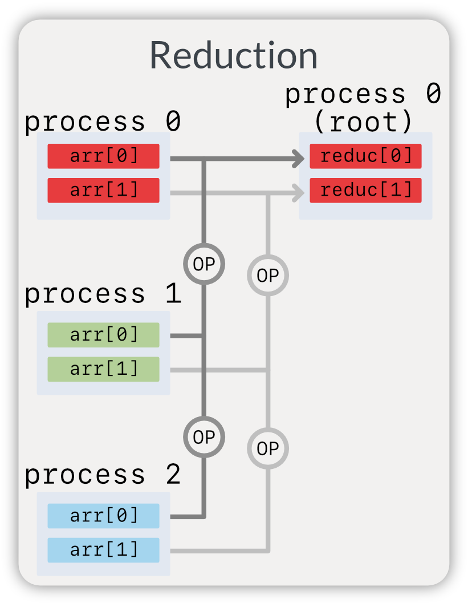	
]

---
template: reduce

.left-column-65[
- _Example_: Sum each element of a 3-element array over all processes
```c
	double s_arr[3];
	double r_arr[3]; /* <-- only needs to      *
					  *     be defined on root */
	MPI_Reduce(s_arr, r_arr, 3, MPI_DOUBLE,
			   MPI_SUM, 0, MPI_COMM_WORLD);
```
]

.right-column-35[
		
]

--

.left-column-65[
- _Example_: Sum variable `var` over all processes
```c
    double var;
	double sum; /* <-- only needs to      *
				 *     be defined on root */
	MPI_Reduce(&var, &sum, 1, MPI_DOUBLE,
			   MPI_SUM, 0, MPI_COMM_WORLD);
```
]

---
template: normal

# Collective operations

### Some additional notes on variants of the collectives we have covered

- `MPI_Scatterv()` and `MPI_Gatherv()` 
  - Allow specifying _varying_ number of elements to be distributed or
	collected to or from the process pool
  - Need specifying additional arguments containing offsets of the
    send or receive buffer

--

- `MPI_Allreduce()`
  - Same as `MPI_Reduce()`, but result is placed on all processes in the pool
  - Result is equivalent to `MPI_Reduce()` followed by an `MPI_Bcast()`


--


- In-place operations
  - For some functions, can replace the send or receive buffer with
    `MPI_IN_PLACE`  
	.red[$\mathbf{\rightarrow}$] which buffer depends on the specific MPI function	

--
 - Instructs MPI to use the **same** buffer for receive and send

--
 - E.g. below, the sum will be placed in
    `var` of the root process (process with `rank == 0`):
```c
if(rank != 0) {
			MPI_Reduce(&var, null, 1, MPI_DOUBLE, MPI_SUM, 0, MPI_COMM_WORLD);
} else {
			MPI_Reduce(MPI_IN_PLACE, &var, 1, MPI_DOUBLE, MPI_SUM, 0, MPI_COMM_WORLD);
}
```

---
template: normal

# Point-to-point communication

- Communications that involve transfer of data between two processes

--

- Most common case: send/receive
  - The sender process issues a send operation
  - The receiver process posts a receive operation
  
--
  
- Asynchronous in nature: caution needed for preventing _deadlocks_, e.g.
  - Sending to a process which has not posted a matching receive
  - Posting a receive which does not have a matching send
--
<style type="text/css">
	img[alt=sr]{width: 100%; float: center; padding: 8px}
</style>

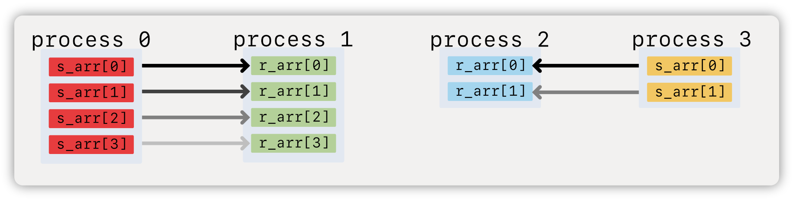
--
.red[Two] point-to-point communications are depicted above  
	⮑ between i) process 0 and 1 and between ii) process 2 and 3


---

template: normal

# Point-to-point communication

- Send/Receive

```c
MPI_Send(void *buf, int n, MPI_Datatype type, int dest, int tag, MPI_Comm comm)
MPI_Recv(void *buf, int n, MPI_Datatype type, int srce, int tag, MPI_Comm comm, MPI_Status *status)
```

--
   - Note the need to specify a source and destination rank (`srce` and `dest`)

   - `n` in `MPI_Recv` specifies the max number of elements that can be received

--
   - The `tag` variables tags the message. In the receiving process, it must match what the sender specified  
   
--

 $\rightarrow$ Use of `MPI_ANY_TAG` in place of `tag` in
 `MPI_Recv()` means "accept messages with any value for `tag`"


--
- Use of `MPI_ANY_SOURCE` in `MPI_Recv()` means "accept data from any source"


--
- `status` can be used to query the result of the receive (e.g. how
  many elements were received). We will use `MPI_STATUS_IGNORE` in
  place of `status`, which ignores the status

---
template: normal

# Point-to-point communication

- Send/Receive; a trivial example

<style type="text/css">
	img[alt=srij]{width: 45%; float: center; padding: 25px}
</style>

.center[
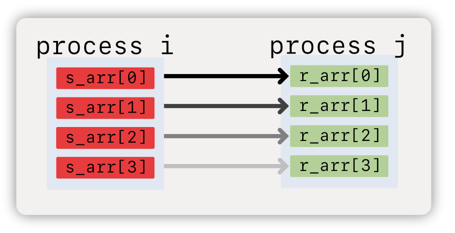
]

--

```c
if(rank == i) {
  MPI_Send(s_arr, 4, MPI_DOUBLE, j, 0, MPI_COMM_WORLD);
}
if(rank == j) {
  MPI_Recv(r_arr, 4, MPI_DOUBLE, i, MPI_ANY_TAG, MPI_COMM_WORLD, MPI_STATUS_IGNORE);
}

```

---

name: sr

# Point-to-point communication

- It is common in parallel applications to require that every process
communicates with another process, e.g. a neighboring process

.center[

]


---
template: sr

- This will .red[not] work:

```c
MPI_Send(&s_var, 1, MPI_DOUBLE, rank+1, 0, MPI_COMM_WORLD);
MPI_Recv(&r_var, 1, MPI_DOUBLE, rank-1, MPI_ANY_TAG, MPI_COMM_WORLD, MPI_STATUS_IGNORE);
```  

--

- It results in a .red[deadlock]: 
  - an `MPI_Recv()` can only be posted once an `MPI_Send()` completes
  - an `MPI_Send()` can only complete if a matching `MPI_Recv()` is posted

--
- One can serialize the communications, i.e. use a loop to determine the order of send/receives

--
  - Serializes communications that may be done faster in parallel

--
  - Inelegant, obscure, and error-prone
  

---
template: sr

- A more efficient and elegant solution is to use `MPI_Sendrecv()`:
```c
MPI_Sendrecv(void *sendbuf, int sendcount, MPI_Datatype sendtype, int dest, int sendtag,
				 void *recvbuf, int recvcount, MPI_Datatype recvtype, int srce, int recvtag,
				 MPI_Comm comm, MPI_Status *status)
```

--

- For the depicted example:
```c
MPI_Sendrecv(&s_var, 1, MPI_DOUBLE, rank+1, 0,
				 &r_var, 1, MPI_DOUBLE, rank-1, MPI_ANY_TAG,
				 MPI_COMM_WORLD, MPI_STATUS_IGNORE);
```


---
template: normal

# Point-to-point communications

### Some additional notes on variants of the point-to-point communications we have covered

--

- `MPI_Isend()` and `MPI_Irecv()`
  - _Non-blocking_ variants. The `I` stands for "immediate"
  
--
  - Functions return immediately, i.e. the functions don't block
    waiting for `sendbuf` to be sent or `recvbuf` to be received
  
--
  - The function `MPI_Wait()` is used to block until the operation has
    complete


  ```c
  MPI_Isend(sendbuf, ..., request);
  /* 
   * More code can come here, provided it 
   * does not modify sendbuf, which is
   * assumed to be "in-flight" 
   */
  MPI_Wait(request, ...);
  ```
  
--
- `MPI_Sendrecv_replace()`
	- Like `MPI_Sendrecv()` but with a single `buf` rather than separate `sendbuf` and `recvbuf`   
--

    ⮑ The receive message overwrites the send message
  
---
template: title

# Exercises

---
template: normal

# Exercises

```sh
cp -r /nvme/scratch/engage/mpi .
```

- Exercises follow a common structure

--
- Each folder includes (where `${n}` below is the exercise number, i.e. `01`, `02`, etc.):
  - A makefile (`Makefile`)
  - A `.c` source code file (`ex${n}.c`)
  - A submit script (`sub-${n}.sh`)

--
- Similarly to previous days, our workflow will typically be:
  - Modify `ex${n}.c` as instructed
  - Compile by typing `make`
  - Submit the job script `sbatch sub-${n}.sh`
  - Look at the output, which can be found in `ex${n}-output.txt`

--
- Note that if you have modified `ex${n}.c` correctly, the job should complete in .red[less than one minute]


---
template: normal

# Exercises

- Exercises are mostly complete but require some minor modifications by you

--
- This is mostly to "encourage" reading and understanding the code

--
- The MPI functions demonstrated in each exercise are:
  - `ex01`: Use of `MPI_Comm_rank()` and `MPI_Comm_size()`
  - `ex02`: Use of `MPI_Barrier()`
  - `ex03`: Use of `MPI_Bcast()`
  - `ex04`: Use of `MPI_Scatter()`
  - `ex05`: Use of `MPI_Scatter()` and `MPI_Gather()`
  - `ex06`: Use of `MPI_Scatter()` and `MPI_Reduce()`
  - `ex07`: Use of `MPI_Send()` and `MPI_Recv()`
  - `ex08`: Use of `MPI_Sendrecv()`

--
- All exercises have been tested with OpenMPI and the GNU Compiler. Please use:
```sh
module load gompi
```
for all exercises.

---
template: normal

# Exercises

## Ex01

- Modify `ex01.c` to call `MPI_Comm_size()` and `MPI_Comm_rank()` with
  the appropriate arguments
  ```c
  int nproc, rank;
  /*
   * TODO: call `MPI_Comm_size()' and `MPI_Comm_rank()' with the
   * appropriate arguments
   */
  MPI_Comm_size(/* TODO */);
  MPI_Comm_rank(/* TODO */);
  ```

--

- To compile, type `make`. Remember to first load the appropriate module (`gompi`):
  ```sh
  [user@front02 ex01]$ module load gompi
  [user@front02 ex01]$ make
  mpicc -c ex01.c
  mpicc -o ex01 ex01.o
  [user@front02 ex01]$
  ```

---
template: normal

# Exercises

## Ex01

- A job script has been prepared to run `ex01`: 
```sh
	[user@front02 ex01]$ cat sub-01.sh
	#!/bin/bash
	#SBATCH --job-name=01
	#SBATCH --nodes=2
	#SBATCH --ntasks=8
	#SBATCH --output=ex01-output.txt
	#SBATCH --time=00:01:00
	#SBATCH --reservation=engage
	#SBATCH -A engage

	module load gompi
	mpirun ./ex01
```

--
	- 2 nodes, 8 processes, meaning 4 processes per node

--
	- program output will be redirected to file `ex01-output.txt`

--
	- requests 1 minute. If not done by then, the scheduler will kill the job

---
template: normal

# Exercises

## Ex01

- Submit the job script:
  ```sh
  [user@front02 ex01]$ sbatch sub-01.sh
  Submitted batch job 69711
  [user@front02 ex01]$
  ```

--

- Check status of job:
  ```sh
  [user@front02 ex01]$ squeue -u $USER
  JOBID PARTITION     NAME     USER ST       TIME  NODES NODELIST(REASON)
  69712       cpu       01	  user  R       0:00      2 cn[01-02]
  [user@front02 ex01]$
  ```
  
--

- The job runs very quickly. You may see no output above if the job has finished:
  ```sh
  [user@front02 ex01]$ squeue -u $USER
  JOBID PARTITION     NAME     USER ST       TIME  NODES NODELIST(REASON)
  [user@front02 ex01]$
  ```

---
template: normal

# Exercises

## Ex01

- If done, the file `ex01-output.txt` should have been created
- Inspect the file:
  ```sh
  [user@front02 ex01]$ cat ex01-output.txt
 This is rank = 3 of nproc = 8 on node: cyc01
 This is rank = 0 of nproc = 8 on node: cyc01
 This is rank = 1 of nproc = 8 on node: cyc01
 This is rank = 2 of nproc = 8 on node: cyc01
 This is rank = 7 of nproc = 8 on node: cyc02
 This is rank = 5 of nproc = 8 on node: cyc02
 This is rank = 6 of nproc = 8 on node: cyc02
 This is rank = 4 of nproc = 8 on node: cyc02
  [user@front02 ex01]$  
  ```
--
- Note the order is nondeterministic; whichever process reaches the print statement first prints

--
- We can use synchronization to serialize the print statements and ensure the correct order

---
template: normal

# Exercises

## Ex02

- `ex02.c` is similar to `ex01.c`
- A for-loop is included over the print statement:
```c
  /*
   * TODO: add an MPI_Barrier() to ensure the ranks print in-order
   */
  for(int i=0; i<nproc; i++) {
		if(rank == i)
			printf(" This is rank = %d of nproc = %d on node: %s\n", rank, nproc, hname);
  }
```
--
- Study the code and carefully place an `MPI_Barrier()` so that the
  print statements will be executed in rank ordered

--
- As before, when done:
  - use `make` to compile and
  - `sbatch sub-02.sh` to submit the prepared job script

---
template: normal

# Exercises

## Ex02

- Inspect the file  `ex02-output.txt`:
  ```sh
  [user@front02 ex02]$ cat ex02-output.txt
 This is rank = 0 of nproc = 8 on node: cyc01
 This is rank = 1 of nproc = 8 on node: cyc01
 This is rank = 2 of nproc = 8 on node: cyc01
 This is rank = 3 of nproc = 8 on node: cyc01
 This is rank = 4 of nproc = 8 on node: cyc02
 This is rank = 5 of nproc = 8 on node: cyc02
 This is rank = 6 of nproc = 8 on node: cyc02
 This is rank = 7 of nproc = 8 on node: cyc02
  [user@front02 ex02]$  
  ```

--
- The print statements should appear in rank order

---
template: normal

# Exercises

## Ex03

- This exercise demonstrates `MPI_Bcast()`
- A file `data.txt` is included:
```txt
[user@front02 ex03]$ cat data.txt
3.14159265359
[user@front02 ex03]$
```
--
- In `ex03.c`, the root process (process with `rank == 0`) calls the
  `readline()` function to read the single line from the file

--
- Your task is to use a `MPI_Bcast()` to broadcast the variable read
  to all processes:
```c
	/*
	 * TODO: add an MPI_Bcast() with the appropriate arguments to
	 * broadcast variable `val' from the root process to all processes
	 */  
  MPI_Bcast(/* TODO */);
```

---
template: normal

# Exercises

## Ex03

- If done correctly, `ex03-output.txt` should include the following output:
```sh
[user@front02 ex03]$ cat ex03-output.txt
 This is rank = 7 of nproc = 8 on node: cyc02 | Got from root var = 3.141593
 This is rank = 6 of nproc = 8 on node: cyc02 | Got from root var = 3.141593
 This is rank = 5 of nproc = 8 on node: cyc02 | Got from root var = 3.141593
 This is rank = 4 of nproc = 8 on node: cyc02 | Got from root var = 3.141593
 This is rank = 3 of nproc = 8 on node: cyc01 | Got from root var = 3.141593
 This is rank = 0 of nproc = 8 on node: cyc01 | Got from root var = 3.141593
 This is rank = 2 of nproc = 8 on node: cyc01 | Got from root var = 3.141593
 This is rank = 1 of nproc = 8 on node: cyc01 | Got from root var = 3.141593
[user@front02 ex03]$
```
	With the order being undetermined also in this case

---
template: normal

# Exercises

## Ex04

- This exercise demonstrates the scatter operation
- The file `data.txt` now includes eight lines:
```txt
[user@front02 ex04]$ cat data.txt
0.42816572487
0.57721566490
0.66274341935
0.69314718056
1.41421356237
1.61803398875
2.71828182846
3.14159265359
[user@front02 ex04]$
```
--
- The root process reads the eight lines into the eight-element double
  precision array `vals[]` using the function `readlines()`
```c
/*
     * root process: read `n' lines of "data.txt" into array `vars[]'
     */
  int nelems = 8;
  double vars[nelems];
  if(rank == 0) {
		char fname[] = "data.txt";
		readlines(nelems, vars, fname);
  }
```

---
template: normal

# Exercises

## Ex04

- Your task is to scatter the array `vals[]` so that each of the eight
  processes receives one element of the array into variable `var`:
  ```c
  double var;
  /*
	 * TODO: use an MPI_Scatter() to distribute the elements of `vars[]'
	 * to the processes, one element for each process. Assume the number
	 * of processes is the same as the number of elements.
	 */
  MPI_Scatter(/* TODO */);  
  ```
--
- Once done, compile (`make`) and submit the job script (`sbatch sub-04.sh`)

--
- If done correctly, you should see the following in `ex04-output.txt`:
```sh
[user@front02 ex04]$ cat ex04-output.txt
 This is rank = 2 of nproc = 8 on node: cyc01 | Got from root var = 0.662743
 This is rank = 3 of nproc = 8 on node: cyc01 | Got from root var = 0.693147
 This is rank = 1 of nproc = 8 on node: cyc01 | Got from root var = 0.577216
 This is rank = 4 of nproc = 8 on node: cyc02 | Got from root var = 1.414214
 This is rank = 5 of nproc = 8 on node: cyc02 | Got from root var = 1.618034
 This is rank = 6 of nproc = 8 on node: cyc02 | Got from root var = 2.718282
 This is rank = 0 of nproc = 8 on node: cyc01 | Got from root var = 0.428166
 This is rank = 7 of nproc = 8 on node: cyc02 | Got from root var = 3.141593
 [user@front02 ex04]$
 ```
--
- .green[**Pro tip**]: you can sort the output by piping through `sort`, i.e. `cat ex04-output.txt | sort`

---
template: normal

# Exercises

## Ex05

- This exercise demonstrates the gather operation
- The exercise starts like `ex04`:
  - The root process reads the eight values from `data.txt` and stores them in `vars[]`

--
- We would like:

--
  - The elements of `vars[]` to be scattered, one element to each of eight processes (same as `ex04`)

--
  - Each process to divide its element, stored in `var`, by two

--
  - The process' `var` variables to be gathered back into `vars[]` of the root process


--
```c
  /* TODO: use an MPI_Scatter() to distribute the elements of `vars[]'
   * to the processes, one element for each process. Assume the number
   * of processes is the same as the number of elements. Same as in
   * exercise ex04. 
   */
  MPI_Scatter(/* TODO */);

  /* Divide by two on each rank */
  var = var*0.5;

  /* TODO: use an MPI_Gather() to collect `var' from each rank to the
   * array `vars[]' on the root process 
   */  
  MPI_Gather(/* TODO */);
```

---
template: normal

# Exercises

## Ex05

- At the end, the root process prints all elements of `vars[]`
```c
  /*
	 * root process: print the elements of `vars[]' obtained via the
	 * `MPI_Gather()'
	 */
  if(rank == 0)
		for(int i=0; i<nelems; i++)
			printf(" vars[%d] = %lf\n", i, vars[i]);
```
--
- Inspect the output `ex05-output.txt` and ensure the result is correct:
```sh
[user@front02 ex05]$ cat ex05-output.txt
 vars[0] = 0.214083
 vars[1] = 0.288608
 vars[2] = 0.331372
 vars[3] = 0.346574
 vars[4] = 0.707107
 vars[5] = 0.809017
 vars[6] = 1.359141
 vars[7] = 1.570796
[user@front02 ex05]$
```

---
template: normal

# Exercises

## Ex06

- This exercise demonstrates the reduction operation
- `data.txt` is now a file with 2520 random numbers, one per line (`nelems = 2520`)

--
- We would like:

--
  - The root process to read all elements into an array `vars[]`

--
  - The elements to be scattered to all processes  
  ⮑ Each process should receive `nelems_loc = nelems / nproc` elements

--
  - Each process to sum its local elements, storing the result into `sum_loc`

--
  - To use a reduction operation to obtain the grand total over all 2520 elements

--
- Note that in `ex06.c` we explicitly check that the number of
  processes divides the number of elements in `data.txt`:
  ```c
  /*
	 * Abort if the number of processes does not divide `nelems' exactly
	 */
  int nelems = 2520;
  if(nelems % nproc != 0) {
		fprintf(stderr, " nelems = %d not divisible by nproc = %d\n", nelems, nproc);
		MPI_Abort(MPI_COMM_WORLD, 1);
  }  
  ```

---
template: normal

# Exercises

## Ex06

- Your `TODO`s are to complete the scatter and reduction operations:
```c
  /*
	 * TODO: use an MPI_Scatter() to distribute the elements of `vars[]'
	 * to each process' `vars_loc[]' array
	 */
  MPI_Scatter(/* TODO */);

  /*
	 * `sum_loc' holds the sum over each process' local elements
	 */
  double sum_loc = 0;
  for(int i=0; i<nelems_loc; i++)
    sum_loc += vars_loc[i];
  
  /*
	 * TODO: use an MPI_Reduce() to sum `sum_loc' over all processes and
	 * store in `sum' of the root process
	 */
  double sum;
  MPI_Reduce(/* TODO */);
```

---
template: normal
# Exercises

## Ex06

- The root process prints the result at the end. If correct, you should see:
```sh
 [user@front02 ex06]$ cat ex06-output.txt
 Used 8 processes, sum = 1266.960662
 [user@front02 ex06]$
```

--
- Note that `ex06.c` allows running with any number of processes which
  divide 2520 exactly

--
- Try, for example, modifying `sub-06.sh` to use 40 processes (20 per node)

--
- You should see an identical sum:
```sh
[user@front02 ex06]$ cat ex06-output.txt
 Used 40 processes, sum = 1266.960662
[user@front02 ex06]$
```

---
template: normal
# Exercises

## Ex07

- This exercise demonstrates `MPI_Send()` and `MPI_Recv()`
- `data.txt` is the same as in `ex04`, with eight elements:
```txt
[user@front02 ex07]$ cat data.txt
0.42816572487
0.57721566490
0.66274341935
0.69314718056
1.41421356237
1.61803398875
2.71828182846
3.14159265359
[user@front02 ex07]$
```
--
- All elements are read by the root process into array `vars[]`

--
- The elements are then scattered, one to each process, and stored in variable `var0`

--
- Using `MPI_Send()` and `MPI_Recv()`, We would like that:
  - All processes with even ranks store in variable `var1` the value
    of `var0` corresponding to their next odd rank
  - All processes with odd ranks store in variable `var1` the value
    of `var0` corresponding to their previous even rank


---
name: ex07
layout: true
# Exercises

## Ex07

<style type="text/css">
	img[alt=ex07]{width: 90%; float: center; padding: 8px}
</style>

---
template: ex07
count: false
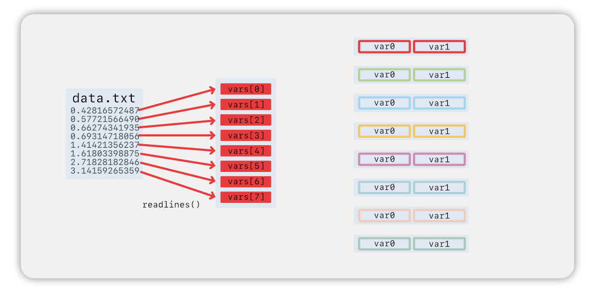
---
template: ex07
count: false
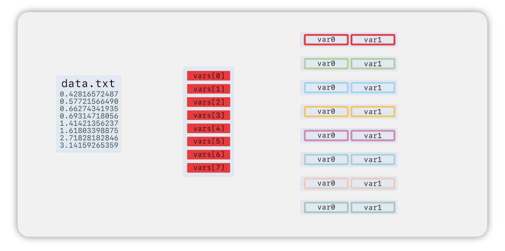
---
template: ex07
count: false
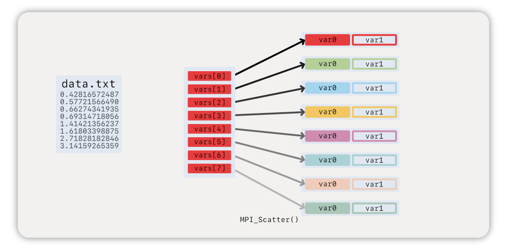
---
template: ex07
count: false
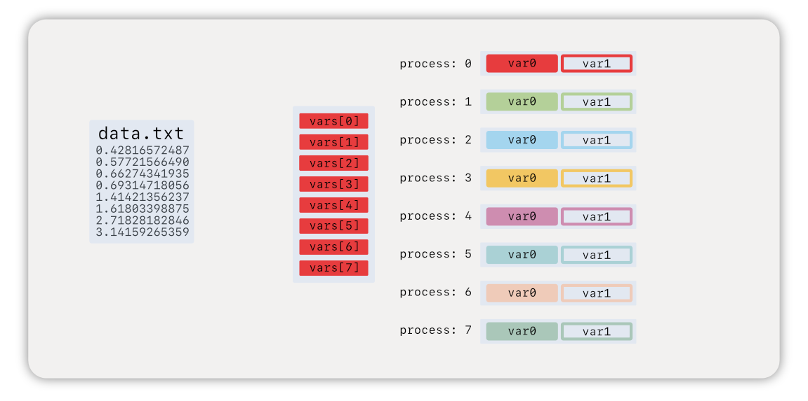
---
template: ex07
count: false
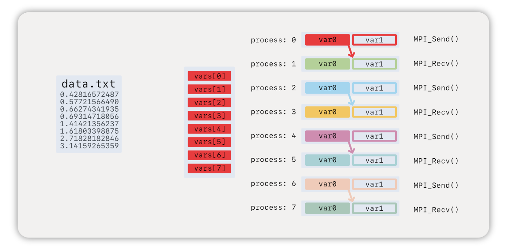
---
template: ex07
count: false
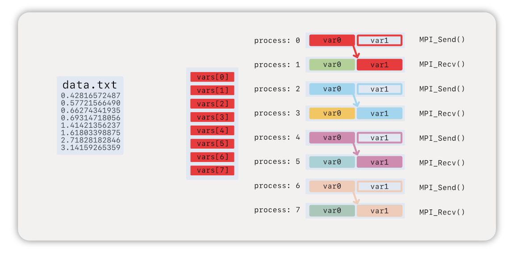
---
template: ex07
count: false
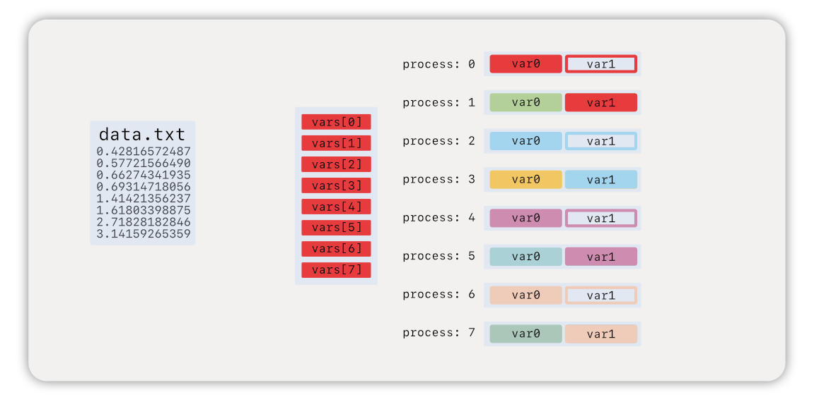
---
template: ex07
count: false

---
template: ex07
count: false

---
template: ex07
count: false
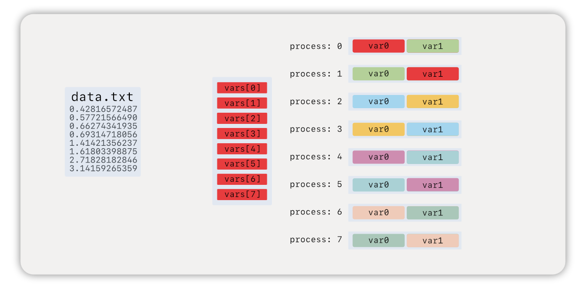


---
template: normal
# Exercises

## Ex07
- The `TODO`s are for completing the arguments of the `MPI_Recv()`s and `MPI_Send()`s
```c
  double var1;
  /*
	 * TODO: Use `MPI_Send()' and `MPI_Recv()' appropriately, so that
	 * `var0' of each even rank is copied into `var1' of the next odd
	 * rank
	 */
  if(rank % 2 == 0) {
		MPI_Send(/* TODO */);
  } else {
		MPI_Recv(/* TODO */);
  }
  
  /*
	 * TODO: Use `MPI_Send()' and `MPI_Recv()' appropriately, so that
	 * `var0' of each odd rank is copied into `var1' of the previous
	 * even rank
	 */
  if(rank % 2 == 1) {
		MPI_Send(/* TODO */);
  } else {
		MPI_Recv(/* TODO */);
  }
```

---
template: normal
# Exercises

## Ex07
- The correct output should look like this:
```txt
[user@front02 ex07]$ cat ex07-output.txt |sort
 This is rank = 0 of nproc = 8 on node: cyc01 | var0 = 0.428166   var1 = 0.577216
 This is rank = 1 of nproc = 8 on node: cyc01 | var0 = 0.577216   var1 = 0.428166
 This is rank = 2 of nproc = 8 on node: cyc01 | var0 = 0.662743   var1 = 0.693147
 This is rank = 3 of nproc = 8 on node: cyc01 | var0 = 0.693147   var1 = 0.662743
 This is rank = 4 of nproc = 8 on node: cyc02 | var0 = 1.414214   var1 = 1.618034
 This is rank = 5 of nproc = 8 on node: cyc02 | var0 = 1.618034   var1 = 1.414214
 This is rank = 6 of nproc = 8 on node: cyc02 | var0 = 2.718282   var1 = 3.141593
 This is rank = 7 of nproc = 8 on node: cyc02 | var0 = 3.141593   var1 = 2.718282
[user@front02 ex07]$
```

---
template: normal
# Exercises

## Ex08

- This exercise demonstrates the use of `MPI_Sendrecv()`
- The same `data.txt` with eight elements is used as before
- The elements are read by the root process and scattered to all processes as before

--
- Now each process has three variables:
  - `var_proc` contains the element received from the scatter
  - `var_next` is to contain `var_proc` of the next process
  - `var_prev` is to contain `var_proc` of the previous process

--
- Use two `MPI_Sendrecv()` to achieve this

---
name: ex08
layout: true
# Exercises

## Ex08

<style type="text/css">
	img[alt=ex08]{width: 90%; float: center; padding: 8px}
</style>

---
template: ex08
count: false
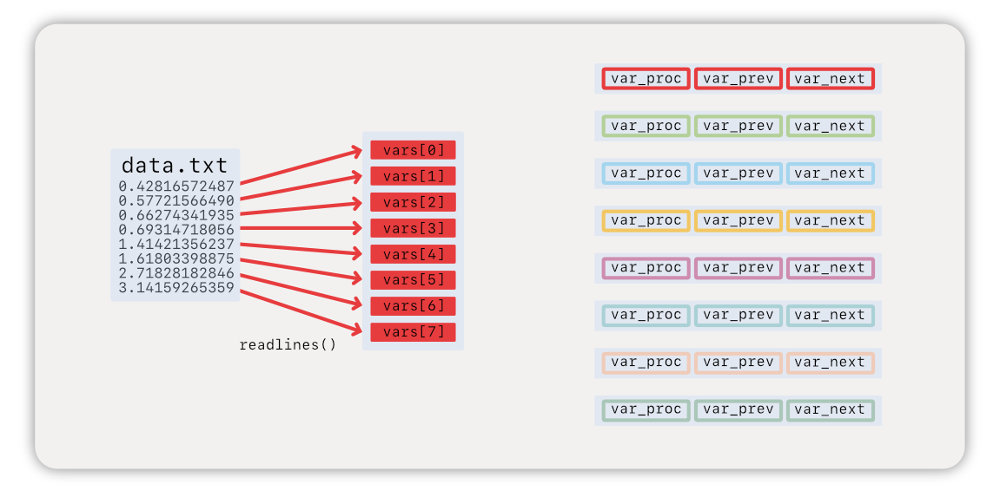
---
template: ex08
count: false
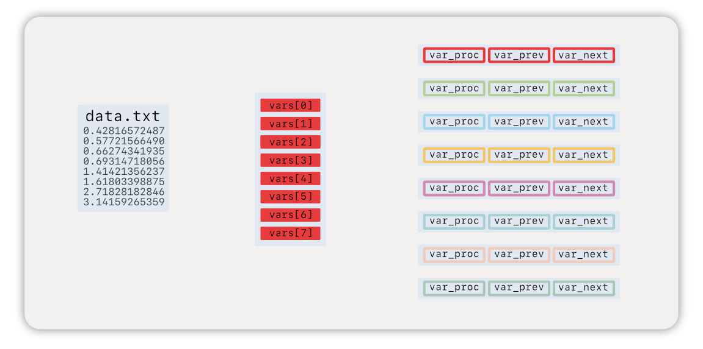
---
template: ex08
count: false
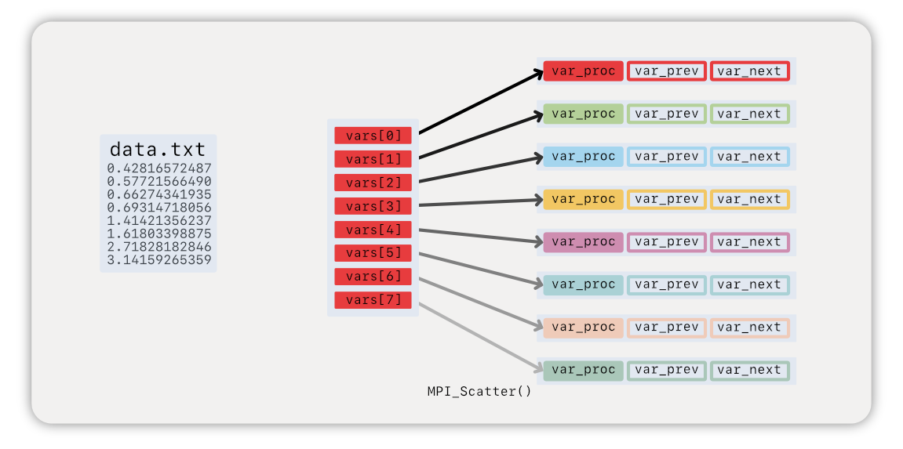
---
template: ex08
count: false
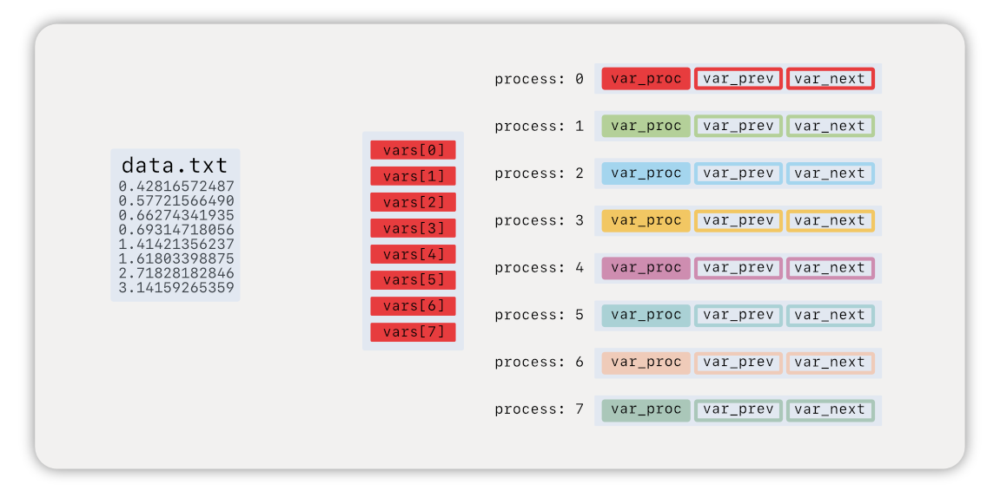
---
template: ex08
count: false

---
template: ex08
count: false

---
template: ex08
count: false
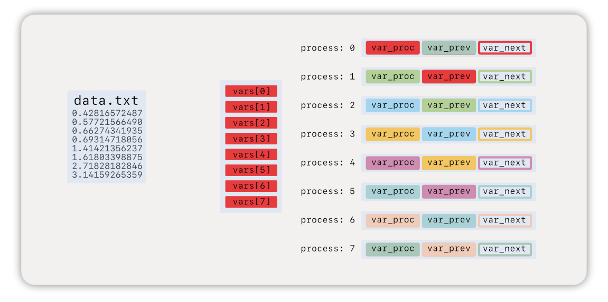
---
template: ex08
count: false
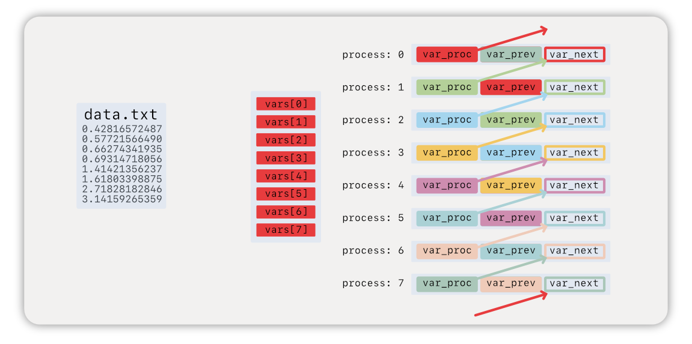
---
template: ex08
count: false
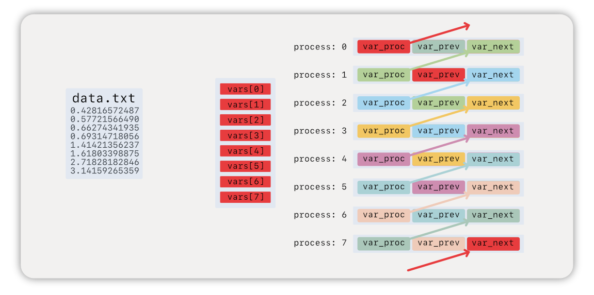
---
template: ex08
count: false


---
template: normal
# Exercises

## Ex08
- The `TODO`s are for completing the arguments of the `MPI_Sendrecv()`s
```c
  double var_next, var_prev;
  /*
	 * TODO: Use `MPI_Sendrecv()' appropriately, so that `var_proc' of
	 * each rank is copied into `var_prev' of the next rank. Assume
	 * periodicity of ranks, i.e. if the sender is the last process
	 * (`rank == nproc - 1') then send to the first process (`rank ==
	 * 0')
	 */
  MPI_Sendrecv(/* TODO */);
  
  /*
	 * TODO: Use `MPI_Sendrecv()' appropriately, so that `var_proc' of
	 * each rank is copied into `var_next' of the previous rank. Assume
	 * periodicity of ranks, i.e. if the sender is the first process
	 * (`rank == 0') then send to the last process (`rank == nproc - 1')
	 */
  MPI_Sendrecv(/* TODO */);
```

---
template: normal
# Exercises
## Ex08
- The correct output should look like this:
```txt
[user@front02 ex08]$ cat ex08-output.txt | sort
 This is rank = 0 of nproc = 8 on node: cyc01 | var_proc = 0.428166   var_prev = 3.141593   var_next = 0.577216
 This is rank = 1 of nproc = 8 on node: cyc01 | var_proc = 0.577216   var_prev = 0.428166   var_next = 0.662743
 This is rank = 2 of nproc = 8 on node: cyc01 | var_proc = 0.662743   var_prev = 0.577216   var_next = 0.693147
 This is rank = 3 of nproc = 8 on node: cyc01 | var_proc = 0.693147   var_prev = 0.662743   var_next = 1.414214
 This is rank = 4 of nproc = 8 on node: cyc02 | var_proc = 1.414214   var_prev = 0.693147   var_next = 1.618034
 This is rank = 5 of nproc = 8 on node: cyc02 | var_proc = 1.618034   var_prev = 1.414214   var_next = 2.718282
 This is rank = 6 of nproc = 8 on node: cyc02 | var_proc = 2.718282   var_prev = 1.618034   var_next = 3.141593
 This is rank = 7 of nproc = 8 on node: cyc02 | var_proc = 3.141593   var_prev = 2.718282   var_next = 0.428166
 [user@front02 ex08]$
```


